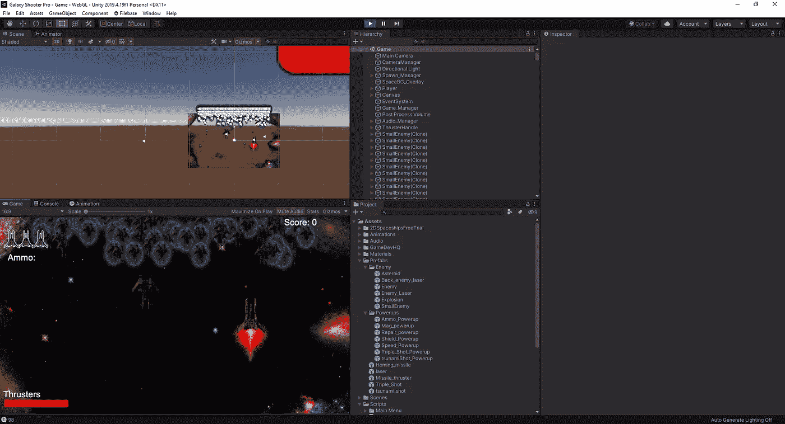
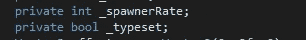
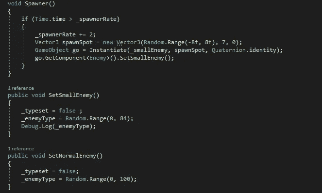
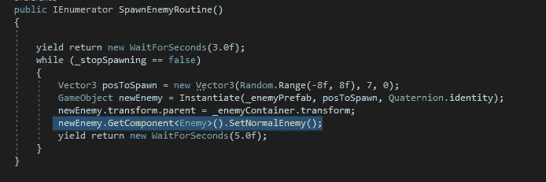
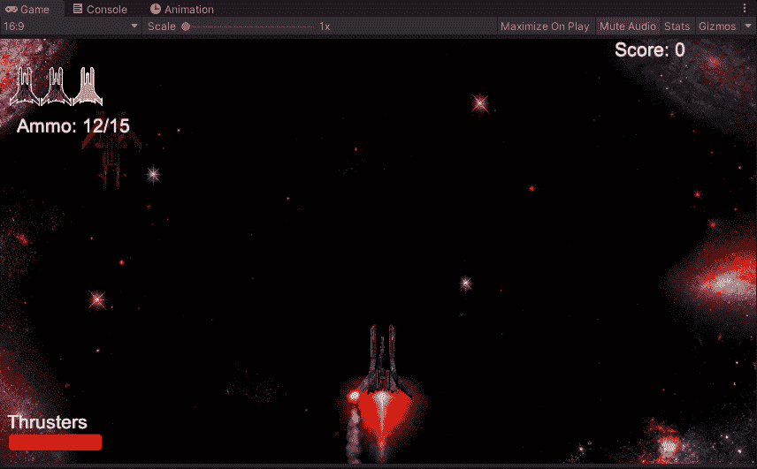

# 创造一个产卵的敌人第 1 部分

> 原文：<https://medium.com/nerd-for-tech/creating-a-spawning-enemy-part-1-1e7af1475a47?source=collection_archive---------21----------------------->

所以，我去尝试找出什么类型的敌人是独特的，从一开始就不会对你构成威胁，但是如果你花太长时间去杀死它，你会被敌人单位包围。这在实践中要复杂得多，至于我使用的一些不同的方法，我只会得到敌人的持续瀑布效应:

瀑布敌人

当然，这可能看起来不错，处理起来会很有挑战性，但问题是游戏会在几秒钟后崩溃，因为敌人无限繁殖。所以，我不得不回去工作，试图找出如何解决这个问题。我尝试了许多不同的方法，都无济于事。因此，下一步是询问我所在的 GameDevHQ 社区，看看是否有人可以帮助解决这个问题。有时候，用另一双眼睛观察事物有助于解决出现的问题。因此，在得到一些帮助后，我们设法解决了这个问题。首先，我们需要创建几个新变量:

从这里开始，我们将创建几个新的空白进行处理:

我们的第一个虚空只是我们基本的新敌人类型的虚空。然而，我们需要设置最后一部分，以便我们的 Spawner 在实例化新的敌人类型时使用我们的 SetSmallEnemy void。我们有这个 SetSmallEnemy 类型，这样我们就可以让这些小敌人不要像产卵者一样产卵，也不会在我们的屏幕上再次引起瀑布故障。至于 SetNormalEnemy，这是我们的新方法，我们将把它附加到我们的 spawn manager 脚本中，这样它就知道我们何时想要实例化敌人，它从完整范围中提取，而不是从 smallenemy void 中提取我们的 shorted list。
接下来，我们必须进入我们的 Spawnmanager 脚本，将这一行快速代码添加到敌人的 spawner 中:

现在我们有了所有这些，我们可以看看它在我们的游戏中是如何工作的:

好吧，我们可以看到我们的产卵器现在一次只能产生一个敌人，但是现在有一个新的奇怪的错误需要我们解决。正如我们看到的红色敌人，他们应该躲避我们的激光，已经决定改变他们的颜色，但忘记了如何躲避我们。
至于如何解决这个问题，我会继续修改代码，并为这个特性写第二部分。