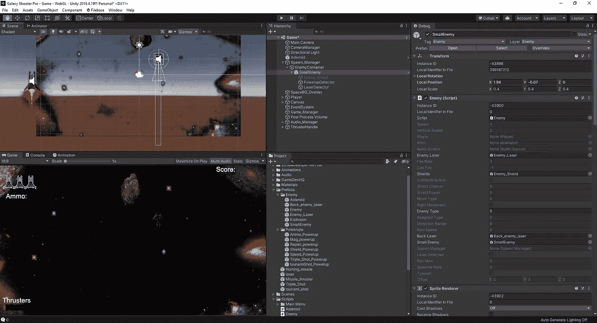
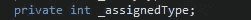
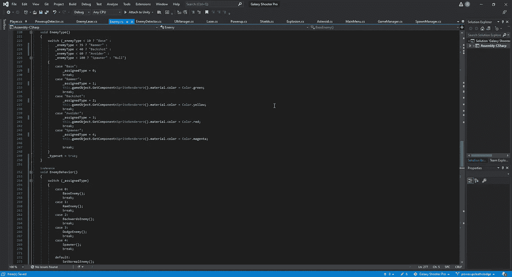
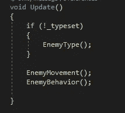
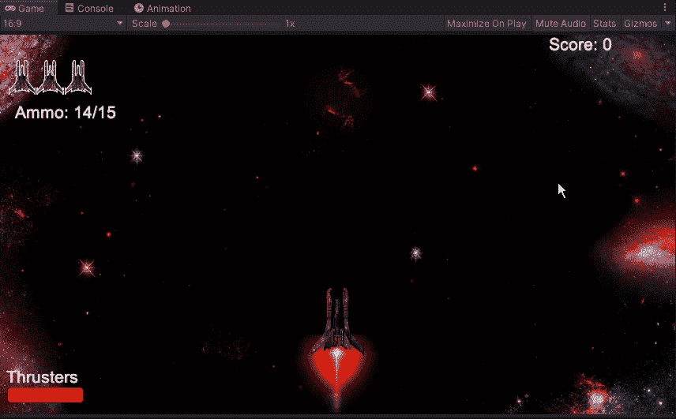
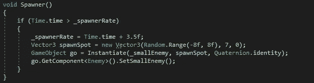
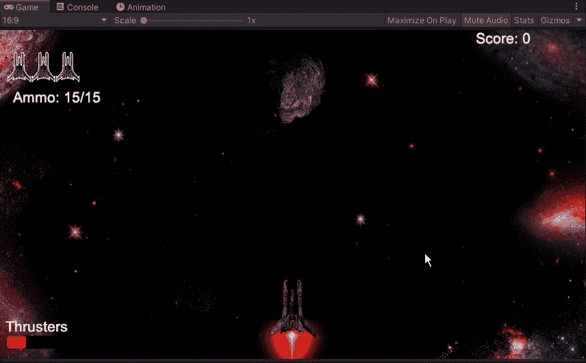

# 创造一个产卵的敌人第 2 部分

> 原文：<https://medium.com/nerd-for-tech/creating-a-spawning-enemy-part-2-97c00121f2d?source=collection_archive---------10----------------------->

现在我们已经为产卵器设置好了基础，大部分问题也解决了，让我们进一步研究修复它的方法，这样我们就可以让我们的敌人正确地使用他们的技能。首先，我们将在编辑器中快速调整我们的小敌人，使其具有我们放置的探测器，以便它们具有与我们的常规敌人相同的行为:

接下来，解决了我们的产卵问题，我们需要创建一个新的变量来处理:

至于我们将如何处理这个 assignedType，我们将把当前的 switch 语句拆分成另一个语句。这样，我们告诉 Unity 我们将值设置为一个特定的数字，并将该设置值用于新语句:

有了这个新的声明，我们可以稍微放松一下，把它设置成一个新的声明，理论上，我们可以转移到我们的 spawn manager 脚本，让它从那里选择我们的船的行为。
添加了这个新的 void 后，我们必须返回到我们的 void 更新，并将其添加到我们的行动中:

从这里，我们可以测试它是如何工作的:

在做了一个快速测试后，我们注意到我们的产卵者正在产卵船，但是现在它马上开始了一堆船。这似乎是一个有趣的挑战，但问题是有时你会让整个屏幕充满敌人和激光，导致死亡。
为了解决这个新问题，我们需要了解产卵者的行为，并做一个小小的调整。

之前发生的事情是，当产卵者第一次产卵时，它会重复我们的代码，直到我们的产卵率赶上时间。这导致我们的敌人产生无数的爪牙来攻击我们，这导致 4-5 到也许 12 或更多，这都取决于它产卵的速度。此外，我们将增加我们的产卵时间的频率，使董事会不会得到单位过多。我们可以将它设置为一个变量，并根据特定情况进行调整，但这将是另一个时间的事情。
现在我们已经做了这些调整，我们可以在我们的游戏中测试一下:

所以，我们现在有我们的道奇正确地避开我们的激光，并且一个产卵者一次只带一艘船进来。

有了这一点，我们现在有一个强大的敌人基地来对付，而不是简单的敌人。我们可以调整这些数字来计算出我们想要对每个敌人使用什么样的数值，但是除此之外，在我们结束游戏之前，我们还可以考虑更多的特性。