# 创建一个产卵机制

> 原文：<https://medium.com/nerd-for-tech/creating-a-spawning-mechanism-78d5d0a67d9b?source=collection_archive---------30----------------------->

今天我们将看看如何创建一个方法来引入一个对象，这个对象将被用来产生新一波的敌人。首先，我们将创建我们的小行星，并将所有适用的组件连接到它:

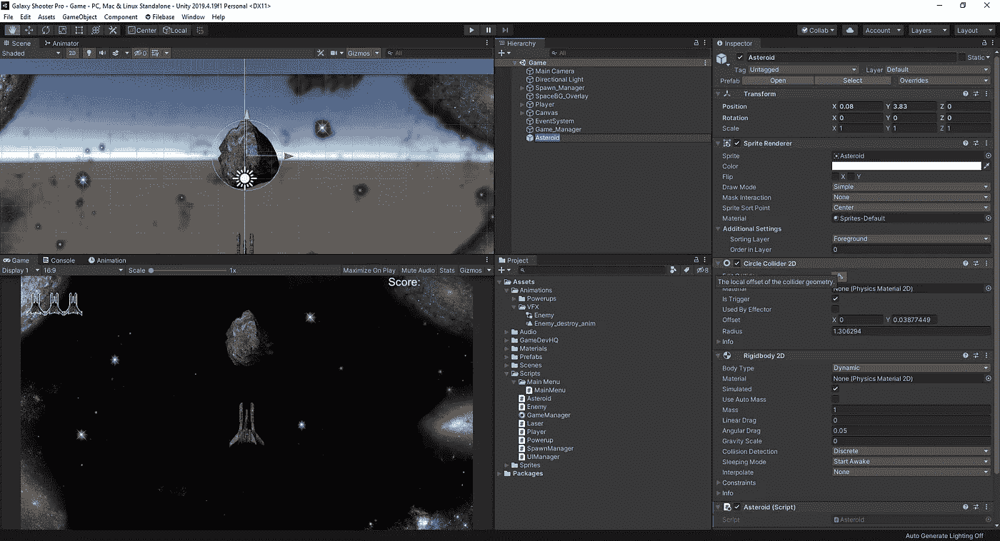

现在，让我们给我们的物体引入一些旋转，让它看起来更像是在太空中漫无目的的飞行。为此，我们只需进入脚本，编写与移动对象类似的代码，但这一次我们将使用旋转而不是平移:

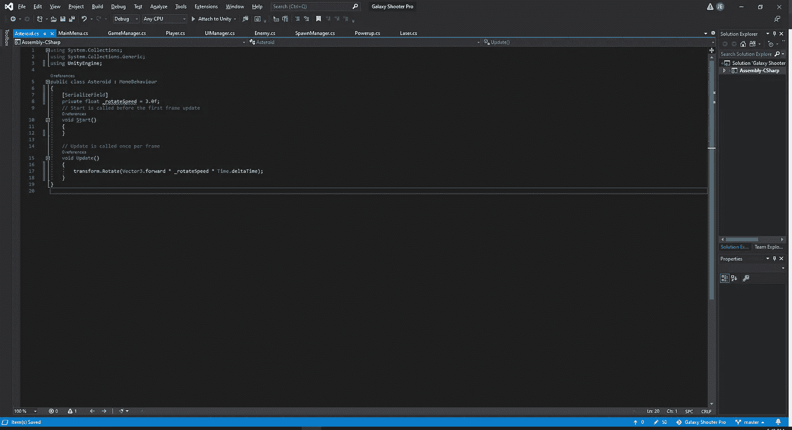

至于这在游戏中是什么样子，我们来看看:

正如我们所看到的，旋转开始时相当慢，所以我们可以使用脚本组件上旋转速度旁边的滑块，并将其增加到我们更喜欢的值。现在我们让它像我们想要的那样移动，让它与我们的激光相互作用，这样它就会在撞击时被摧毁。

首先，让我们制作一个爆炸预制品，这样我们就可以把它附加到我们的小行星上:

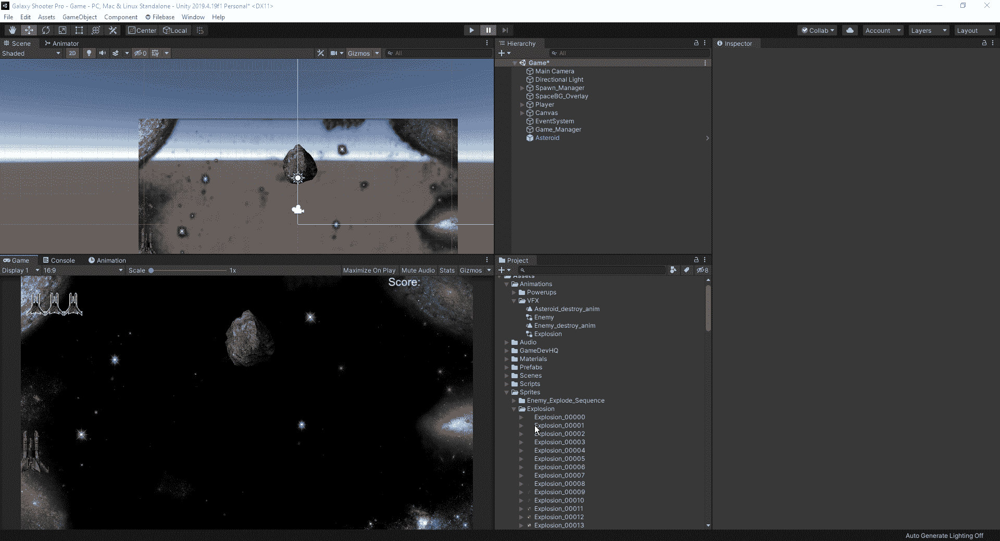

一旦我们的层次中有了一个爆炸对象，我们就可以简单地将我们的爆炸动画应用于它，就像我们对我们的敌人所做的那样:

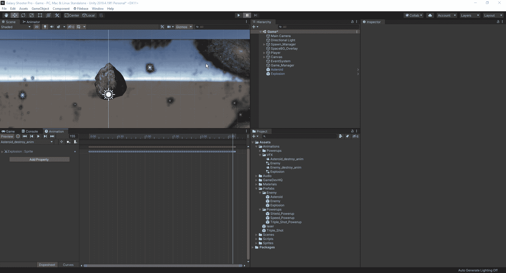

接下来，我们要去我们的小行星脚本，写下与激光互动所需的代码，就像我们之前与敌人互动一样。

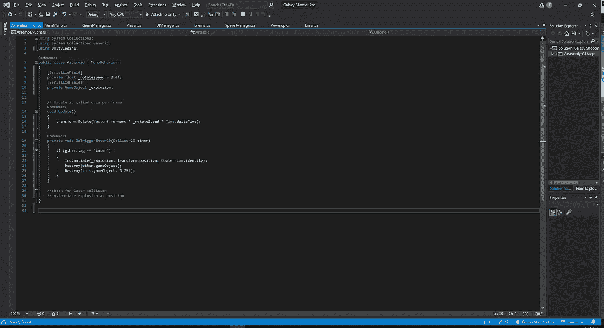

如我们所见，我们必须为小行星创造一个触发事件。从这里开始，我们简单地实例化我们创造的爆炸来展示小行星的死亡。我们必须确保摧毁撞击小行星的激光和小行星本身。我们增加了一点延迟，这样看起来会好一点。一旦我们完成了所有这些，我们现在可以在我们的游戏中尝试一下，看看它看起来怎么样:

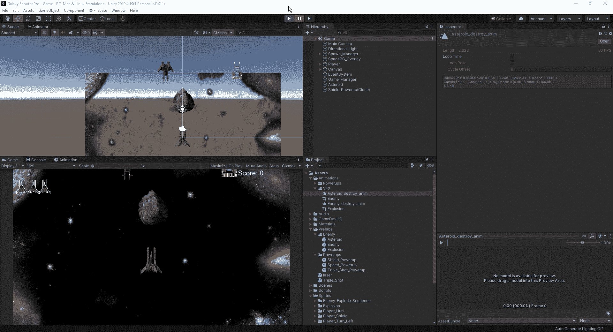

然而，现在的问题是，我们有一个爆炸克隆，它将只是坐在我们的层次结构中。拥有 1 并不太坏，但如果我们决定在游戏中拥有大量小行星，它会开始成为一个很大的资源使用，所以让我们为爆炸制作一个快速脚本，只需让它完成 1 个任务，摧毁物体。

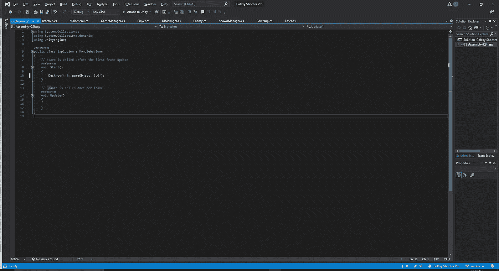

现在，让我们测试一下，看看爆炸是否会从我们的层次结构中消失:

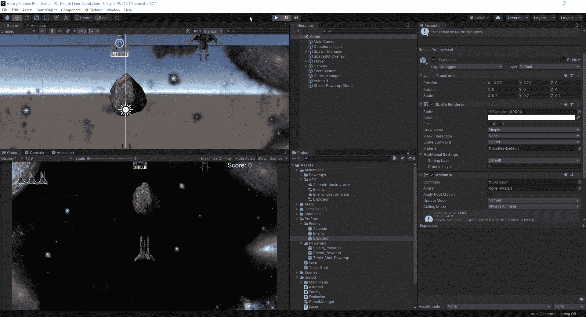

最后，让我们给这颗小行星更多的目的，让它在那里，这样我们就可以从它那里产生一波又一波的敌人。首先，让我们转到我们的产卵管理器脚本，把我们的产卵例程放入一个公共空间，这样我们就可以从我们的小行星脚本与它交互:

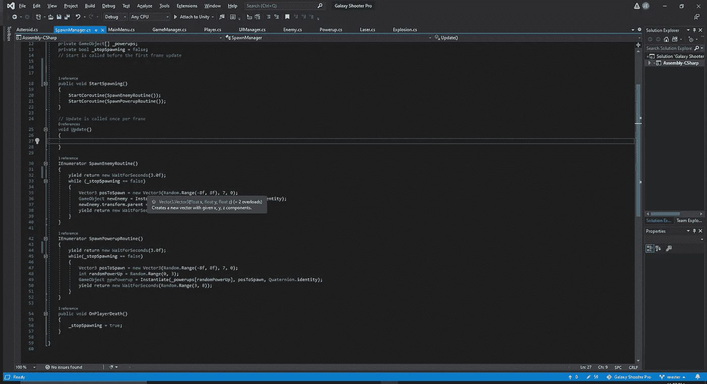

从这里，让我们回到我们的小行星脚本，并让它调用新的例程，当我们摧毁它。

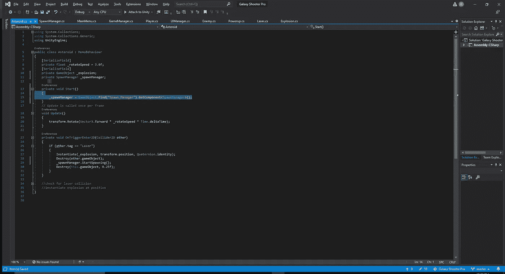

从这里，我们可以看到游戏中发生了什么:

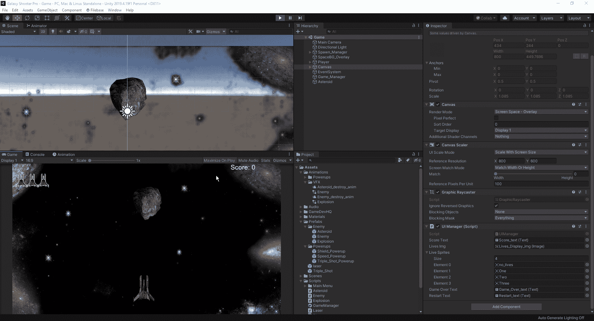

我们现在可以在小行星被摧毁的时候产卵，但是感觉不太好，所以让我们稍微放慢初始产卵速度:

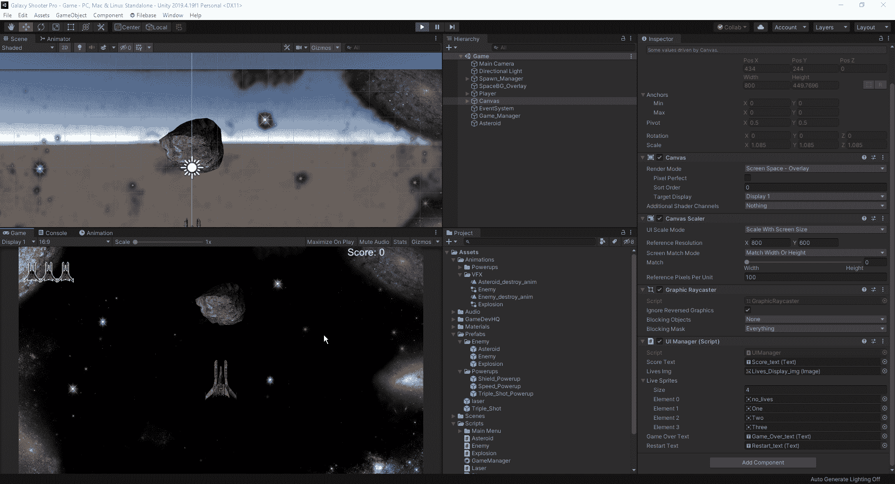

现在我们有了。我们现在已经创建了一个对象，附加了一个爆炸，并允许它成为我们生成例程的开始。接下来，我们将考虑给我们的播放器添加一些效果。