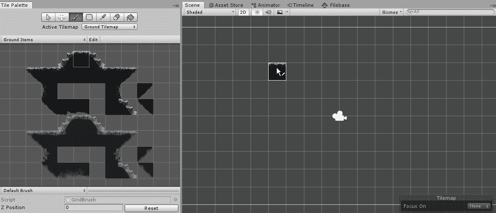
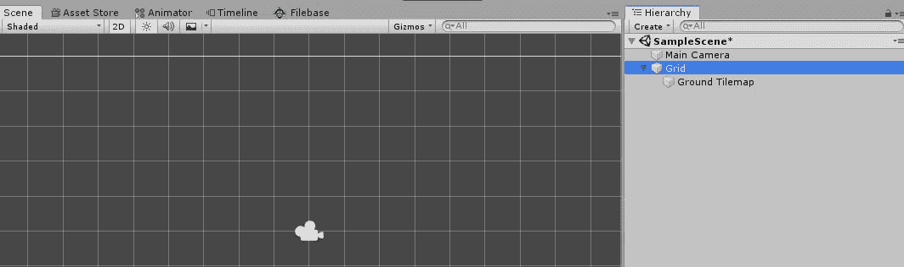
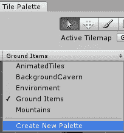
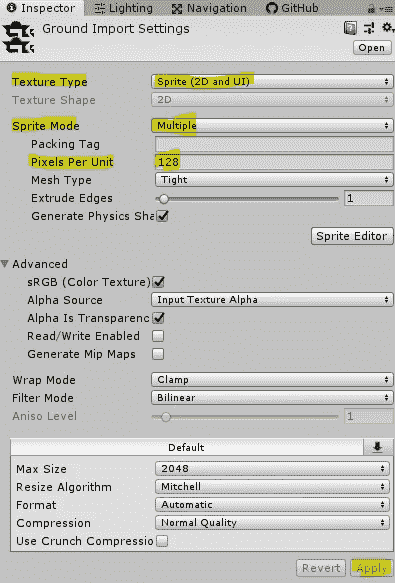
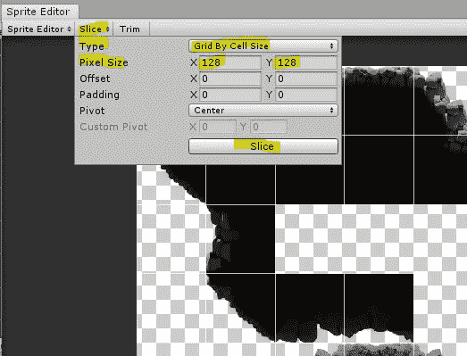
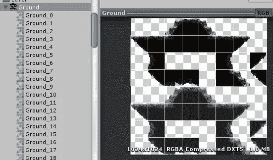
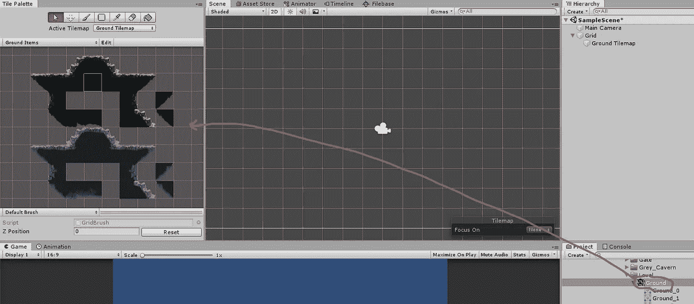

# 在 Unity 中创建瓷砖调色板

> 原文：<https://medium.com/nerd-for-tech/creating-a-tile-palette-in-unity-5610b6ac269f?source=collection_archive---------5----------------------->

**目的:**准备一个瓷砖调色板进行绘画。

使用平铺调色板可以轻松创建游戏区域。我们首先在我们的层次中创建一个新的 *Tilemap* 对象，方法是*创建→ 2D 对象→ Tilemap* 。这将创建一个*网格*对象和一个 *Tilemap* 。我们将把 tilemap 重命名为 *Ground Tilemap* 。

在*图块调色板*选项卡中，我们将选择*创建新调色板*并保存它。

接下来，我们将选择包含我们的图像的精灵资产。艺术家给了我们一个 1024 x 1024 像素的图像，并告诉我们每个图块应该是 128 x 128 像素。因此，我们将应用下面的设置，并单击*应用*。

接下来我们将点击*精灵编辑器。*在精灵编辑器中，我们将选择*切片*并使用下面的设置，然后点击*切片*。

这将创建单独的瓷砖精灵。

最后，我们将切片的 sprite 表拖动到 *Tile Palette* 选项卡，我们的 Tile 资产就创建好了。我们现在可以开始绘画了！

