# 用顶点人工智能 AutoML 建立时间序列预测模型

> 原文：<https://medium.com/nerd-for-tech/creating-a-time-series-forecasting-model-using-vertex-ai-automl-105fc50feea9?source=collection_archive---------3----------------------->

## 一个独特的无需编码的 ML 解决方案:Google 的 Vertex AI 是使用 AutoML 功能训练 ML 模型的最佳平台。由 [Vaishnavee Baskaran](https://www.linkedin.com/in/vaishnavee-baskaran-397495238)

由[劳拉·尼豪斯](https://unsplash.com/@lauraintacoma)在 [Unsplash](https://unsplash.com/?utm_source=unsplash&utm_medium=referral&utm_content=creditCopyText) 上拍摄的照片

谷歌云平台为所有人工智能解决方案带来了一个独特的平台。Vertex AI 将 AutoML 和 AI 平台整合到一个统一的 API、客户端库和用户界面中。在 Vertex AI 中，你可以使用 [AutoML](https://cloud.google.com/vertex-ai/docs/beginner/beginners-guide/) 或自定义代码训练来轻松训练和比较模型。

在这篇博客中，我们将看到如何使用 AutoML 构建简单的时间序列预测模型。此外，AutoML 允许您在图像、表格、文本和视频数据集上训练模型，而无需编写代码。

要免费试用 Vertex AI，请阅读 [Vertex AI 谷歌云](https://cloud.google.com/vertex-ai)，也可以查看谷歌的[教程视频](https://cloud.google.com/vertex-ai/docs/start/introduction-unified-platform)。

# **自动预测模型**

在 GCP，Vertex AI 是整个 ML 工作流的统一用户界面。为了训练和建立机器学习模型，第一步是选择合适的训练数据集并准备它们。从 GCP 产品中，在人工智能下，选择 Vertex AI 并进入仪表板 UI，如下图所示。

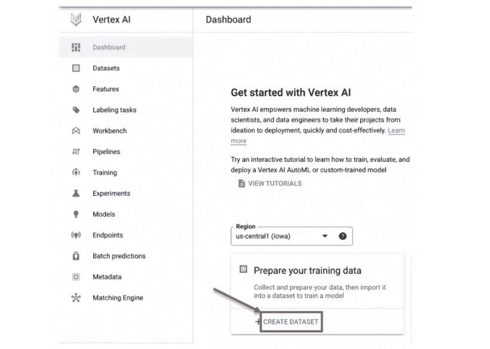

选择上面屏幕截图中突出显示的“创建数据集”,将数据源添加为训练数据集。您将被带到“创建数据集”页面，在这里您应该键入数据集名称。顶点人工智能是你需要的每一个人工智能工具的一个人工智能平台。它允许表格、图像、文本和视频格式构建全新的智能应用程序或现有应用程序，包括翻译和语音到文本转换。

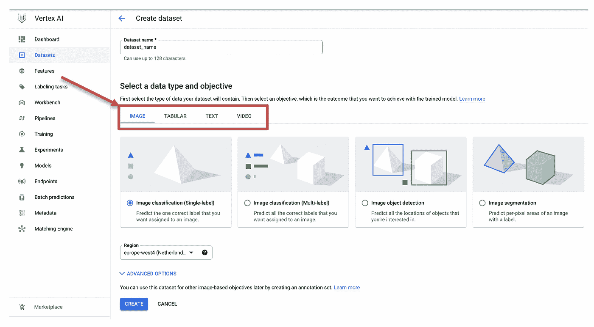

在这篇博客中，我们将介绍使用 AutoML 构建预测模型的步骤。因此，我们将选择“表格”来使用分类/回归和预测算法预测目标列值。单击“预测”为时间序列预测准备训练数据。

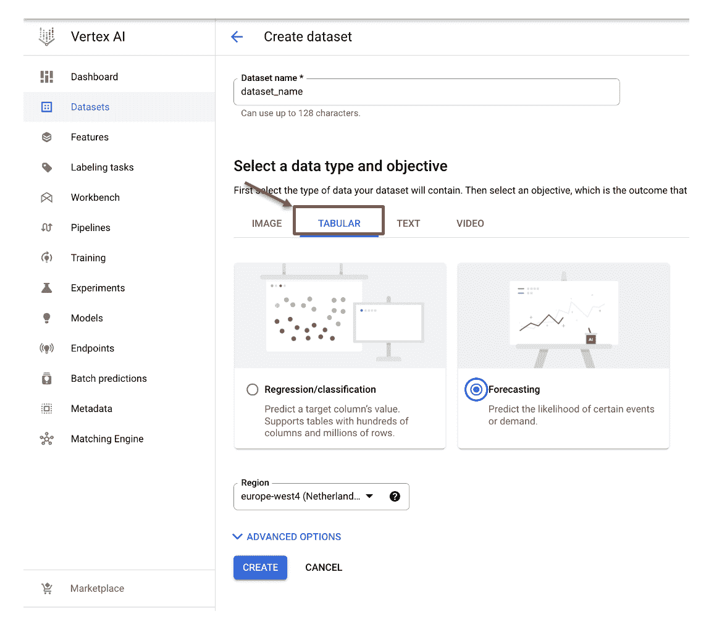

数据源可以从本地计算机/云存储/BigQuery 上传。我将从 BigQuery 上传该表作为我们模型的训练数据。

选择“从 BigQuery 中选择一个表或视图”，然后按照“projectId.datasetId.tableId”的格式在给定的 BigQuery 路径中给出表或视图路径。

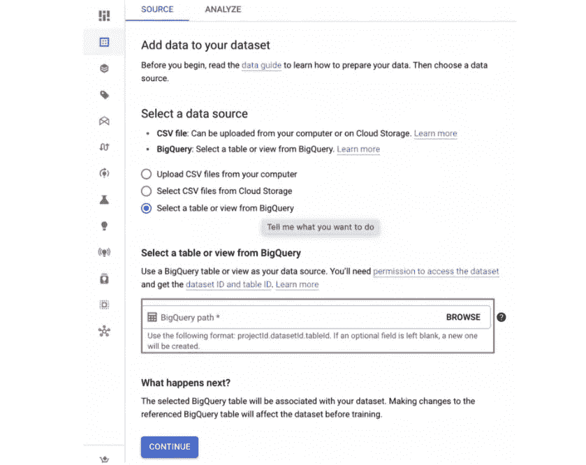

如下图所示，将要求您选择系列标识符列和时间戳列。序列标识符列是唯一标识时间序列中观察值的变量。例如，我们的表中的 product_id 列在一系列特定的时间段或时间间隔(我们的数据中有几个产品 id，也称为多个时间序列)中区分字段(其他产品 id ),时间戳列是表中的一个周期性字段。

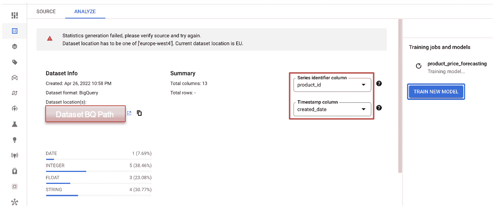

在您选择了上面突出显示的必填字段后，现在选择 Train New Model。如下图所示，数据集名为 product_price_forecasting，我选择了 AutoML 来训练我们的模型。我们还可以通过编写 DL 库(如 tf)、ML 库(如 sklearn)和 boosting 算法(我们将在时间序列预测博客系列的后续博客中看到)来创建自定义训练。

谷歌增加了一种新的模型训练方法，称为 Seq2Seq+，意思是序列对序列。该模型采用项目序列并输出项目序列，简单地作为使用深度学习算法的编码器和解码器。我们很快也会在我们的系列博客中看到这种类型的培训模式。

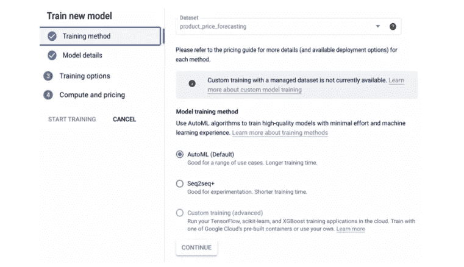

选择 AutoML 并单击 Continue 后，您将被导航到模型详细信息页面，如下图所示，您应该为该模型指定一个合适的名称。

# **预测配置**

*目标列* —需要预测的值。

例如:价格栏

*数据粒度* —时间戳列中每个条目之间的时间间隔。

例如:monthly 表示我们表中的时间戳列有按月的条目。

*假期区域* —选择您的培训数据的相应假期区域。

例如:EMEA(欧洲)

*预测范围* —在给定数据的最近时间戳之后，模型预测的未来时间步数。

例如:在我们的例子中，我将粒度设为每月。因此，预测范围 7 意味着我们的模型预测未来 7 个月的产品价格。

*上下文窗口* —是预测范围值的 0 到 5 倍。因此，在我们的例子中，我们可以给出一个从 0 到 35 的值。

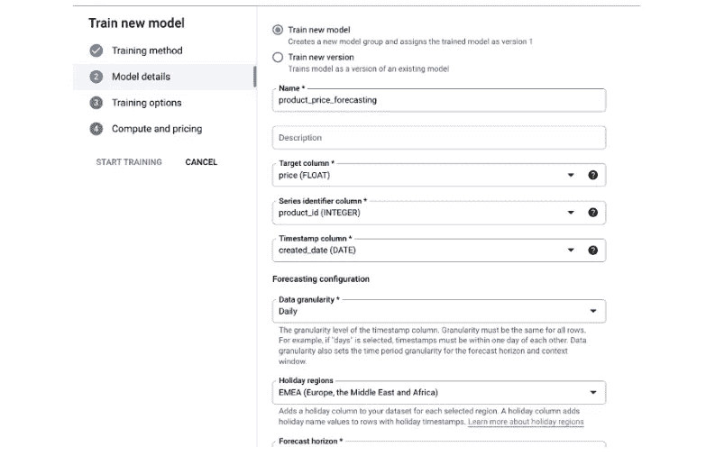

您还可以通过给出 BigQuery 的适当目标路径，将您的测试数据集导出到您的 BigQuery 项目中。点击继续后，时间戳列、目标列和系列标识符列将自动给出所需的 ***特征类型*** 和 ***，在预测*** 选项中可用。对于其余的列，我们需要指定**特性类型**，以了解该特性如何与其时间序列相关，以及它在预测时间是否可用。了解关于[功能类型和可用性](https://cloud.google.com/vertex-ai/docs/datasets/data-types-tabular#feature-type)的更多信息。

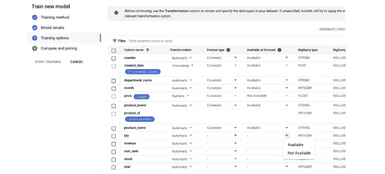

生成统计数据需要一段时间，完成后，您应该继续下一步“计算和定价”。如推荐。节点时间是根据数据集中的行数计算的。

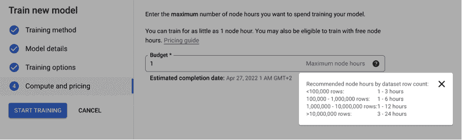

我们休息一下吧！因为这需要几个小时，你也可以看看我们的另一个博客'[BiqQuery ML 介绍](https://datadice.medium.com/introduction-of-bigquery-ml-92ddff190cb0)'。

现在我们的模型已经训练成功了。转到顶点人工智能中的模型，并选择您的模型的名称来评估它。

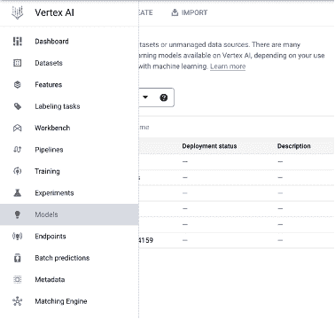

在下面的截图中，你可以看到我们的训练模型的评估结果。每一列的特征重要性通过条形图可视化，并且自动计算诸如 MAE、MAPE 和 RMSE 之类的评估指标。

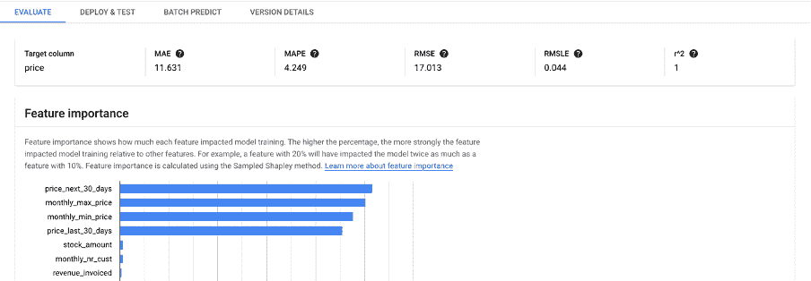

下一步是批量预测。选择批预测，并通过以给定格式给出 BigQuery 的源和目标路径来创建新的批预测。

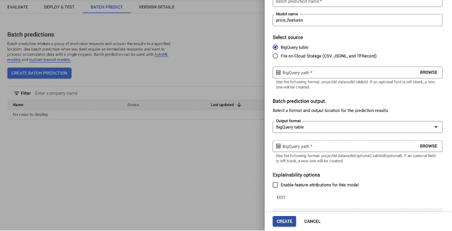

喝杯咖啡休息一下！！！

批量预测完成后，您将在 Gmail 帐户中收到一封自动生成的邮件，就像您在模型培训中收到的邮件一样。

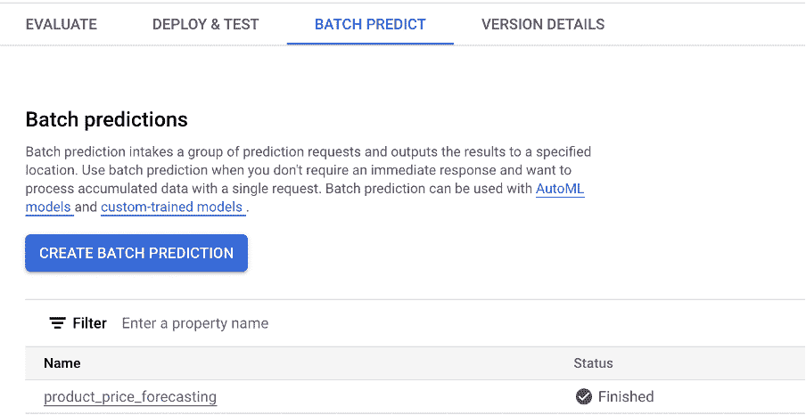

选择完成的批处理预测模型，并转到 BigQuery 的导出位置。您将在 BigQuery 路径中的指定目标中看到预测结果，其名称以“prediction — — —”开头。如果打开该表，可以看到三列，如预测价格值、预测价格下限和预测价格上限，如下图所示。

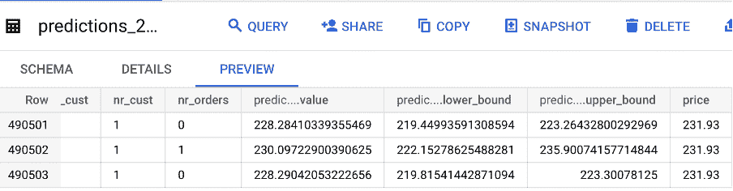

与实际价格相比，该模型预测的结果相当不错。现在我们的下一步是在 Google Looker Studio(以前称为 Google Data Studio)中可视化预测的预测价格值。在 BigQuery 中，转到批预测导出位置并选择导出。您将看到如下图所示的选项。

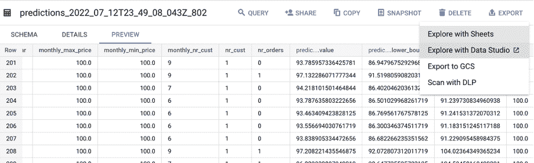

选择使用 Looker Studio(以前称为 Google Data Studio)进行探索，并添加时间序列图表来可视化训练模型的预测结果。

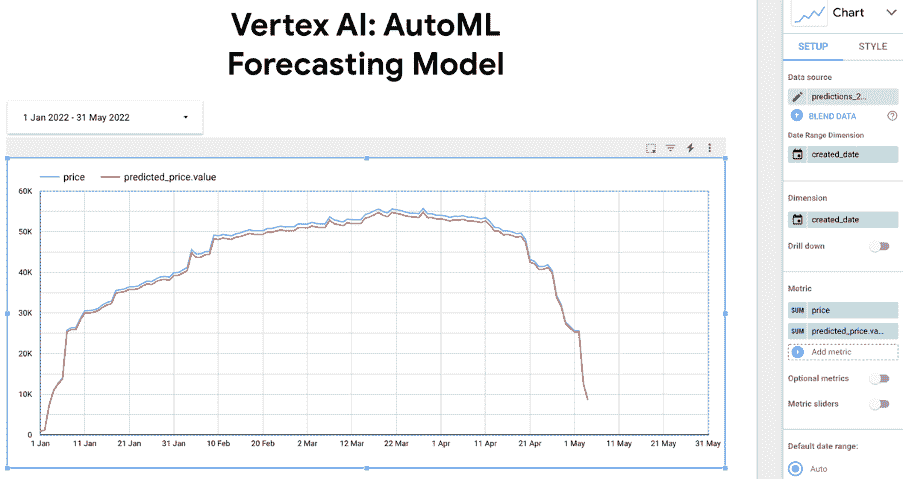

# 结论

Vertex AI 是一种简化的非编码高速解决方案，用于存储和组织具有不太复杂的输入数据的机器学习任务。数据集可以直接从云数据仓库 BigQuery 中使用，我们甚至可以直接在复杂的 BigQueryML 中运行 AutoML 脚本。在本系列即将发布的博客文章中，我们将看到 BigQueryML 令人惊叹的特性以及如何使用标准 SQL 查询构建 ML 模型。

# 本月即将发布的 datadice 博客文章

*   [使用 BigQuery 中的嵌套和重复字段](/nerd-for-tech/working-with-nested-and-repeated-fields-in-bigquery-2eccc2641ee2?source=your_stories_page-------------------------------------)
*   [谷歌数据分析的最新更新(2022 年 10 月)](/geekculture/latest-updates-on-google-data-analytics-october-2022-54b82047112a?source=your_stories_page-------------------------------------)

# 更多链接

这篇文章是来自 [datadice](https://www.datadice.io/) 的数据分析系列的一部分，启发 GCP 人工智能使用谷歌云服务建立 ML 模型和展开数据处理、操纵和可视化技术。

查看我们的 [LinkedIn](https://www.linkedin.com/company/datadice) 账户，深入了解我们的日常工作生活，并获得关于 BigQuery、Looker Studio 和营销分析的重要更新

我们也从我们自己的 YouTube 频道开始。我们谈论重要的 DWH，BigQuery，Looker Studio，以及更多的话题。点击查看频道[。](https://www.youtube.com/channel/UCpyCm0Pb2fqu5XnaiflrWDg)

如果你想了解更多关于如何使用 Google Looker Studio 并结合 BigQuery 更上一层楼，请查看我们的 Udemy 课程[这里](https://www.udemy.com/course/bigquery-data-studio-grundlagen/)。

如果您正在寻求帮助，以建立一个现代化且经济高效的数据仓库或分析仪表板，请发送电子邮件至 hello@datadice.io，我们将安排一次通话。

*最初发布于*[*https://www . data dice . io*](https://www.datadice.io/forecasting-model-with-vertex-ai-automl)*。*