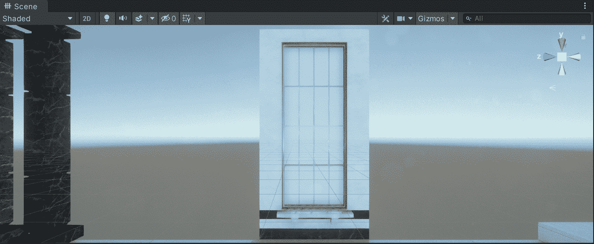
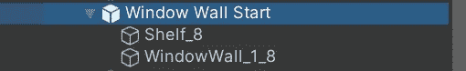
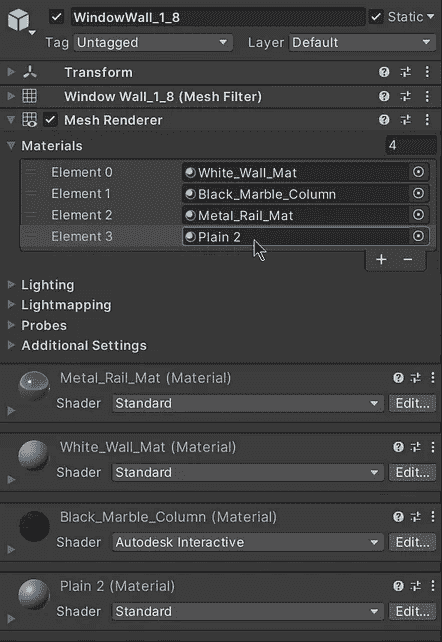
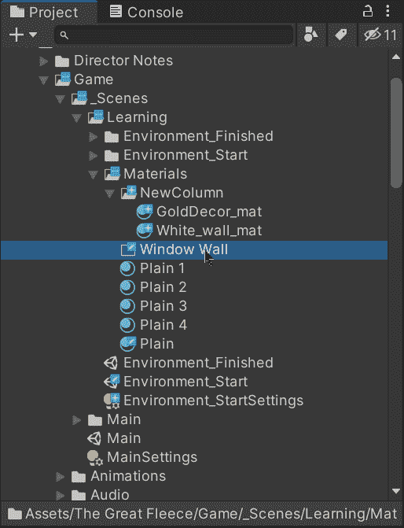
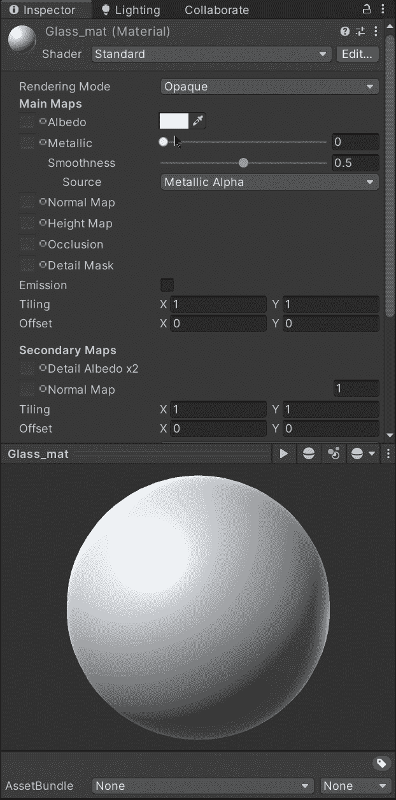
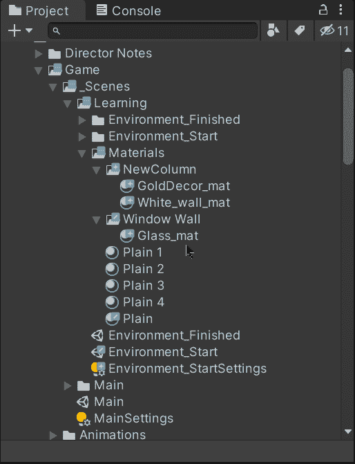
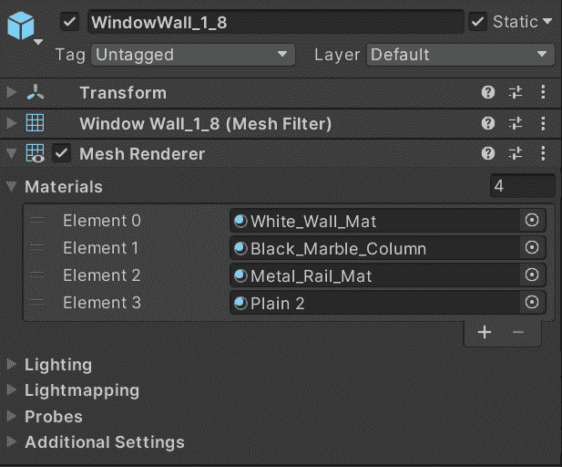
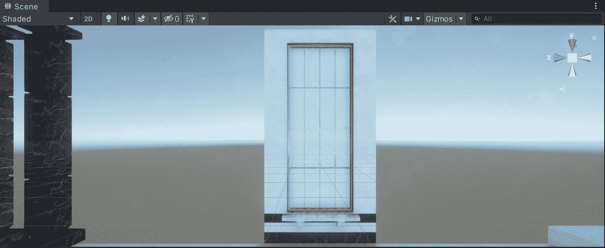

# 在 Unity 中创建透明窗口

> 原文：<https://medium.com/nerd-for-tech/creating-a-transparent-window-in-unity-b1379775165e?source=collection_archive---------8----------------------->

## 统一指南

## 如何在 Unity 中创建透明材质的快速指南

目标:创建一个透明材质，给游戏对象一个窗户的外观。

在上一篇文章中，我介绍了[如何用 Unity](/nerd-for-tech/closing-the-game-with-unity-5c02b9994886) 关闭游戏。现在，是时候实现一个透明材质，让游戏对象看起来像一个真实的窗口。

# 创建材料

为了给游戏对象一个窗口的外观，我们需要创建一个透明的材质来给我们需要的外观。在这个例子中，我们正在处理一个包含两个子窗口的窗口预置:

第二个子对象包含一个网格，它为窗轨、墙、墙线和窗户提供不同的材质。在这种情况下，我们已经为前三个定义了自定义材质:

因此，为了给窗户一个透明的外观，让我们创建一个新的材料来定制它:

现在，让我们选择材质，并在检查器窗口中自定义下一个属性:

*   渲染模式

为了在材质中使用透明度，我们需要将渲染模式改为 ***透明*** 。

*   星体反照率

要修改透明度值，我们需要改变反照率颜色的 alpha 值，它控制着材质表面的基本颜色。

*   平滑

该值决定了有多少光线在材质表面以均匀的方式反射。更平滑的材质会显示更清晰的反射。

现在，在自定义材质之后，让我们将它拖到网格渲染器的最后一个材质槽中，以更改窗口的外观:

就是这样，我们在 Unity 中实现了透明窗口！:d .下一篇文章再见，我将展示如何用 Unity 创建和实现一个 Skybox。

> *如果你想了解我更多，欢迎登陆*[***LinkedIn***](https://www.linkedin.com/in/fas444/)**或访问我的* [***网站***](http://fernandoalcasan.com/) *:D**