# 创建虚拟现实节日贺卡:a-frame 简介

> 原文：<https://medium.com/nerd-for-tech/creating-a-virtual-reality-holidays-card-an-introduction-to-a-frame-cf5a70dd1c34?source=collection_archive---------4----------------------->

## 节日特辑和 a-frame 简介

# 目标

我们正在度假，但由于疫情，我们被迫呆在家里。然而，今年，我决定开始一个新的传统:我创造了一个 VR 卡。虽然它远不是一个互动的地方，像绿洲或你选择的科幻宇宙，但这是一个很好的方式来创造一些小东西与我的朋友和家人分享。

在这一课中，我将介绍 a-frame 的基础知识，仅使用原始类型(和文本)创建一个简单的浏览器内假日“冬季仙境”卡片。在这里，你将学习如何创建一个天空，如何创建基本的三维形状，如何从网上制作图像形状的背景，最后，如何添加文本。

# 第一步:设置

首先，我们需要在 HTML 中添加一个框架。我在 [Repl.it](https://repl.it/) 上创建了这个项目，以便轻松发送给我的朋友和家人。接下来，我通过添加以下脚本标记将 aframe 导入到 HTML 中:

```
<script src="https://aframe.io/releases/1.1.0/aframe.min.js"></script>
```

接下来，在主体中添加标签<a-scene>。这是我将添加所有 VR 相关代码的地方。我删除了 style.css 和 index.js 这张卡片完全是用 HTML 创建的。现在，在`index.html`中，完整的代码应该是:</a-scene>

```
<!DOCTYPE html>
<html>
<head>
<meta charset="utf-8">
<meta name="viewport" content="width=device-width">
<title>Holiday Card</title>
<script src="https://aframe.io/releases/1.1.0/aframe.min.js"></script>
</head>
<body>
<a-scene>
<!--All the code will be here-->
</a-scene>
</body>
</html>
```

运行时，我们的结果应该是一个空屏幕，右下角有一个“VR”按钮。如果您可以看到该按钮，那么恭喜您:您已经成功导入了一个框架！

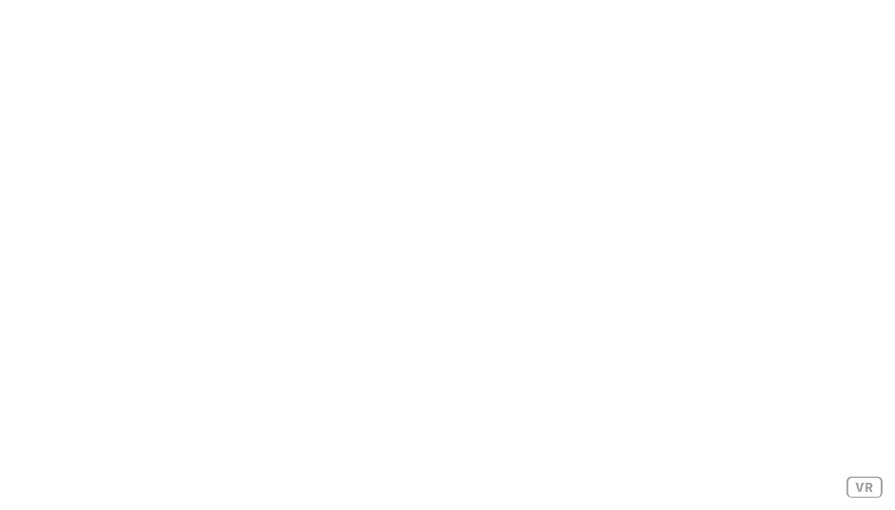

导入 A 帧后的卡片

# 第二步:添加天空

首先，我们需要添加一个背景颜色。经过大量的搜索和调整，我最终选择了浅蓝色的背景，#CCC6E8。在`<a-frame>`标签之间，添加天空标签:

```
<a-sky color = "#CCC6E8"></a-sky>
```

运行代码时，结果应该如下:

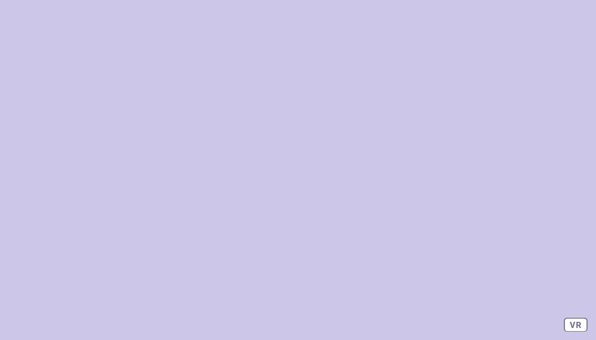

有天空的卡片

# 第三步:添加底座

接下来，我创建了冬季仙境场景的基础。我从一个`<a-box>`开始，试验 xyz 坐标和维度，直到它完美为止。对于位置，x、y 和 z 坐标由空格分隔。我的最终结果如下:

```
<a-box height="25" width="200" depth="100" position = "0 -16 -10"></a-box>
```

接下来，我想添加一个雪的纹理。为此，我在网上搜索并找到了一张我喜欢的雪的图片，然后我将属性添加为 src。这个链接太长了，所以我不把它加到博客上。您可以查看参考资料中的 Repl 来找到我使用的链接。

```
<a-box src="YOUR_LINK_HERE" height="25" width="200" depth="100" position = "0 -16 -10"></a-box>
```

如果你添加了和我一样的图片，卡片看起来会像下面这样:


带底座的卡片

# 第四步:制作一个圣诞支柱

最后我开始做得相当简单:一个圣诞主题的柱子。这需要两种形状:一个圆柱体和顶部的灯，我做了一个十二面体。

首先，我调整圆柱体的尺寸，直到我满意为止。由于这是一个圆柱体，需要考虑的尺寸是半径和高度(以及位置)。请注意，用户从 0，0，0 的位置开始，因此 z 方向应为负，以使组件可见。接下来，我在网上搜索，发现这张照片是糖果棒底座的包装纸。这是圆柱体的结果:

```
<a-cylinder src="https://thumbs.dreamstime.com/b/red-white-stripe-pattern-seamless-line-background-christmas-gift-wrap-fabric-textile-tile-wallpaper-163538152.jpg" radius = "0.5" height="10" position = "0 2 -10" ></a-cylinder>
```

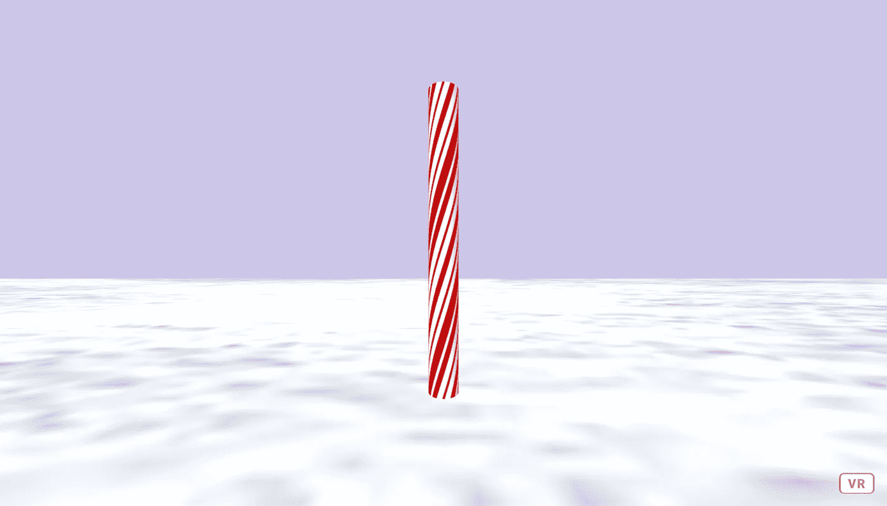

圆筒卡

接下来，我想在圆柱体的顶部添加一盏灯。为此，我使用了十二面体。我决定把它做成浅蓝色，然后我把它移到圆柱体的顶部。

```
<a-dodecahedron radius = "1" position = "0 7 -10" color = "#86A9E1"></a-dodecahedron>
```

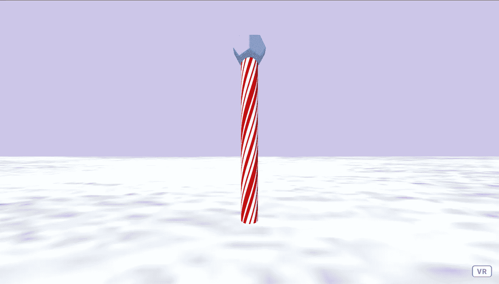

全圣诞支柱中心

最后，我决定要两根柱子，一根在左边，一根在右边，这样我就可以创造一个不同的中心装饰品。为此，我将 x 位置更改为 8 和-8，结果如下:

```
<!--*Christmas Left Pillar*-->
<a-cylinder src="https://thumbs.dreamstime.com/b/red-white-stripe-pattern-seamless-line-background-christmas-gift-wrap-fabric-textile-tile-wallpaper-163538152.jpg" radius = "0.5" height="10" position = "-8 2 -10" ></a-cylinder>
<a-dodecahedron radius = "1" position = "-8 7 -10" color = "#86A9E1"></a-dodecahedron><!--*Christmas Right Pillar*-->
<a-cylinder src="https://thumbs.dreamstime.com/b/red-white-stripe-pattern-seamless-line-background-christmas-gift-wrap-fabric-textile-tile-wallpaper-163538152.jpg" radius = "0.5" height="10" position = "8 2 -10" ></a-cylinder>
<a-dodecahedron radius = "1" position = "8 7 -10" color = "#86A9E1"></a-dodecahedron>
```

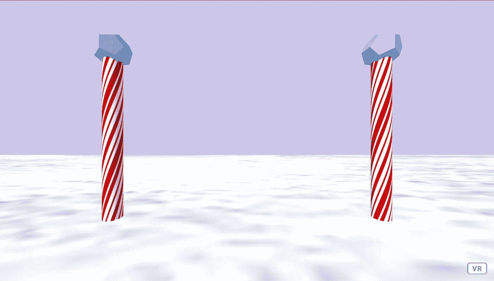

双柱卡片

# 第五步:雪人的底部

对于卡片的中心，我选择了一个雪人。首先，我需要创建一个基础。我的底座由三个半径逐渐增大的白色球体组成，如下图所示。

```
<a-sphere radius = "2" color = "white" position="0 -3 -8"></a-sphere>
<a-sphere radius = "1.5" color = "white" position="0 -1 -8"></a-sphere>
<a-sphere radius = "1" color = "white" position="0 1 -8"></a-sphere>
```

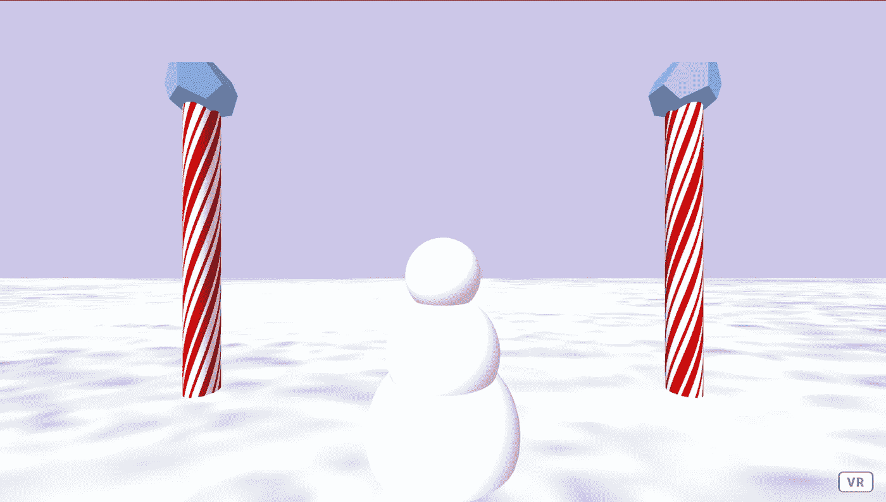

雪人的底部

# 第六步:雪人手

接下来，我为我的雪人添加了树枝手。为此，我创建了一个棕色圆柱体。然而，由于雪人的手不是上下的，我不得不添加旋转。旋转由 x、y 和 z 旋转角度组成。我创建了两只手:两只手都在 y 方向旋转了-90 度，但左手在 x 方向旋转了-135 度，右手在 x 方向旋转了-45 度。我调整了位置，减小了半径，增加了高度。

```
<a-cylinder color = "#804004" position = "-2 0 -8" rotation="-135 -90 0" radius="0.15" height = "2"></a-cylinder><a-cylinder color = "#804004" position = "2 0 -8" rotation="-45 -90 0" radius="0.15" height = "2"></a-cylinder>
```

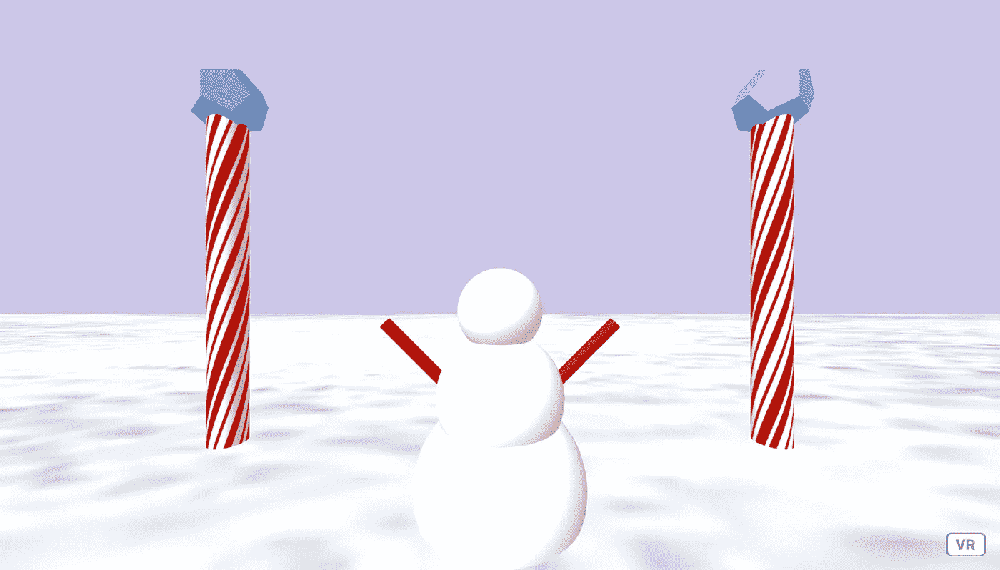

有手的雪人

# 步骤七:雪人帽子

接下来，我给我的雪人加了一顶帽子。这是由一个圆柱体加上一个圆环(一个甜甜圈形状的物体)组成的。这两个都是黑色的。对于圆环，我必须调整整个圆环的半径和圆环的管状部分的半径。调整位置后，我得到了以下结果:

```
<a-torus color = "black" radius-tubular="0.1" position = "0 1.7 -6" rotation="-90 0 0" radius="0.6"></a-torus>
<a-cylinder color = "black" position = "0 2.2 -6" radius="0.6"></a-cylinder>
```

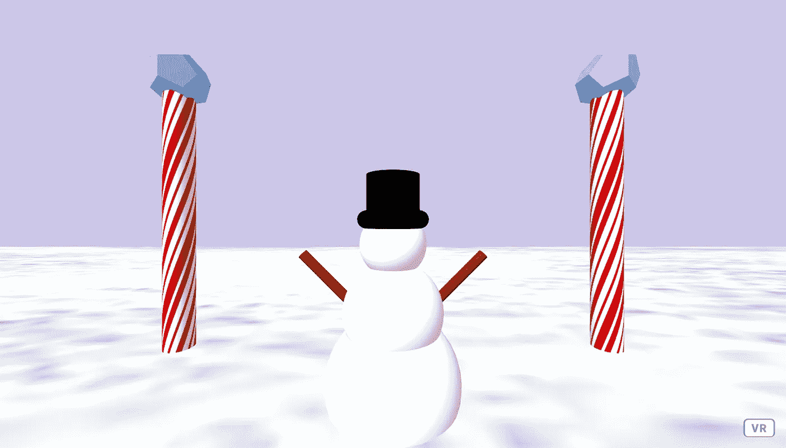

带帽子的雪人

# 第八步:雪人饰品

最后，在得到雪人的主要组件后，我添加了一个脸和按钮。首先，我添加了一个胡萝卜鼻子和一个圆锥体。对于圆锥，我不得不调整半径底部，使鼻子变窄。我把它做成橙色，并调整了高度、位置和旋转，使其适合雪人:

```
<a-cone color = "orange" position = "0 1 -6" radius-bottom="0.1" height = "0.75" rotation = "90 0 0"></a-cone>
```

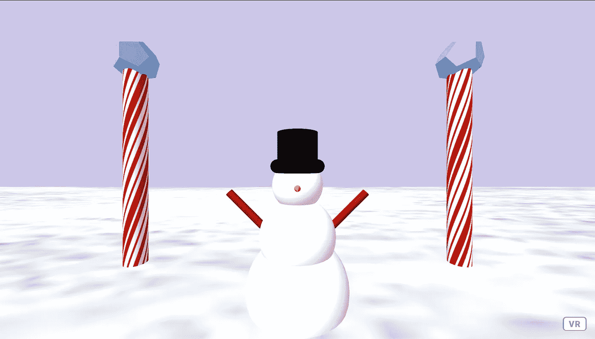

有鼻子的雪人

最后，我添加了眼睛、一张脸和带有 0.1 半径的黑色小球的按钮。

```
<!--*Snowman Eyes*-->
<a-sphere radius = "0.1" position = "-0.25 1.25 -6" color = "black"></a-sphere>
<a-sphere radius = "0.1" position = "0.25 1.25 -6" color = "black"></a-sphere><!--*Snowman Smile*-->
<a-sphere radius = "0.1" position = "-0.25 0.85 -6" color = "black"></a-sphere>
<a-sphere radius = "0.1" position = "0 0.8 -6" color = "black"></a-sphere>
<a-sphere radius = "0.1" position = "0.25 0.85 -6" color = "black"></a-sphere><!--*Snowman Buttons*-->
<a-sphere radius = "0.1" position = "0 -0.5 -6" color = "black"></a-sphere>
<a-sphere radius = "0.1" position = "0 -1 -6" color = "black"></a-sphere>
<a-sphere radius = "0.1" position = "0 0 -6" color = "black"></a-sphere>
```

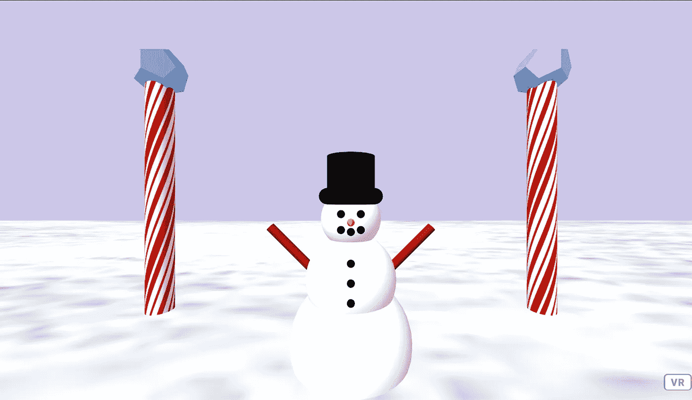

带配饰的雪人

# 第九步:信息

最后我用`a-entity`加了一条消息。为此，大小由`scale`决定，消息通过`text="value: ENTER_MESSAGE_HERE"`添加。我相应地调整了比例和位置，结果如下:

```
<a-entity scale = "10 10 5" text="value: Happy Holidays!" position="3.35 3 -3"></a-entity>
```

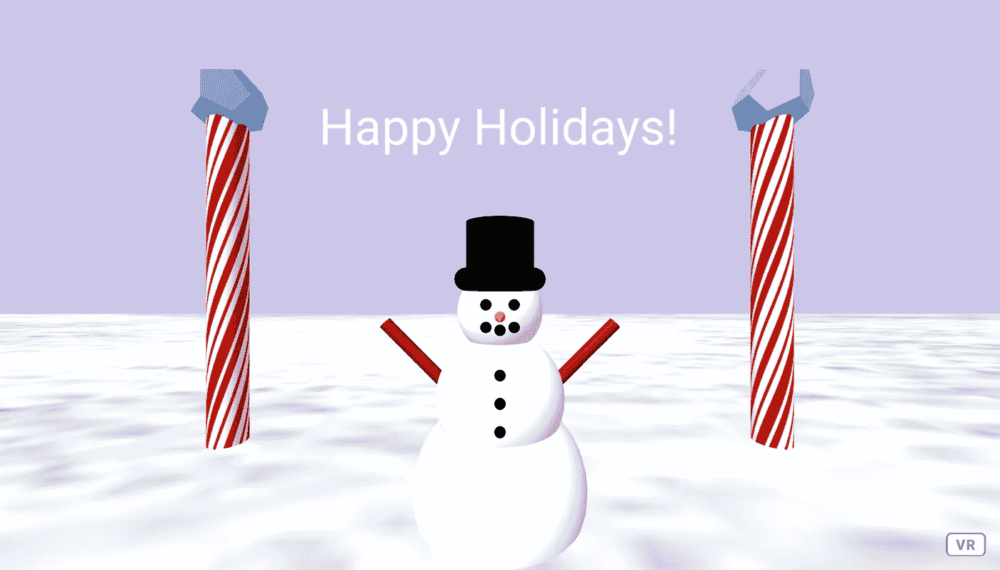

最后一张有文字的卡片

# 步骤十:后续步骤

如果你到了这一步，恭喜你！您刚刚制作了一张圣诞卡，与您的家人和朋友分享！现在，我要求你们在此基础上增加更多，包括礼物和圣诞树。既然这是 VR，如果你有 VR 眼镜，就在 VR-mode 下看看你的卡，做相应的调整。试着将这张卡片制作成你自己的，并为你添加节日的重要内容，并与你的朋友和家人分享！

# 资源

**注:除特别注明外，所有图片均为作者所有。**

一般资源

*   回复:[https://merrysquarecharacter.genericp3rson.repl.co/](https://merrysquarecharacter.genericp3rson.repl.co/)
*   a 字架文档:[https://aframe.io/docs/1.1.0/introduction/](https://aframe.io/docs/1.1.0/introduction/)

查看更多像这样的教程现场或随时讨论

*   领英:[https://www.linkedin.com/in/shreya-chaudhary-/](https://www.linkedin.com/in/shreya-chaudhary-/)
*   抽动:[https://www.twitch.tv/wisempowerment](https://www.twitch.tv/wisempowerment)
*   不和:[https://discord.gg/TMtnP8J](https://discord.gg/TMtnP8J)