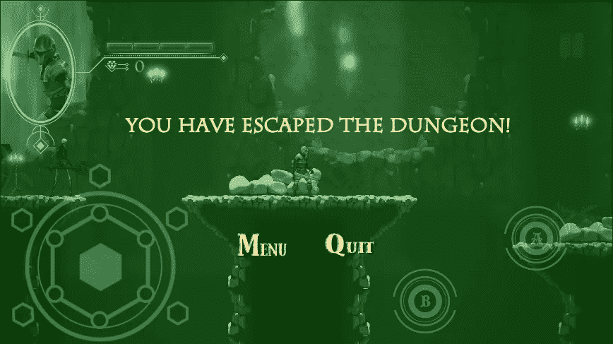
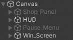
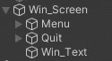
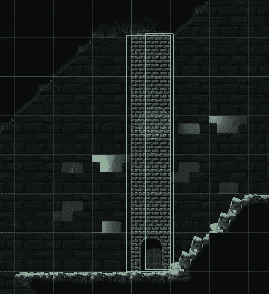
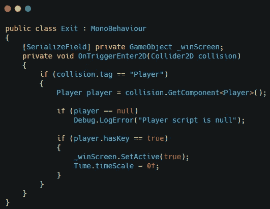
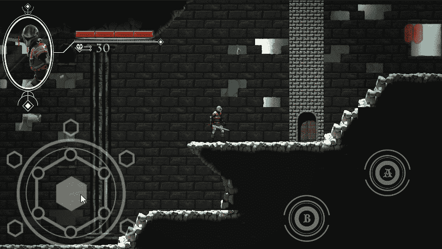

# 在 Unity 中创建一个 Win 屏幕

> 原文：<https://medium.com/nerd-for-tech/creating-a-win-screen-in-unity-da902fe540f3?source=collection_archive---------6----------------------->

我已经为我的游戏创建了胜利界面。

为此，我在画布下创建了一个新面板。

然后我从暂停菜单中复制了菜单和退出按钮，并将它们添加到 win 屏幕面板中。我还创建了获胜消息文本。

为了让屏幕出现，我在关卡末尾的大门上添加了一个 2D 碰撞器。这是一个触发器，如果玩家有钥匙，它将触发获胜屏幕。

这将允许玩家赢得游戏。

