# 在具有 3 个公共子网的定制 VPC 中部署 ASG 和 ALB，以使应用程序高度可用

> 原文：<https://medium.com/nerd-for-tech/creating-an-aws-autoscaling-group-with-a-custom-vpc-a49c43cc3613?source=collection_archive---------0----------------------->


让我们从一些有趣的事情开始

## 概述:

在本文中，我将创建一个 VPC 和 3 个公共子网来演示 ALB 和 ASG 的工作方式(2 分钟和 5 分钟，目标策略是 50%的 CPU 利用率)。然后，使用压力测试将对其中一个 CPU 施加压力以达到其利用率极限，这将启动另一个实例。


这是我们将通过这个项目实现的云中的架构


**步骤 1:创建 VPC**
为了使事情变得更加简单，使用“VPC 和更多选项”来创建 VPC &一次性添加子网。

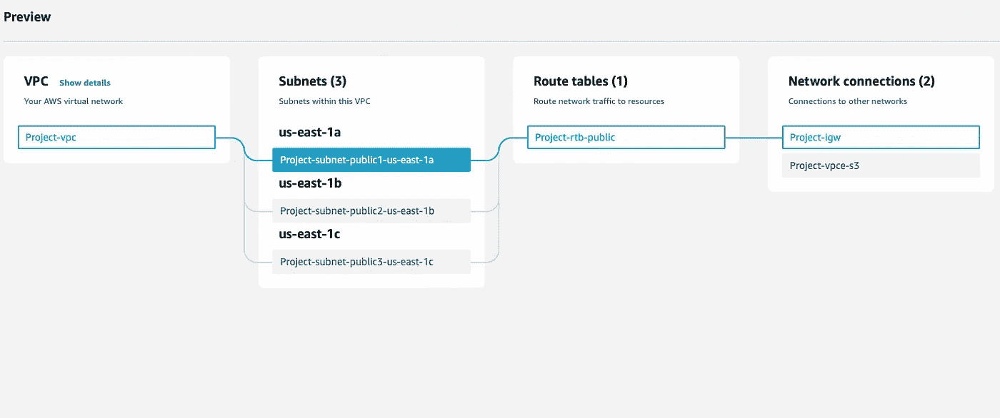

一起创建 VPC 和子网

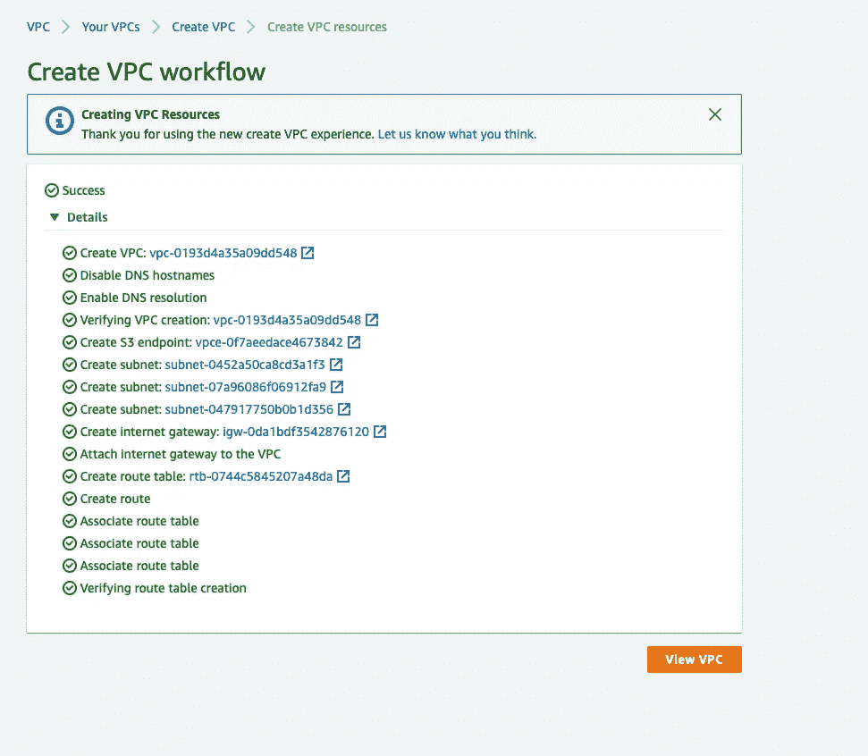

**步骤 2:创建启动模板** 使用 Apache 安装创建启动模板:转到 EC2 >启动模板>配置设置

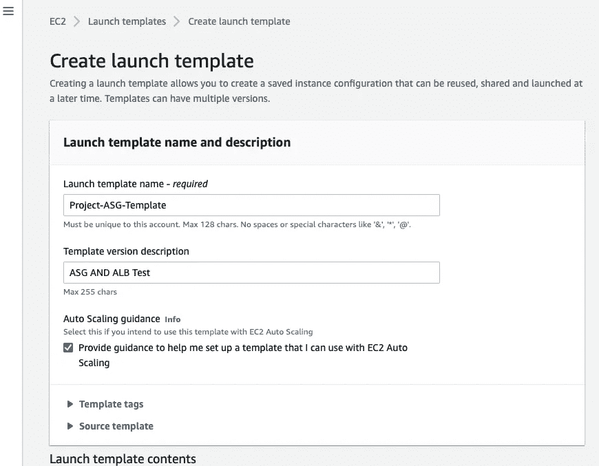

选择 AMI

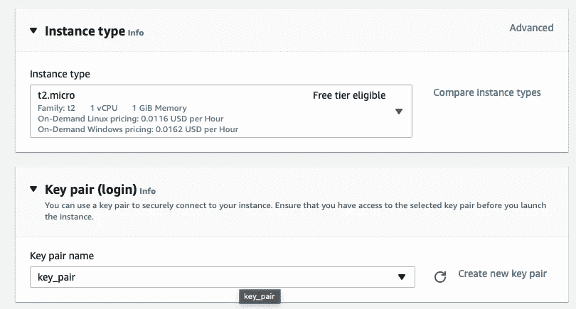

配置网络设置

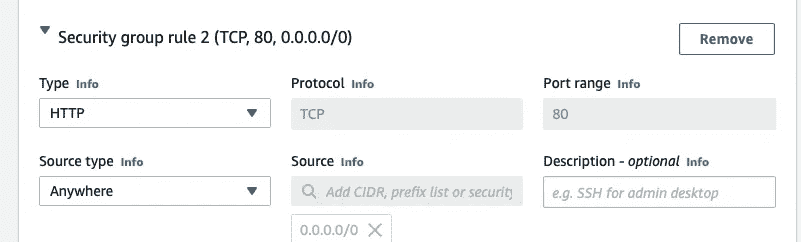

启用自动分配公共 IP

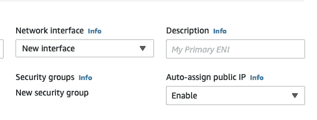

转到高级设置:启用监控并添加用户数据


```
#!/bin/bash
yum update -y
yum install httpd -y
systemctl start httpd
systemctl enable httpd
amazon-linux-extras install epel -y          *#extra package library* 
yum install stress -y                       #*Installs the stress pkg*
```

**第三步:使用上一步创建的启动模板创建一个自动缩放组** :**点击启动模板>选择启动模板>动作>创建自动缩放组**

**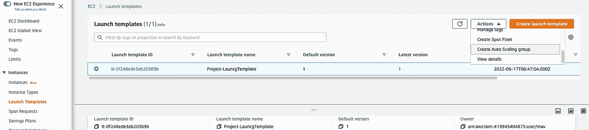**

**点击>配置您的 ASG 后**

**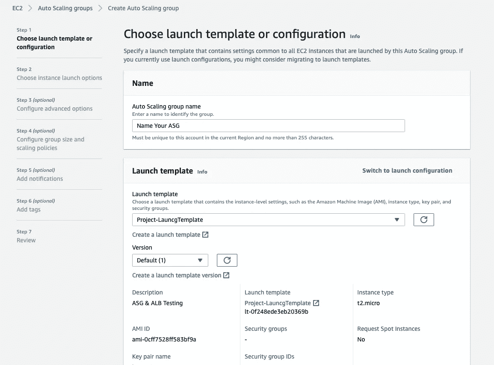****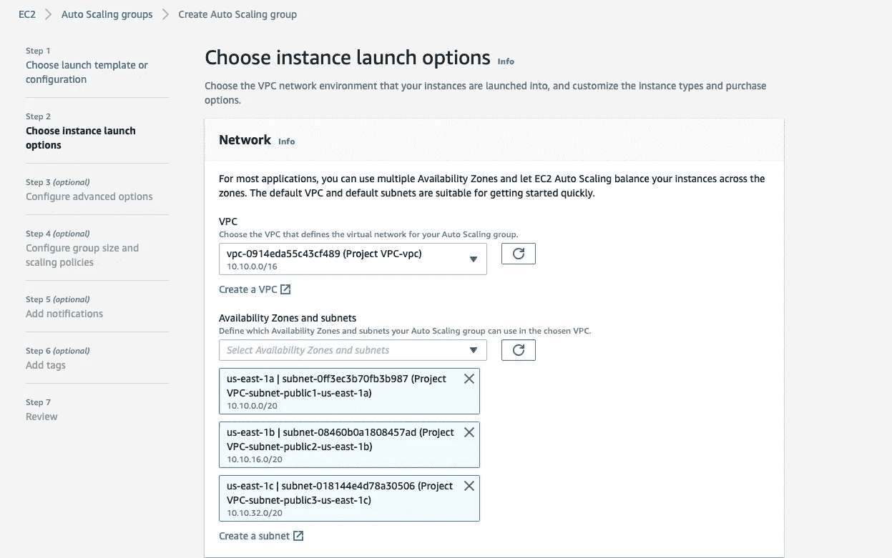**

**在下一步中，添加 ALB 并关联您的子网。**

**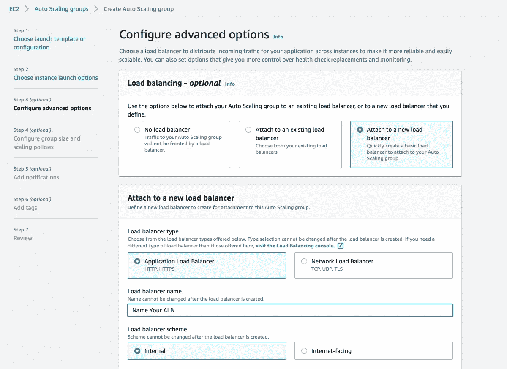**

**将最小和最大 CPU 分别增加到 2 和 5**

****

**在 CPU 利用率超过 50%后，将目标策略添加到扩展中**

**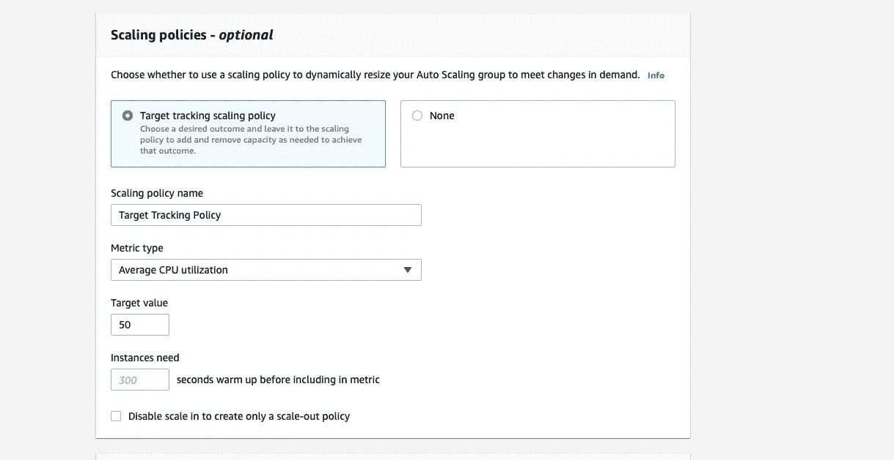**

**现在你已经完成了创建 ASG 和奥尔布。因此，实例将在 2 个 AZs 中启动，因为我们已经将最小值设置为 2。**

****步骤 4:测试运行实例 IP 以显示 apache 服务器**
只需复制已启动实例的公共 IP 并在浏览器中测试**

**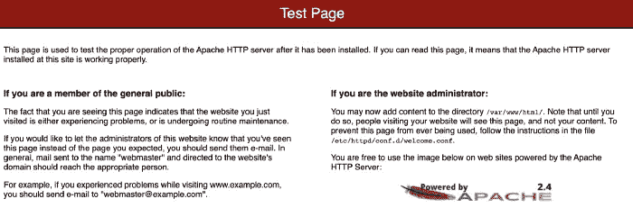**

****步骤 5:对我们的实例进行压力测试的时间**
我们已经通过启动模板中的用户数据安装了压力包。现在，我们将 ssh 到其中一个实例，并使用下面的命令运行压力测试。**

```
$ sudo stress — cpu 1 — timeout 300
```

**由于我的实例将需要 60 秒来预热(如 Auto Scaling 组中所配置的)，压力工具将需要对 CPU 施加足够的压力，以达到最大限度并触发目标跟踪策略中配置的 CloudWatch 警报。`--timeout`值代表压力测试的长度。压力测试将结束并产生以下结果:**

**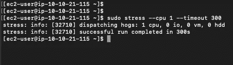****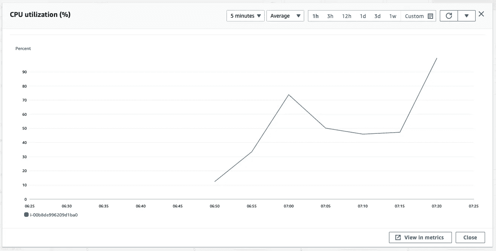**

**显示 CPU 利用率超过 50%的云观察指标**

**因此，将启动一个新实例。**

**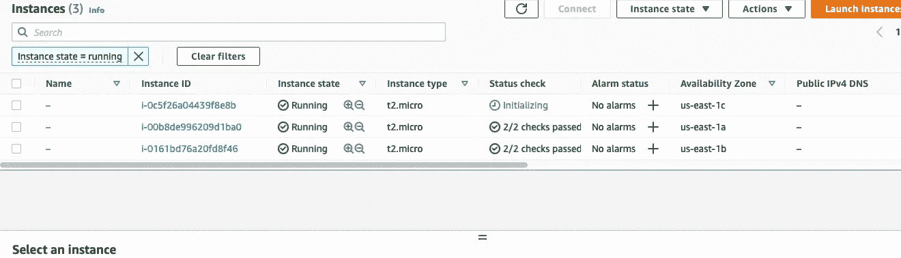**

**实现的目标**

****第五步:清理** 请清理你的资源以避免收费。**

**— — — — — — — — — — — — — — — — — — — — — — — — — — — — — —**

****感谢通过！鼓掌并跟随:如果我的文章内容丰富。继续推！！****