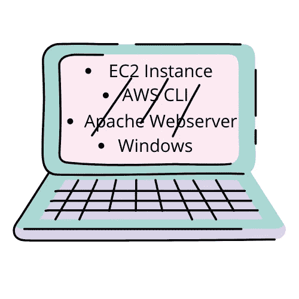

# 在 Windows AWS CLI 中使用 Apache Webserver 创建 EC2 实例

> 原文：<https://medium.com/nerd-for-tech/creating-an-ec2-instance-with-an-apache-webserver-in-windows-aws-cli-83bdee6e90ea?source=collection_archive---------0----------------------->

利用 AWS CLI 启动 EC2 实例的先决条件是:

*   Windows Powershell 以管理员身份打开
*   IAM 用户的 AWS 帐户
*   适当的 IAM 权限
*   Vim 文本编辑器已安装
*   AWS CLI 已安装