# 在 Unity 中创建电梯

> 原文：<https://medium.com/nerd-for-tech/creating-an-elevator-in-unity-790986d7d31?source=collection_archive---------10----------------------->

现在我们已经设置好了游戏的基础，让我们来看看如何在游戏中添加一些更高级的功能。首先，我们将着眼于创建一个电梯系统，玩家可以使用它来达到无法达到的高度。我们首先要做的是让我们的玩家能够与面板互动，以呼叫电梯下降:

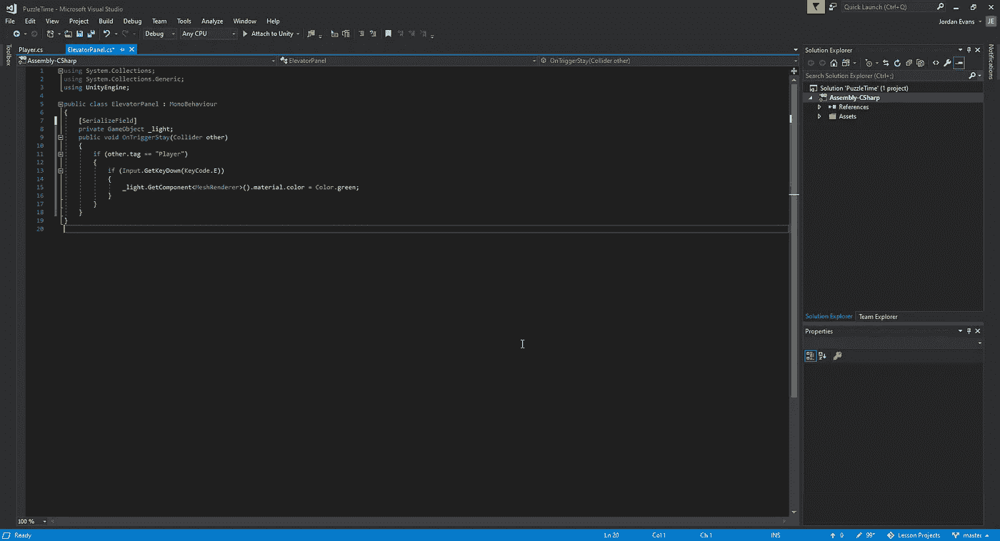

对于这种情况，我们需要使用 OnTriggerStay，这样我们就可以在触发区内调用它。接下来，我们将告诉 Unity，当我们按下“e”按钮时，我们希望按钮的材料颜色变为绿色:

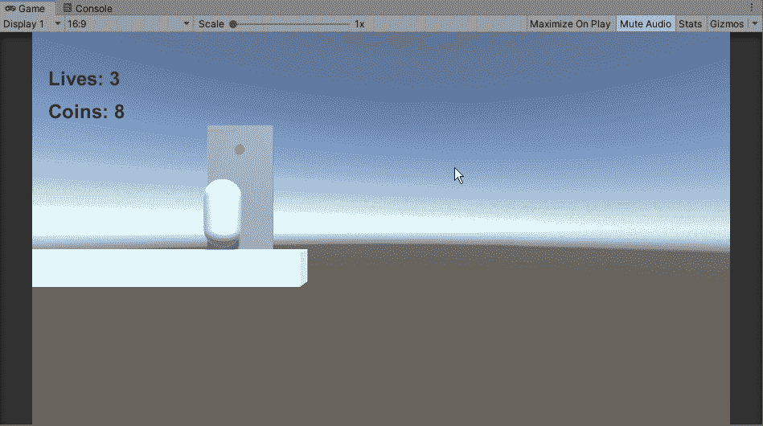

现在我们的按钮改变了颜色，让我们设置它，这样当我们收集到所需数量的硬币时，我们就可以激活按钮。我们要做的是创建逻辑，让电梯知道在我们操作它之前我们想要它有多少硬币。在这种情况下，我们将把它设置为一种模块化方法，这样我们就可以调整我们安装的每个不同电梯系统的值:

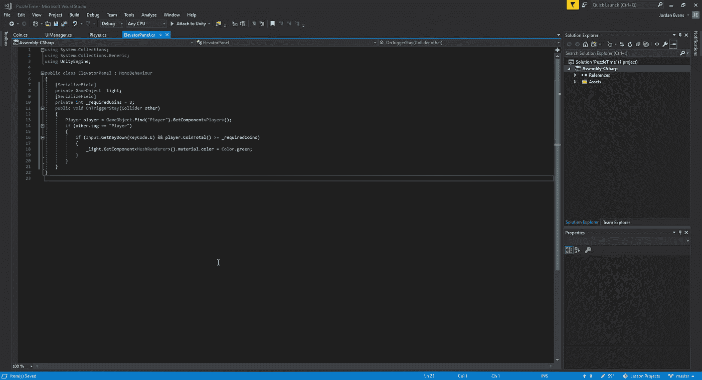

为了能够知道玩家有多少硬币，我们需要创建一个新的变量，让我们能够设置电梯需要多少硬币。为了知道玩家有多少硬币，我们需要创建一个到脚本的链接，并通过一个公共 int:

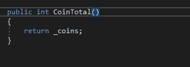

至于我们如何确定值，我们可以在我们的播放器脚本中设置一个简单的返回方法。现在，我们已经准备好了，让我们看看它在游戏中是如何操作的:

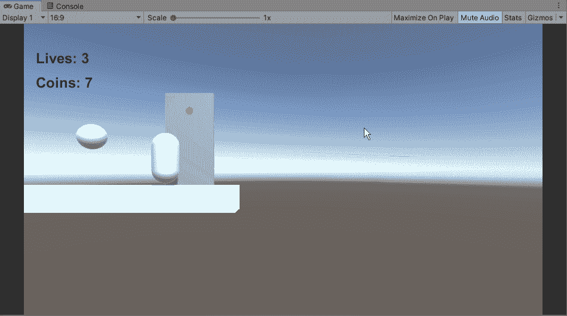

现在我们的面板工作了，让我们看看如何创建逻辑来允许电梯下降到玩家，这样我们就可以进一步前进。首先，我们需要为电梯创建一个脚本，并将其连接到我们的呼叫按钮:

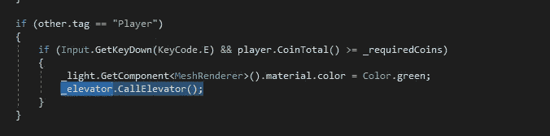

一旦我们创建了这个连接，我们就可以进入我们的新脚本，创建呼叫电梯所需的逻辑。然而，问题变成了，一旦我们启动电梯，我们是希望它不断地在我们身上自由地上下移动，还是希望它只在我们让它移动的时候才移动。
如果我们想让它自由地上下移动，我们可以使用下面的代码:

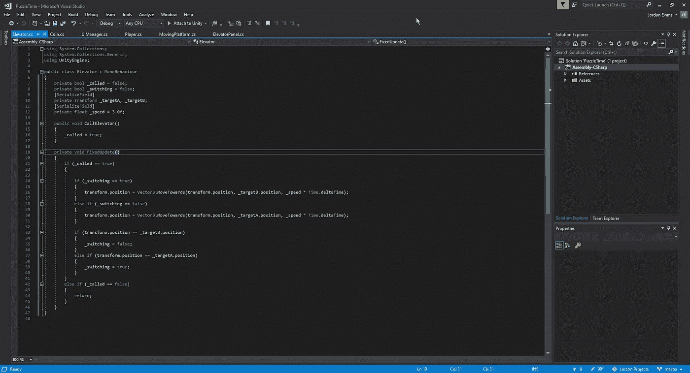

这样，我们实际上是在重复移动平台的过程，但在我们允许它自由移动之前，我们需要确保首先调用我们的 CallElevator 方法，以允许我们的电梯自由移动:

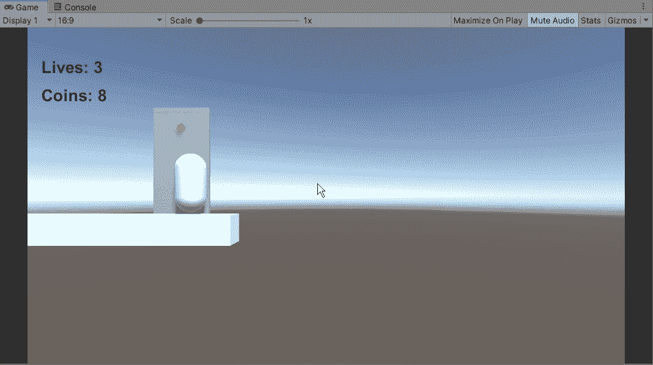

现在我们已经设置了这个方法，让我们来看看我们将如何去做，这样一旦我们上了电梯，我们就必须点击' e '来向上移动。我们为此需要的脚本将略有不同，因为我们可以为该流程创建更少的步骤:

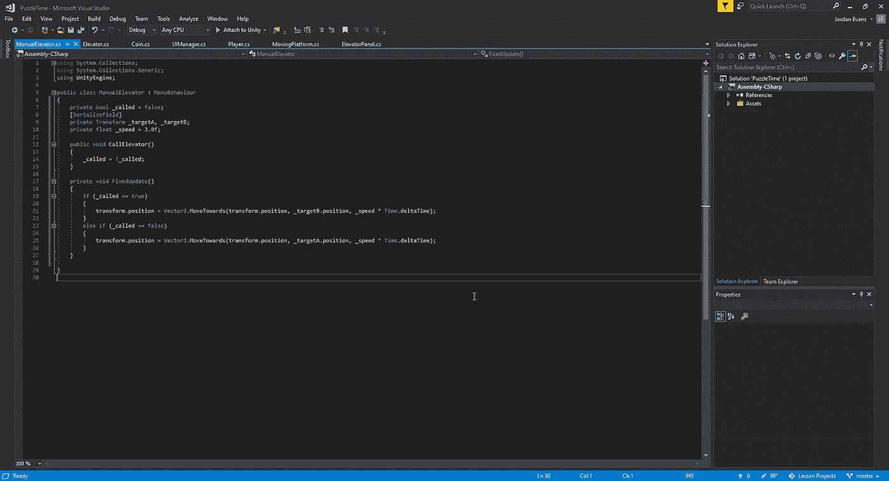

我们在这里所做的是在每次调用 bool 语句的时候打开和关闭它。这个方法只用了一行代码，而不是输入一个巨大的来回切换语句。接下来，我们只是简单地告诉 Unity 我们想要根据语句到达哪个目标。
接下来，我们需要在我们的面板脚本中做一些调整:

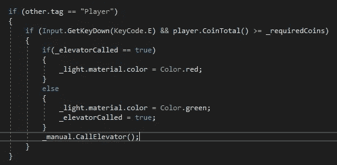

当我们呼叫电梯上升或下降时，为了给游戏一个小的视觉更新，我们将在绿色和红色之间切换我们的灯。除此之外，我们只是在每次按下“e”按钮时调用我们的电梯方法:

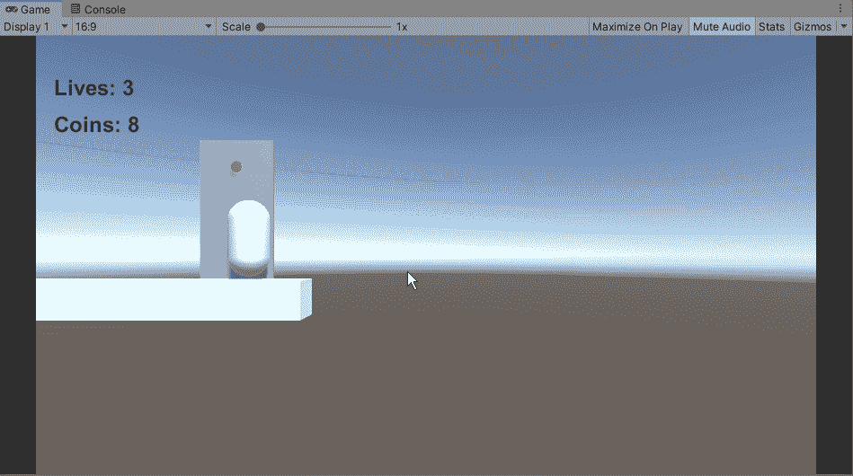

当我们乘电梯上升时，我们可以注意到轻微的晃动。要解决这个问题，我们只需像以前一样使用移动平台进行养育过程:

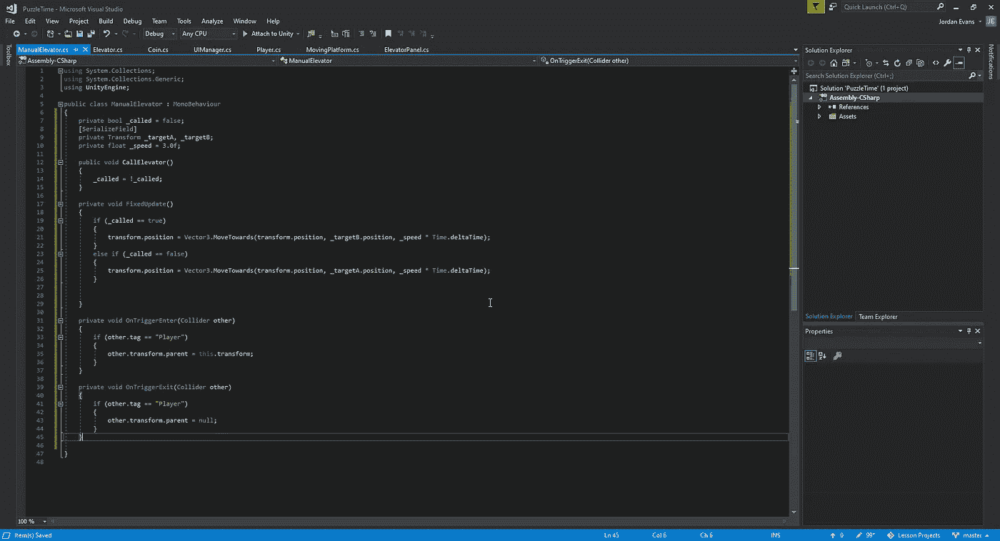

完成后，我们的电梯上增加了一个盒子碰撞器，我们可以看到玩家是否平稳地向上滑行:

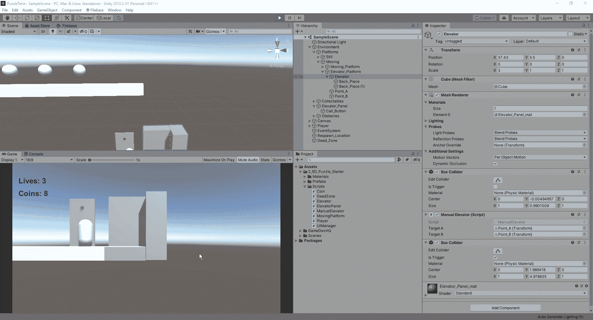

我们有了它，我们现在有了一个可以工作的电梯，并且研究了两种不同的方法让它移动。接下来，我们将看看如何创建一个跳墙机制。