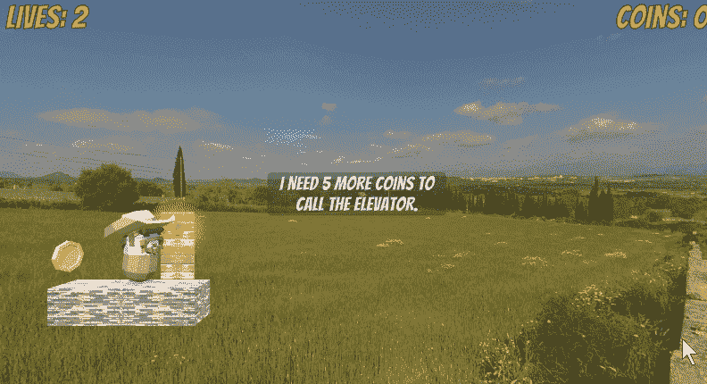
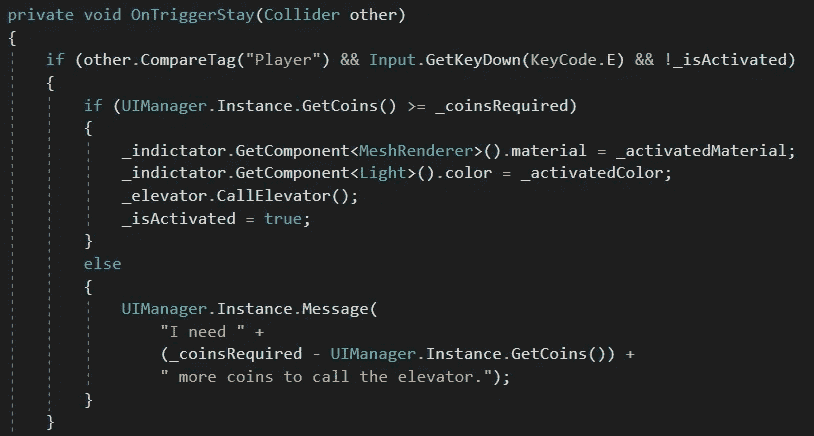
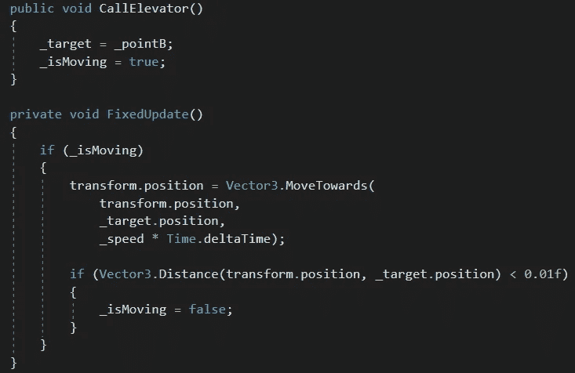
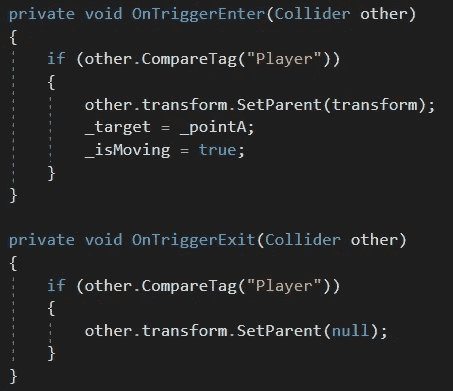

# 在 Unity 中创建电梯

> 原文：<https://medium.com/nerd-for-tech/creating-an-elevator-in-unity-f42d145503db?source=collection_archive---------16----------------------->

**目的:**如果玩家收集到足够的硬币，允许他们呼叫电梯。电梯会等他们登机后再搬回来。

我们将在电梯面板周围制造一个触发碰撞器。当玩家在碰撞器内时，如果他们按下 *E* 键、*和*电梯还没有被呼叫，面板将询问 *UIManager* 玩家已经收集了多少硬币。如果该金额大于或等于使用电梯所需的硬币，指示器和指示灯将变绿，电梯将被呼叫。然后， *_isActivated* bool 将被标记为 true，因此玩家不能再次呼叫电梯。

如果玩家*没有*足够的硬币，脚本将告诉 *UIManager* 显示一条消息，告诉玩家他们还需要多少硬币。

电梯本身在我们的移动平台上工作。当电梯面板调用电梯的 *CallElevator* 方法时，它将目标设置为 *_pointB* ，并将 *_isMoving* 标记为 *true* 。

在*固定更新*方式中，如果*is moving*为 *true* ，电梯将向目标移动。当它非常接近目标时，它将停止移动。

当玩家登上电梯时，电梯将使自己成为玩家的 p *而不是*，因此玩家将随着电梯移动。它还会将 *_pointA* 设置为其目标，并再次开始移动。

当玩家下电梯时，电梯会清除玩家的*父*属性，使其不受电梯的影响。

