# 在 Unity 中创建电梯—第 1 部分:设置电梯面板

> 原文：<https://medium.com/nerd-for-tech/creating-an-elevator-in-unity-part-1-setting-up-the-elevator-panel-9ab96e815a46?source=collection_archive---------35----------------------->

课程的下一部分让我们用新的脚本安装一个新的场景，这样我们在未来可能会做一些不同的事情。

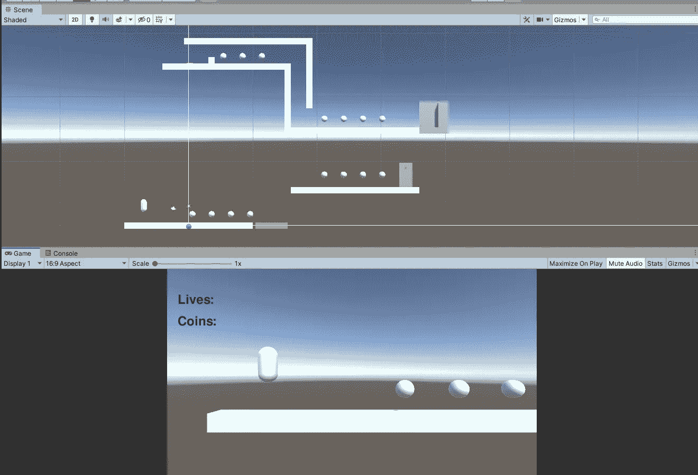

当前的挑战是让玩家收集 8 个硬币，走到电梯面板，按下 E 键，并呼叫电梯，这样他们就可以乘坐它了。

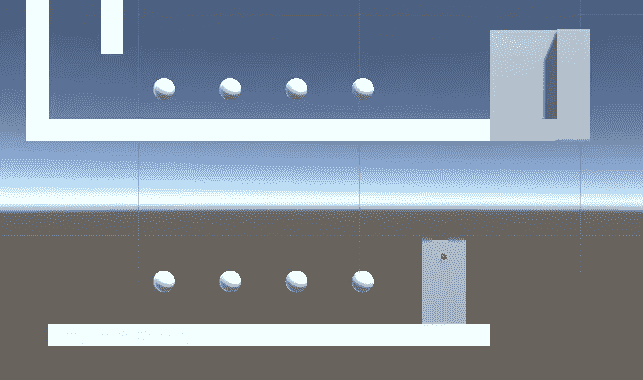

挑战似乎很简单，电梯不过是一个移动的平台，等待下一次呼叫，所以我们将编写许多熟悉的代码。像之前所有的挑战一样，我们将一步一步来。

电梯面板有一个附加的 a 盒碰撞器，所以我们将使用它来查看玩家是否在里面并按下了 E 键，如果是，就把灯变成绿色。

首先，我们将创建一个名为 ElevatorPanel 的脚本，并将其附加到 ElevatorPanel 对象。

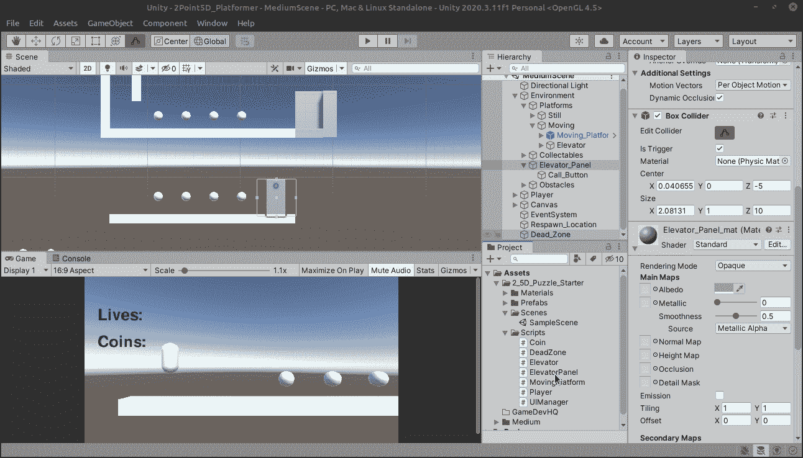

使用触发碰撞时，有三种方法:

*   OnTriggerEnter()
*   OnTriggerExit()
*   OnTriggerStay()

它们非常简单明了，如果我们想在玩家按下 E 键时检查电梯触发器是否感应到玩家，OnTriggerStay 似乎是我们需要的，所以让我们开始吧！

为了安全和肯定，让我们添加一个刚体到我们的电梯面板。我关闭了重力，也勾选了运动学，并关闭了一些旋转限制，所以撞上它不会有任何作用。它就像一件家具一样放在那里。

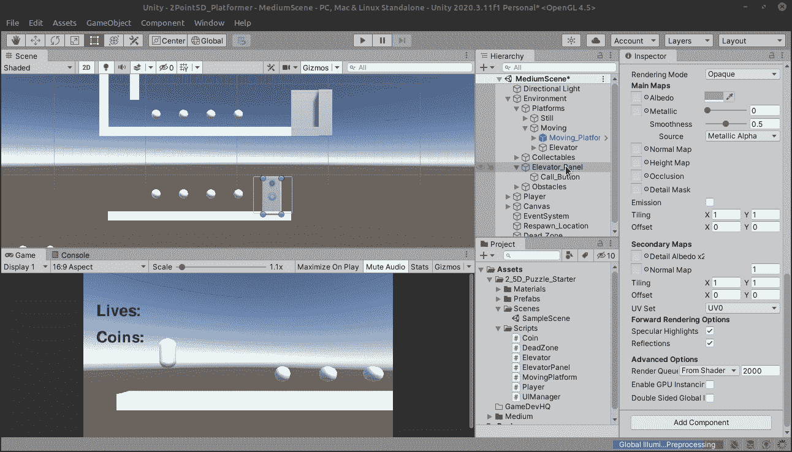

检测触发冲突:

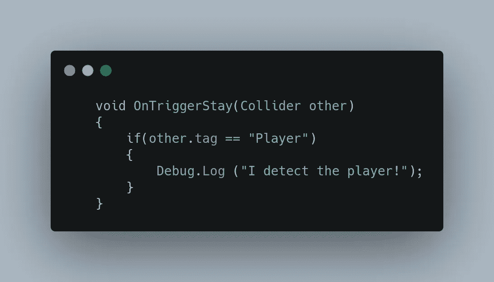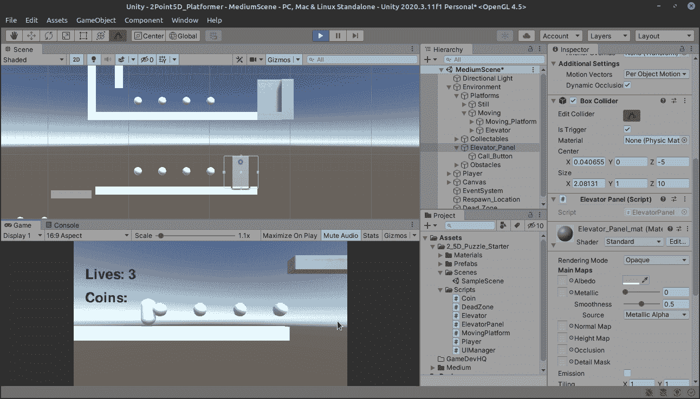

太好了！我们知道触发因素是识别球员，我们将能够为他们创造条件。现在让我们检查 E 键是否被按下。

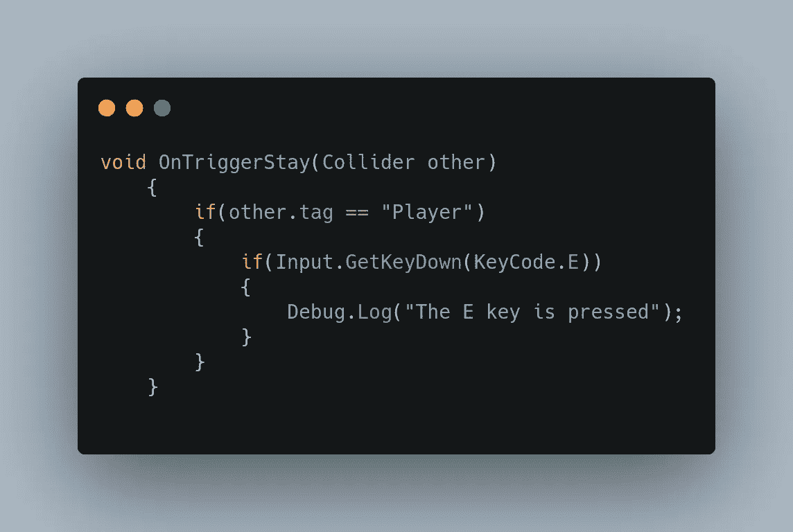

让我们看看它是否出现在我们的迷你控制台行的左下角。

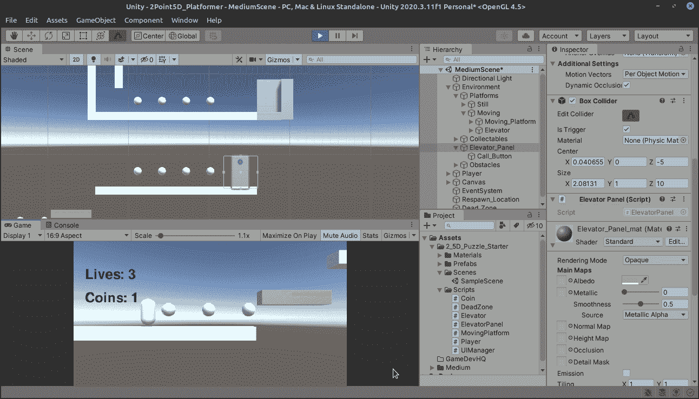

是啊！我喜欢事情进展顺利的时候！最后，让我们把灯变成绿色。

电梯面板有一个名为 Call Button 的对象，我们需要对它进行引用，以便更改它的颜色:

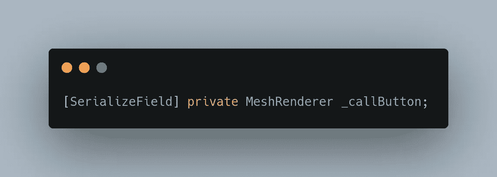

我们只对 MeshRenderer 感兴趣，而不是整个游戏对象，所以我们可以将它用于类型，现在我们可以将它拖到脚本中，

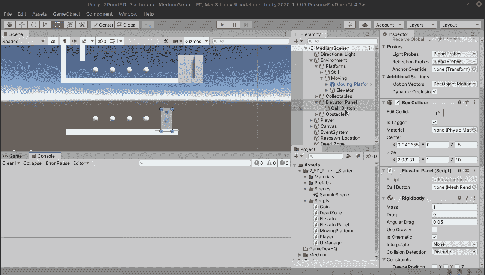

现在让我们改变颜色！

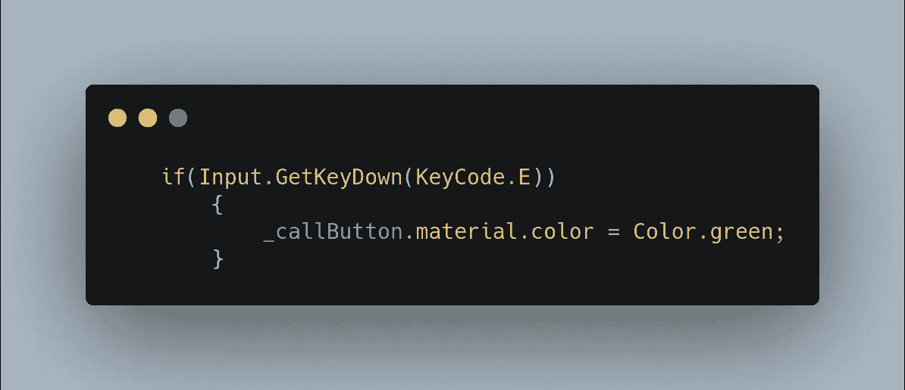

快速的谷歌搜索向我们展示了如何改变材质的颜色，记住 _callButton 是实际的 MeshRenderer 而不是 gameObject，所以我们可以通过材质直接引用颜色！我会选择绿色。

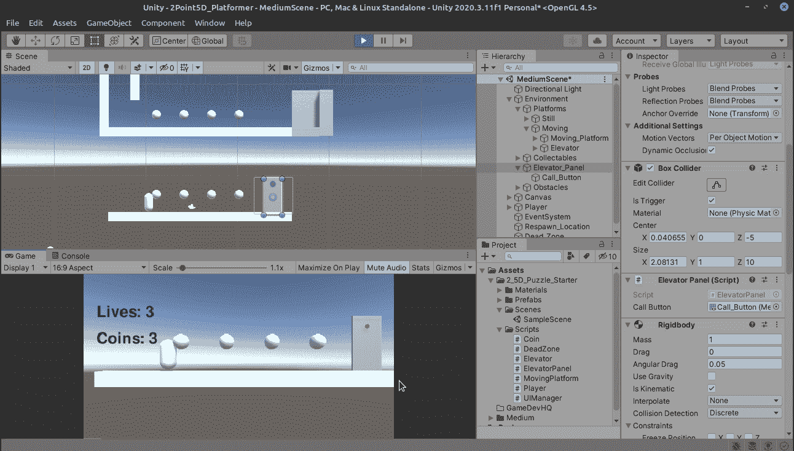

完美运作！

明天，我们将投入一张所需硬币的支票！到时候见！