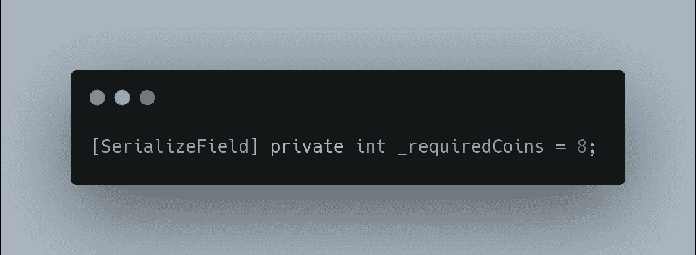
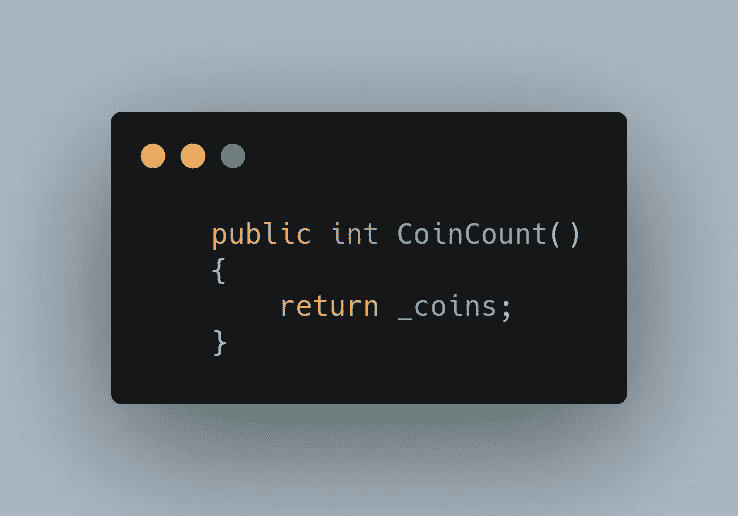
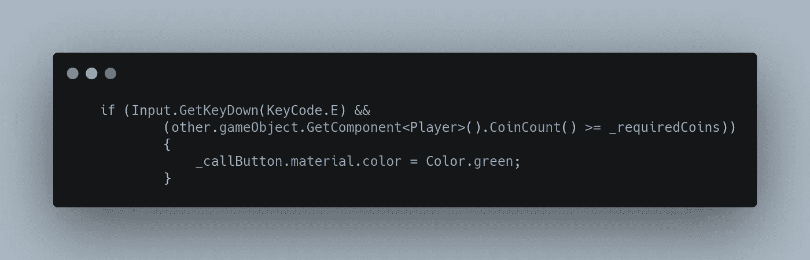
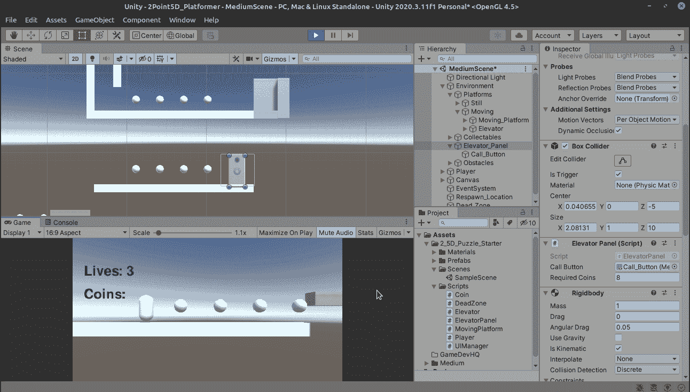

# 在 Unity 中创建电梯，第 2 部分:支付成本

> 原文：<https://medium.com/nerd-for-tech/creating-an-elevator-in-unity-part-2-paying-the-cost-354261f58623?source=collection_archive---------24----------------------->

昨天，我们让面板开始工作，使用这个电梯的要求之一是有 8 个硬币，所以让我们进入它并为它创建一个变量！

如前所述，我们几乎从来没有想要硬编码项目的数字，你想保持事情的灵活性，所以在这里我们将保持它对任何开发人员可能想要改变所需的硬币数量来调整游戏平衡，例如。

虽然玩家有一个 _coins 变量，但它是私有的，我们不想把它改成公有的。幸运的是，我们可以创建一个公共方法来返回我们能够调用的硬币数量。打开玩家脚本，我们将添加它。

太棒了。我们现在可以使用这种新的信息方法来检查我们的电梯面板！

太好了！让我们通过丢失 1 个硬币来检查它是否有效。

到目前为止一切顺利！当我发送 e 键时，它没有变绿，让我们捡起最后一枚硬币试一试。

厉害！灯变绿了，因为我们有 8 个硬币！

明天我们会把电梯降下来！