# 创造一个可以躲避你的投射物的敌人

> 原文：<https://medium.com/nerd-for-tech/creating-an-enemy-that-can-dodge-your-projectiles-ffc116e78627?source=collection_archive---------9----------------------->

之前我们用一个简单的脚本给我们的一些**敌人**添加了一些**正弦运动**，给他们一些更复杂的**运动**。从而使摧毁它们变得更加困难。

如果我们更进一步呢？创造一个有**能力的**敌人****来**探测**是否有激光向它的方向飞来，并且**试图**闪避**它？好吧，系好安全带，因为它马上就要来了！**

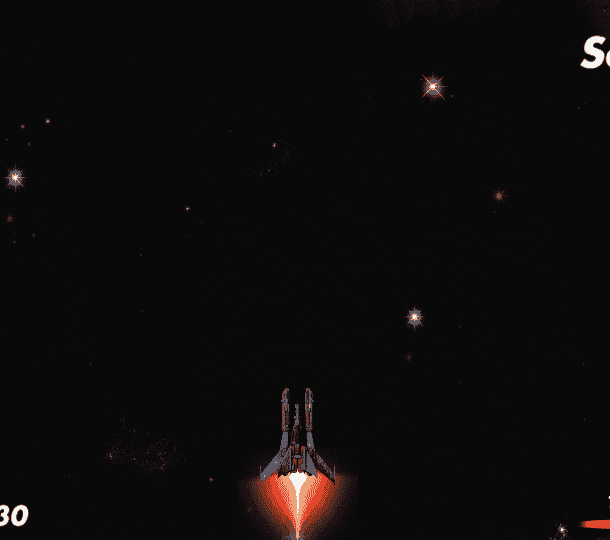

我们对死亡说什么？今天不行。

# 创建敌人的预置

为了创造这个**敌人**，我想躲避玩家的激光会让玩家觉得有点**烦**。黄蜂也很烦人。所以我把这个敌人的预置**变小**并把它们染成黄色**…**

**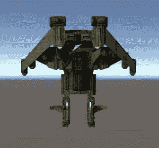**

**狡猾的黄色小敌人**

**并且增加了**基础**如同任意**敌人** — **刚体 2D** (重力比例= 0)**箱式碰撞器 2D** (被触发选中)。**

**然后创建了一个**dodging nemy 脚本**并附上。还附上了我们的 **SineMovement 脚本**。**

# **在剧本里面**

**这是所有奇迹发生的地方。多半是抄袭我们**正规的敌方剧本**——开火逻辑，向下移动，碰撞逻辑。**

**但是现在我们将创建一些新的**全局变量**:**

**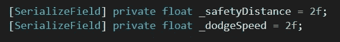**

**用来决定我们的闪避逻辑**

**然后我们的 **DodgeLasers()** 函数:**

**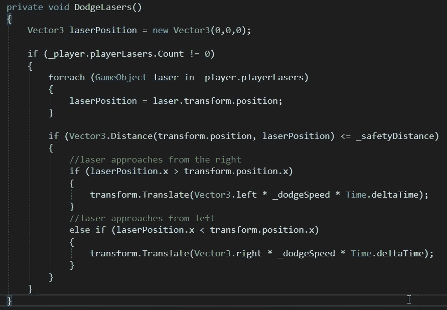**

**在这个逻辑中，我们利用了一个由玩家处理的激光动态列表**和**(将在稍后创建)。**

**我们将把 **DodgeLasers()** 放在我们的敌人 **Update()** 函数中，所以它将不断检查这个激光列表，如果有任何激光在它的**_ 安全距离**内，它将尝试**躲闪**左**或**右**。****

# **激光器列表**

**在我们的**玩家脚本**中，我们将处理这个**列表**，因为玩家决定何时发射激光。**

**我们将创建一个名为**玩家**的**游戏对象**的**公共列表**:**

**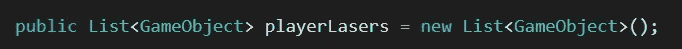**

**然后，在我们的 **FireLaser()** 中，我们可以在实例化时将创建的**激光器**添加到列表中。**重要的是**要注意我们需要创建一个对这个新实例化的**引用**，以便**将**添加到列表中:**

**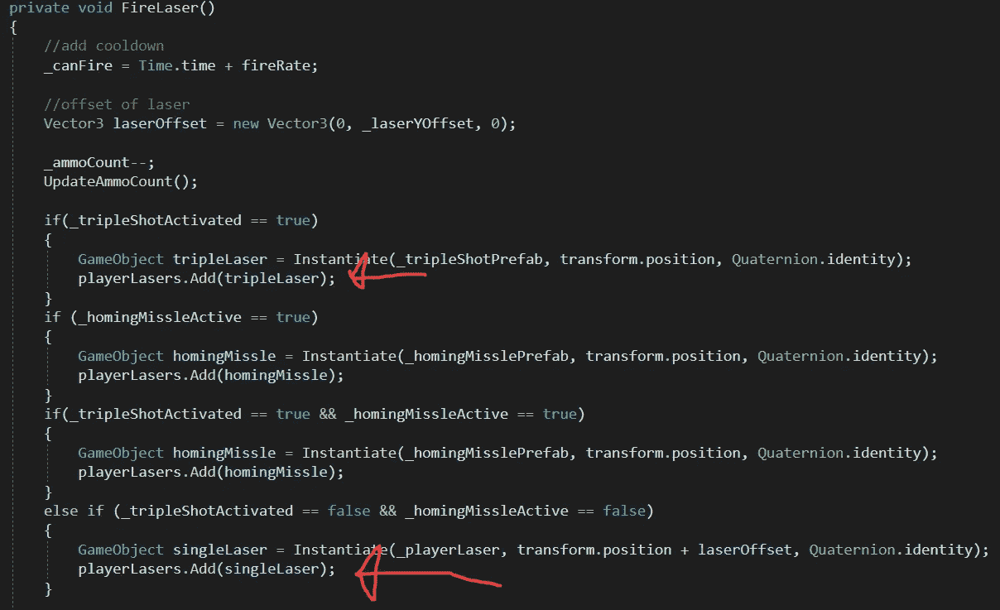**

**暂时忽略归航导弹…它们很快就要来了；)**

**为了确保这个列表正确更新，我们将进入**播放**模式并发射几束激光:**

**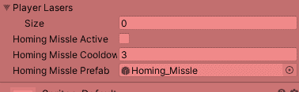**

**我们的实时动态榜单！**

**你可能想知道为什么有些**激光器**正在**消失** …那是因为我已经添加了代码，以便在它们超出界限时**从**列表**中删除**:**

**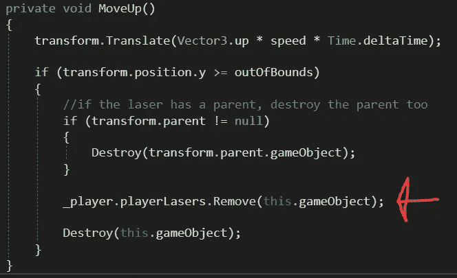**

*   ***确保将**_ player . player lasers . remove()**代码添加到其他**实例**中，其中**激光**被**摧毁**，即当激光摧毁敌人时！**

# **视觉化安全距离**

**当调整你躲避敌人的逻辑时，这有助于**想象**你的**变化**和你的**距离**。**

**这就是小发明是你朋友的地方！**

**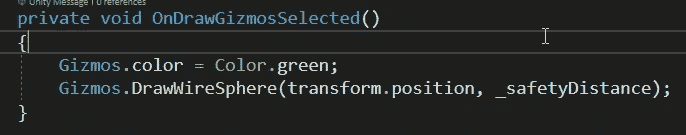**

**将它添加到脚本的末尾将使您能够可视化变量:**

**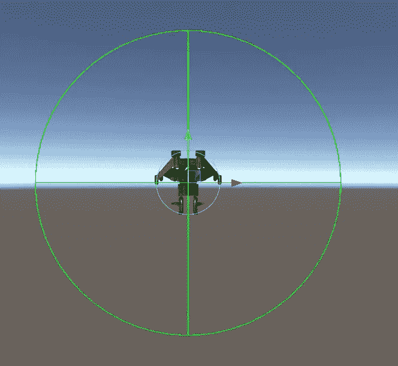**

**也可以在播放模式下看到:**

**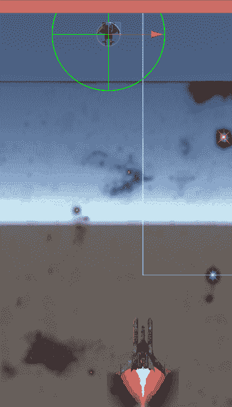**

**躲开了！**

**成功！我们现在有了一个小小的**黄蜂敌人**，这是一个很大的挑战！**

**在下一篇文章中，我们将讨论在本文中潜入我们代码的寻的导弹；)**