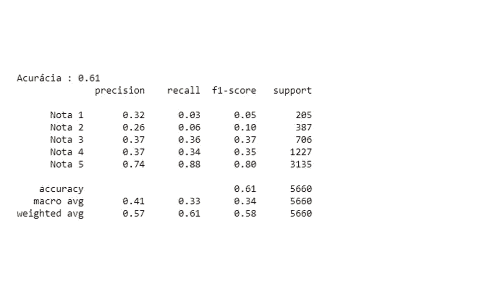

# 用 python 从头开始创建 NLP 模板

> 原文：<https://medium.com/nerd-for-tech/creating-an-nlp-template-from-scratch-with-python-a6dcd90513e7?source=collection_archive---------5----------------------->


点击 [**这里**](https://luis-miguel-code.medium.com/criando-um-modelo-de-nlp-do-zero-com-python-5ae278568119) **阅读葡萄牙语**

NPL(或自然语言处理)是数据科学的一个分支，近年来发展很快，考虑到这一点，我决定写一篇关于如何使用它以及今天了解这一分支的重要性的文章！

在这篇文章中你会发现什么？

*   什么是 NLP？；
*   NLP 有多重要？；
*   如何创建 NLP 模板？；

# 什么是 NLP？


在我们开始分析之前，我们必须对什么是 NLP 有一个概念！NLP 代表自然语言处理。以一种非常直观的方式，NLP 是数据科学的一个子领域，旨在使用机器和人类语言来分析和处理 T21。

简而言之，NLP 正在让计算机能够翻译人类语言。

# NLP 有多重要？


NLP 和所有的数据科学都有许多特性，这个子领域有几个工作选项！

许多公司都有数据库，在这些数据库中，我们可以有文本数据，这些数据可以告诉我们很多关于客户想法的信息。

为了说明这个主题，我将举一些例子:

*   **分析客户短信**:想象一下，能够使用机器学习将我们的邮件数据分组为“问题”、“投诉”和“建议”，并发送到公司的不同部门；
*   **建议等级**:如果客户在对产品发表意见时，我们可以建议他们仅根据文字给出哪个评级等级，会怎么样？；
*   **图形化分析意见**:想象一下，能够从数据库中创建图像，以图形化方式显示意见中最常出现的单词？；

现在你知道了我们可以用 NLP 做什么，是时候动手了。加油？

# 机器学习


为了开始我们的模型，我必须弄清楚我将在本文中用作示例的数据的来源，所有这些数据都来自 [Kaggle](https://www.kaggle.com/) 站点，您可以通过点击[此处](https://www.kaggle.com/nicapotato/womens-ecommerce-clothing-reviews)来访问它。

我想指出的另一件事是，下面的教程可以直接从 GoogleColaboratory 访问，那里有完整的代码行和对所使用的每个算法的更详细的解释。要访问，请点击此处的。

在我们的模型中，我们应该做的第一件事是考虑**预处理**我们的文本。但是为什么呢？文本集(尤其是那些从互联网上获取的)可能包含“污垢”，如链接和表情，为了避免代码问题，应该删除**。**

我们应该删除的另一件事是“停用词”，这些词基本上是通常不会在机器的解释中聚合的**词**(像“是”、“这个”、“不是”和“那个”这样的词往往不会有助于算法的解释)。

```
**def** Preprocessing(instancia):
    *#* instantiating the stemmer method
    stemmer = nltk.stem.RSLPStemmer()

    *#* removing links from text
    instancia = re.sub(r"http\S+", "", instancia).lower().replace('.','').replace(';','').replace('-','').replace(':','').replace(')','')

    *#* aggregating the stopwords into a list
    stopwords = set(nltk.corpus.stopwords.words('english'))

    *#* removing the stopwords from the sentence
    palavras = [stemmer.stem(i) **for** i **in** instancia.split() **if** **not** i **in** stopwords]

    **return** (" ".join(palavras))
```

我不打算详细介绍每一行代码是做什么的，但一般来说，我们使用 python 的 **RE** 库来**从链接**中移除某些字符和前缀，就像我们使用 **NLTK** 库来将停用词存储在列表中，然后**再从句子(实例)中移除它们**。

**注意:我们应该指出的是，这些预处理技术需要大量的处理和时间，因此我们在应用时必须考虑到这一点，因为并非在所有情况下，这些预处理都会在我们的模型中产生明显更好的结果。**


处理完我们的文本后，是时候开始机器学习本身了。

我想马上强调的一点是:**机器不处理文本！你看到的没错，**电脑无法理解字母是什么！**毕竟，我们要如何解决这个问题？很简单:计算机理解数字而不是单词，所以我们为什么不把文本转换成数字呢？这正是我们将要做的。**

使用机器学习 **Scikit Learn** 库中的*计数矢量器*方法，我们可以解决这个问题！

让我们举个例子:

```
frase = ["Olá Mundo!","Olá , Meu nome é Luís Miguel"]vetorizador = CountVectorizer(analyzer="word")frase = vetorizador.fit_transform(frase)print(frase)output:

  (0, 5) 1   
  (0, 3) 1   
  (1, 5) 1
  (1, 1) 1   
  (1, 4) 1   
  (1, 0) 1   
  (1, 2) 1
```

注意，我们有一个用括号括起来的元组(一组值),在其中我们可以看到列表中单词的索引作为第一个元素，然后我们有一个与该单词相关联的数值。请注意，单词“Olá”在列表的两个项目中都被赋予了值“5”。

usando essa veto Riza o vamos aplicar as altera es em nossos textos:

```
reviews = df['Review Text']reviews_processed = [Preprocessing(i) **for** i **in** reviews]reviews_processed = vetorizador.fit_transform(reviews_processed)
```

我将我们的数据集称为“df ”,只将文本保存在一个变量中，然后应用预处理技术，最后将文本“矢量化”。

最期待的部分已经到来，创造模型！经历了这么多麻烦之后，我们可以看到我们将要创造的东西。

我选择使用的算法是**朴素贝叶斯多项式**，它最适合我们的分析，甚至是最值得推荐的。如果你想更多地了解他和他背后的数学理论，我建议[这篇](https://www.organicadigital.com/blog/algoritmo-de-classificacao-naive-bayes/)文章，作者是劳罗·贝克尔。

```
X_treino, X_teste, y_treino, y_teste = train_test_split(reviews_processed , y , random_state=42 , stratify=y)modelo = MultinomialNB()modelo.fit(X_treino , y_treino)predicoes = modelo.predict(X_teste)
```

我们首先将我们的数据分为训练和测试数据，以便能够衡量我们的模型最终有多好。


我们训练并做了预测，是时候看看他的结果了:



我们模型的结果

我们的准确率相对较低，只有 0.61 (61%的整体命中率)，除此之外，随着等级的提高，我们的准确率会更高。这要归功于我们自己的数据。在使用的集合中，我们有一个不平衡的特征，也就是说，我们有更多的数据用于评分为 5 的评论。这无疑改变了我们模型的效率。

有一种方法可以“解决”这个问题，我已经写了一篇关于不平衡类的文章，可以点击[这里](https://luis-miguel-code.medium.com/how-to-deal-with-unbalanced-classes-in-machine-learning-precision-recall-oversampling-and-9a719d9bb3b0)随意阅读。

今天我不打算解决这个问题，但如果你愿意，你可以解决这个问题，并测试效率的差异。

在关于 Colab 的原始文章中，我解决了这个问题，如果你想看完整版，请点击[这里](https://colab.research.google.com/github/LuisMig-code/NLP-com-Reviews-de-roupas-femininas/blob/main/NLP_Reviews_roupas_femininas.ipynb)。

# 了解更多:


如果你想加深知识，这里有一些有用文章的链接:

*   [自然语言处理(NLP)——IBM](https://www.ibm.com/cloud/learn/natural-language-processing)；
*   [朴素贝叶斯:机器学习算法的共同功能——数字房屋](https://www.digitalhouse.com/br/blog/naive-bayes)

# 链接:


**点击** [**此处**](https://colab.research.google.com/github/LuisMig-code/NLP-com-Reviews-de-roupas-femininas/blob/main/NLP_Reviews_roupas_femininas.ipynb) 可访问包含所有代码行和更详细解释的 GoogleColaboratory 笔记本

感谢您阅读本文，请考虑访问其他文章并在社交媒体上找到我:

*   Github
*   [LinkedIn](https://www.linkedin.com/in/luis-miguel-code/)
*   [LinkTree](https://linktr.ee/iNukss)