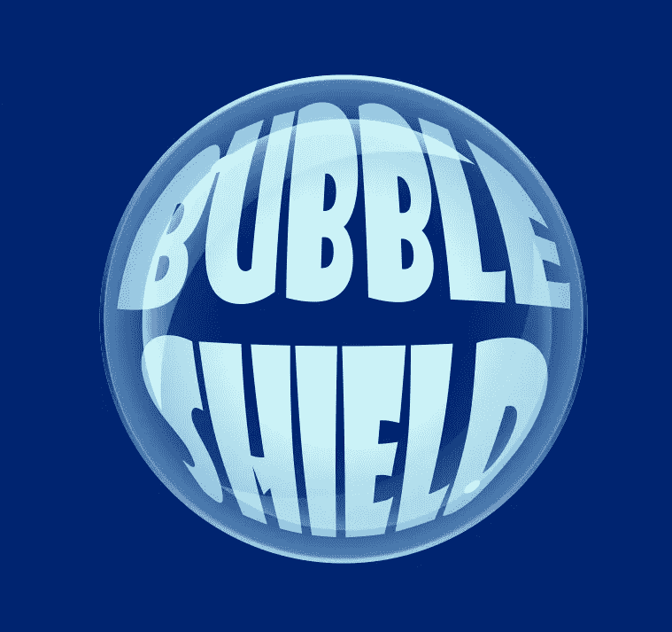

# 创建和实施屏蔽加电

> 原文：<https://medium.com/nerd-for-tech/creating-and-implementing-a-shield-powerup-446b55a419e3?source=collection_archive---------16----------------------->

在我的前几篇文章中，我一直在我的游戏中引入各种各样的能量。这个护盾增强是我最初三个中的最后一个，包括三次射击和加速增强。

一如往常，当涉及到艺术创作时，使用**参考**只会有助于最终产品的质量。对于这个项目，我使用了一些谷歌搜索气泡的照片参考。气泡…