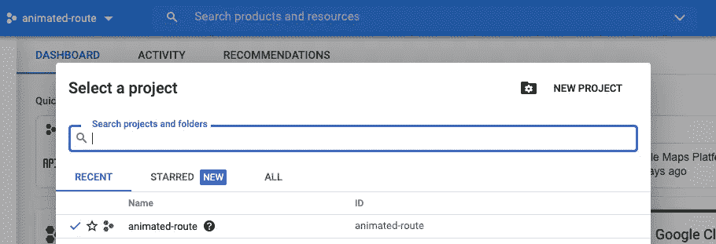
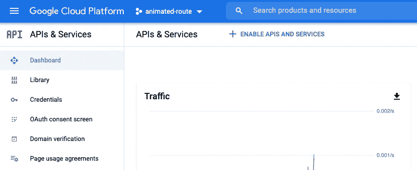
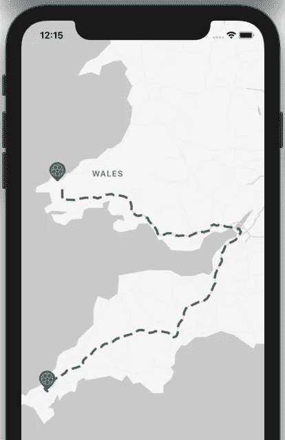

# 使用 iOS 版地图 SDK 和方向 API 创建动画路线

> 原文：<https://medium.com/nerd-for-tech/creating-animated-routes-with-maps-sdk-for-ios-and-directions-api-4419b6d421ed?source=collection_archive---------9----------------------->

有时你可能会遇到一些需求，比如在谷歌地图上显示两点之间的动画路线，不一定是在移动应用程序中，而是出于视频编辑等目的。像我一样。

塔玛斯·图兹-卡泰在 [Unsplash](https://unsplash.com?utm_source=medium&utm_medium=referral) 上的照片

这将是谷歌地图上的[动画路线的延伸](https://levelup.gitconnected.com/animated-routes-on-google-maps-5de4f32261d7)故事由[瑞安·NHP](https://medium.com/u/d516315b7918?source=post_page-----4419b6d421ed--------------------------------)撰写并发表在 [Level Up Coding](https://levelup.gitconnected.com/) 上，因为我发现初学者可能很难开始上面的教程。为了继续这样做，您需要安装 Xcode 11 或更高版本的 macOS，以及运行 iOS 13 或更高版本的模拟器或物理设备。

在你的浏览器中，导航到[https://console.cloud.google.com](https://console.cloud.google.com/apis/dashboard)，用你的谷歌账户登录。使用现有项目或创建一个新项目。

选择一个项目

导航至左侧窗格上的**API&服务**菜单。点击**凭证**菜单，创建一个 API 密钥供您使用。然后返回**仪表板**菜单，导航至**启用 API 和服务**链接。搜索 iOS 版地图 SDK 和方向 API，并在每个 API 中导航以启用它们。

API 和服务

为了使用方向 API，您需要链接一个计费帐户。别担心，使用本教程不会向你收取任何费用。点击左上角的**谷歌云平台**文字。导航至**计费**菜单，链接现有计费账户或创建新账户。

 [## ryanisnhp/AnimatedRoute

### 使用动画增强地图上的路线 Permalink 无法加载最新提交信息。在…上增强您的路线

github.com](https://github.com/ryanisnhp/AnimatedRoute) 

一旦你完成了 Google APIs 的设置，克隆上面的 GitHub 库。在克隆的文件夹中打开一个终端窗口，运行 **pod install** 来安装 CocoaPods 依赖项。然后在 Xcode 中打开项目。在 AnimatedRoute 文件夹中创建一个名为 **Constant.swift** 的文件，并添加以下文本。用上面生成的 API 键替换占位符。

> 让 DGoogleAPIBrowserKey=" <your_google_api_key>"</your_google_api_key>

之后，打开**animated route/Controller/view Controller . swift**文件，找到名为 a、b 的变量。替换这些变量的纬度和经度，并/或根据需要添加其他变量。如果您已经创建了附加变量，请确保将它们添加到传递给 **addMarkersOnMap** 和 **getRoute** 函数的参数数组中。完成更改后，在模拟器或物理设备上运行应用程序。

模拟器中的动画路线

编码快乐！下面是我发布的一个 DEV 社区视频。此外，你可能有兴趣看看我的媒体故事[给 iOS 应用程序添加启动屏幕](https://mmafrar.medium.com/adding-a-launch-screen-to-an-ios-app-ac197075b25b)。

 [## 为 iOS 创建简单的浏览器

### 链接到故事…

开发到](https://dev.to/mmafrar/creating-a-simple-browser-for-ios-2b3)