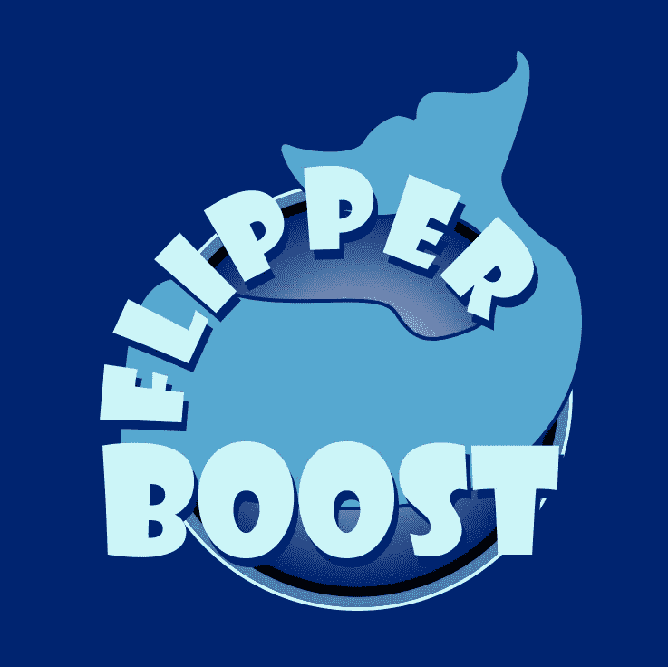

# 创建、动画制作和实现速度提升

> 原文：<https://medium.com/nerd-for-tech/creating-animating-and-implementing-a-speed-boost-powerup-21e5ef21c9f7?source=collection_archive---------33----------------------->

在为我的 Unity2D 游戏制作三个电源时，已经完成了一个，还有两个。我从一个简单的**圆**形状开始，然后在 Corel Draw 的曲线特征上使用一个**类型。谈到字体设计，在曲线上打字是一个非常**强大的**工具。然后，我为我的 **boost** 文本添加另一个字体层。**