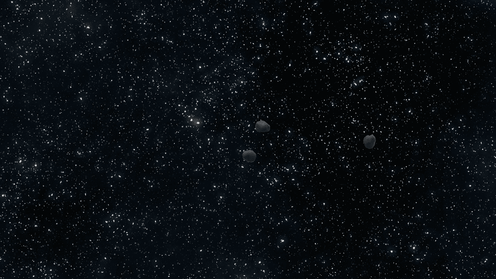
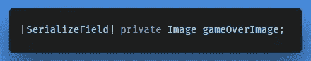
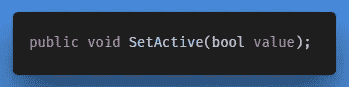
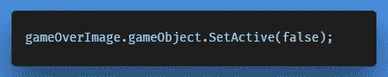
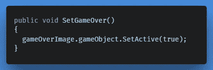
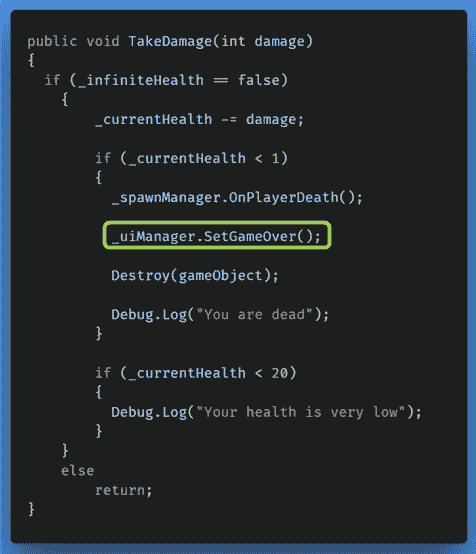
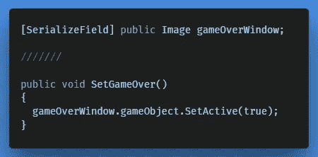

# 创造超越行为的基本游戏

> 原文：<https://medium.com/nerd-for-tech/creating-basic-game-over-behaviour-df4fa70b6f98?source=collection_archive---------9----------------------->

游戏结束

为了演示如何通过代码轻松开始使用[图像 UI 元素](https://gert-coppens.medium.com/creating-ui-elements-image-7fa165731c7e)，在本文中，我们将着眼于创建一个基本的系统游戏。

这个想法很简单，通过代码我们声明“*游戏在*上的图像默认是关闭的，如果需要，我们打开它。您可以将此应用于您自己项目的任何图像。

在 *UIManager.cs* 脚本中，创建一个新的私有成员变量，允许我们通过代码引用图像元素，就像我们对文本元素所做的那样。

在检查器中分配您的“游戏结束”图像

现在让我们来看看这个函数；

*   ***值*** *:激活或停用对象，其中* `*true*` *激活游戏对象，* `*false*` *停用游戏对象。*

在 *Start()* 方法中，我们首先可以使用它来禁用图像，方法是:

然后，我们可以创建一个新方法，以后可以访问它来启用映像:

## 启用“游戏结束”行为

转到 *Player.cs* 脚本，我们做的第一件事是创建一个对 UI 管理器的引用(如果你还没有的话)，这是[通过脚本](/nerd-for-tech/script-communication-in-unity-using-getcomponent-45fba58f322a)进行通信所需要的:

现在在 *TakeDamage(int damage)* 方法中，我们可以告诉 UI 经理当玩家死亡时游戏结束。

太好了，基本的“*游戏结束*”行为现在起作用了。除了让我们先想一步；知道我们将在以后升级并添加更多的 UI 功能，我们可以将它附加到一个名为'*游戏 Over Window* '的**新父**，并改为打开和关闭它:

在下面的文章中，我们将继续改进用户界面，并为玩家引入一个健康栏。

← [上一张](https://gert-coppens.medium.com/creating-ui-elements-image-7fa165731c7e) | [下一张](https://gert-coppens.medium.com/adding-a-player-health-bar-d59d629c1311) →