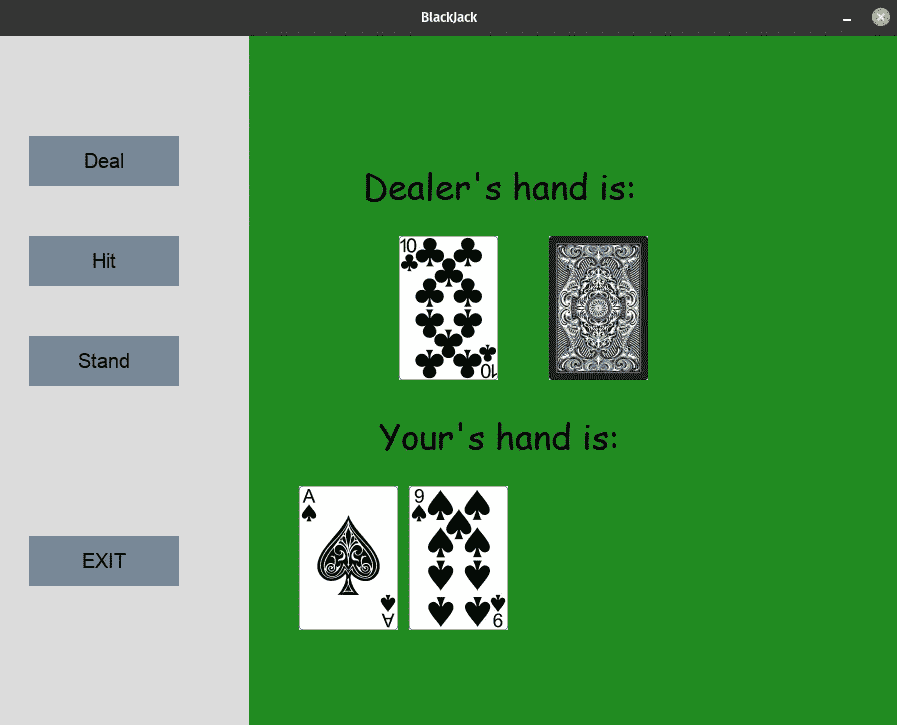
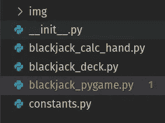
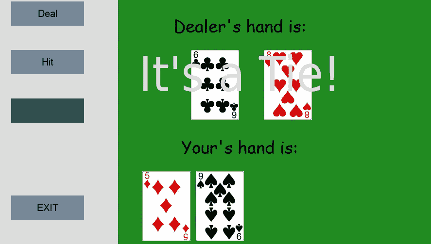
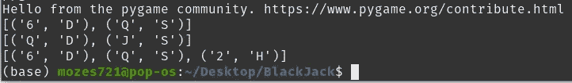
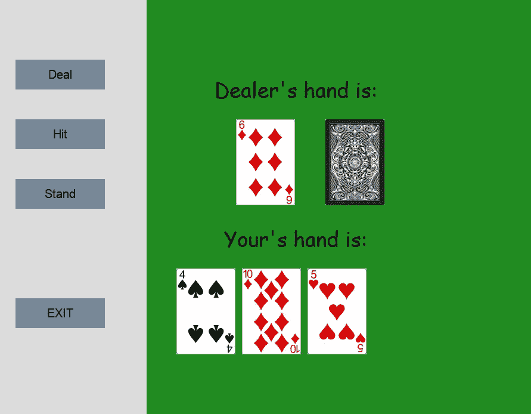
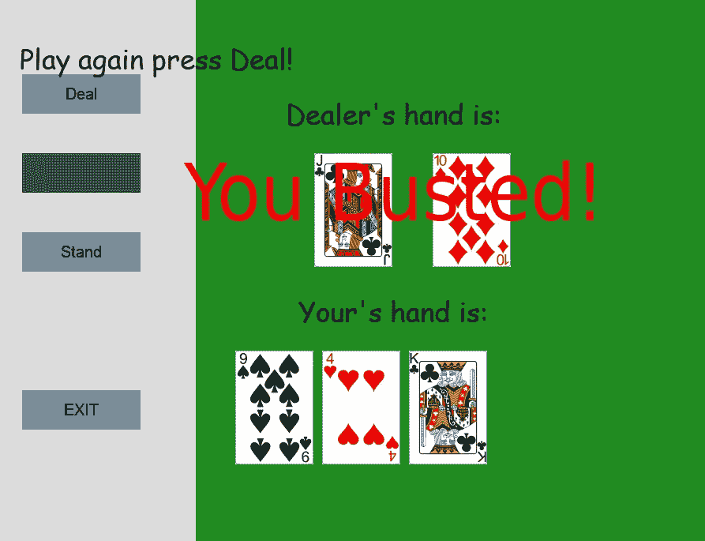

# 用 Python 制作 21 点游戏

> 原文：<https://medium.com/nerd-for-tech/creating-blackjack-game-with-python-80a3b87b1995?source=collection_archive---------1----------------------->



在本教程中，我们将使用 Pygame 创建一个 21 点游戏。这将是一个动手项目。这个游戏的概念很简单，但是需要定义许多变量属性来使它按照需要工作。我学到了很多关于 Pygame 和游戏创作以及 T2 OOP T3 的概念。免得惹火上身！

# 目录

这个项目有一个 **__init__** 文件、 **img** 文件夹，用于存放所有的卡片图像和其他三个脚本文件

1.  **常量**字体、颜色模式、屏幕尺寸等的脚本。
2.  **blackjack_deck** 脚本，其中我们创建了卡对象的**牌组**以及**手**对象，以创建玩家和庄家的**手**实例。
3.  **black jack _ pygame****脚本文件，我们主要关注初始化 py game 及其背后的其他逻辑。**

**下面是一个例子:**

****

****21 点计算手**不相关**

# **甲板**

**这部分已经在我之前的博客中讨论过了，我在那里谈到了 **OOP** 的概念，所以我就不在这里讨论了，脚本的名字是 [blackjack_deck](https://github.com/Mozes721/BlackJack/blob/master/blackjack_deck.py) ，这里是博客，你可以按照代码或者复制脚本:**

**[](/geekculture/understanding-oop-python-with-a-deck-of-cards-︎️-99c31ea5acaa) [## 用一副纸牌理解 OOP python♠︎️

### 解释简单的 OOP 概念和实时用例示例

medium.com](/geekculture/understanding-oop-python-with-a-deck-of-cards-︎️-99c31ea5acaa) 

# 常数

当创建游戏时，为常量**创建一个单独的脚本文件**来分离游戏的逻辑部分、pygame GUI 等是很常见的事情。而且它让代码看起来更干净，更容易理解！

我们不会谈论常数，因为它是不言自明的。

# 21 点游戏

代码可能有点长，这就是为什么我们将在小节中让它更容易理解和跟随。但是请原谅我，这是值得的！

## 初始化 Pygame 和 text 对象

我们将一步一步地从导入所有的包和 **blackjack_deck** 和**常量**脚本开始。继续设置**游戏显示**填充它，并使用 **pygame.draw.rect** 方法为难处理的按钮设置灰色左栏。如果你迷失了，我知道我是；)然后点击[这里](https://realpython.com/pygame-a-primer/)了解一些基本的 **PyGame** 概念。** 

**ext_objects 是用来创建一个新的 rect 对象的，我创建了其中的两个，一个用于常规的文本显示，另一个在游戏结束时用来改变文本的字体和颜色。**

****

**text_object(代表庄家和你的手)end_text_object(代表你赢了还是输了)**

**当游戏结束时，你会被提示是否想再玩一次。**

****game_texts** 、 **game_finish** 和 **black_jack** 方法都在分配 *text* 、 *x、y* 位置以及可能的*颜色*属性中起着至关重要的作用。最后在游戏显示屏上推它！**

****重要:** *TextSurf，TextRect 都传入了我们前面创建的****text _ object****创建了****rect****object 然后传入了 x，y 参数，并完成了它在屏幕上的关闭更新！***

## **纽扣**

**button 方法有许多传入的参数。我使用了速记符。 **w，h** 是宽度和高度 **ic** ， **ac** 非活动和活动颜色，**动作**设置为无，但意味着以另一种方法(发牌、击中、站立、退出)传递**

**得到**鼠标**的位置，同样当**点击**时按下。**

**在 if 语句中，检查鼠标位置是否在按钮位置，如果是，将非活动颜色变为活动颜色。并且通过按下你触发的**动作()**功能。**

# **玩游戏！**

**当 text_objects、button 方法和 Pygame 运行初始化后，我们创建了一个 **Play()** 类，该类将在 play_blackjack 变量中初始化。**

**我们首先调用 **__init__** 方法来初始化这副牌(洗牌)并创建庄家和玩家 **Hand()** 实例。**

**然后，在**21 点之后，调用**方法，首先计算庄家和玩家当前的手牌，然后检查他们中是否有人拿到 21 点，并在屏幕上显示赢家。然后，如果您想再次播放，请将该值重置为 0。**

> **注意: **show_dealer_card** 变量是第二张没有显示的牌，它会在屏幕上显示出来，赢家会被骂**

## **交易**

**当在 while 循环中按下发牌按钮时**

```
button("Deal", 30, 100, 150, 50, light_slat, dark_slat, play_blackjack.deal)
```

**然后给庄家和玩家发两张牌，然后运行**display _ cards()(**the**card _ img**例如被命名为 6D)方法，该方法实际上会得到庄家和玩家的牌名，例如:**

****

**接下来，我们通过进入“img”文件夹找到图像来加载庄家和玩家的卡，然后从 **card_img** 数组中获取 **card_img[0]** ，并在最后添加“png”来连接文件，以便在目录中找到它。**

**经销商的第二张卡将被隐藏，这就是为什么立即加载(' img/back.png ')**

**然后在相应的 x 轴和 y 轴上 blit 这些卡片。**

## **打**

**当我们有一个低号码时，显然我们希望得到一张新卡来增加我们的机会，对吗？**

**当点击时，我们开始为用户添加一张卡，然后运行**21 点**方法来检查是否有 21 点(额外计算当前分数)**

**每次调用 hit()方法时，添加 **player_card** +1，同时检查该值并在屏幕上 blit 该卡。如果 **self.player_card** 大于 4 则退出！**

****

**击中目标**

****

**击两次很少是个好主意…**

## **站起来再玩一次！**

**现在我们到了最后阶段，当我们确定我们的手牌是获胜的手牌时，我们计算分数并显示获胜者(如果没有显示明显的 21 点)！**

**最后一节❤❤❤**

**因此，我们立即开始显示庄家的手牌，并开始计算庄家的手牌和玩家的手牌，并通过获得最高分来提示谁赢了！**

**在所有情况下，最后通过调用 **play_or_exit** 方法询问你是否想再玩一次。**

**展示交易按钮上方的文字。**

****

**我知道这不是直观的，击中消失了一段时间，但我洗耳恭听的建议！**

**当按“发牌”时，我们所有的实例(牌组、庄家和玩家手牌)将被重置，并再次使用 gameDisplay.fill 和 rect 将屏幕重置为原来的位置。完成更新后，你就可以尽情地玩了！**

# **结论**

**用 **PygamesGUI** (尤其是正确的卡片显示和定位 lol)让这一切正常运行是一个漫长而艰难的旅程。尽管如此，我希望你学到了很多，我知道我写这个项目，因为没有实际的**Pygame 21 点**的例子。我将进一步与 **Pygame** 合作，因为它让我理解游戏机制和 **OOP** 概念。**

**现在你有一个蓝图，可以创建自己的纸牌游戏，如纸牌，猜测下一张牌是高还是低等等。希望再次见到你，你可以找到 GitHub repo:**

**[](https://github.com/Mozes721/BlackJack) [## GitHub-mozes 721/21 点

### 在 GitHub 上创建帐户，为 Mozes721/BlackJack 开发做出贡献。

github.com](https://github.com/Mozes721/BlackJack) 

# 相关故事

[](https://python.plainenglish.io/data-visualization-for-beginners-with-matploptib-3fde2c635c1d) [## 用 Matplotlib 实现初学者的数据可视化

### 关于如何使用 Python 显示不同类型的绘图的指南。

python .平原英语. io](https://python.plainenglish.io/data-visualization-for-beginners-with-matploptib-3fde2c635c1d) [](/codex/instagram-choose-img-from-gdrive-or-local-storage-629fa836dd4f) [## Instagram:从 GDrive 或本地存储中选择图像

### 这个项目分为三个部分:谷歌 API，目录搜索，Instabot/Tkinter

medium.com](/codex/instagram-choose-img-from-gdrive-or-local-storage-629fa836dd4f) [](https://python.plainenglish.io/dynamic-e-mail-automation-from-excel-file-103d35bd9225) [## 从 Excel 文件实现动态电子邮件自动化

### 使用 Python 向整个 Excel 列表发送电子邮件，或者单独发送带有翻译文本选项的电子邮件！

python .平原英语. io](https://python.plainenglish.io/dynamic-e-mail-automation-from-excel-file-103d35bd9225)**