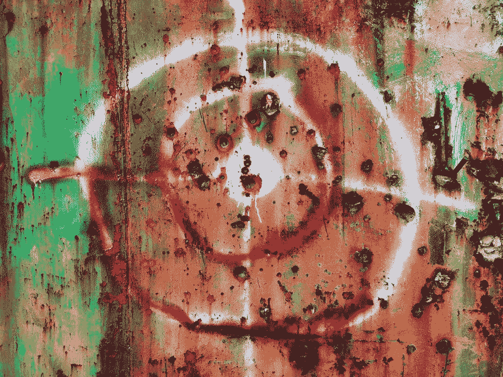
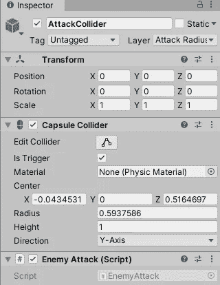
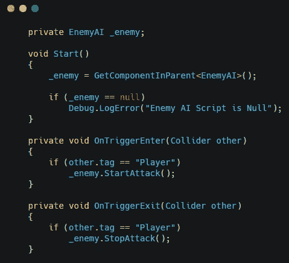
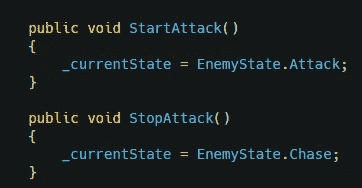
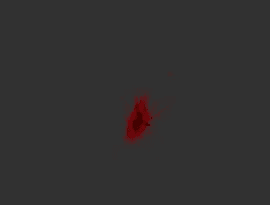
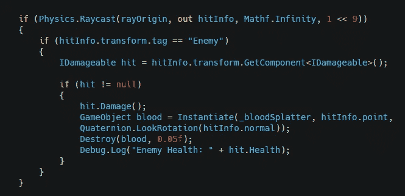
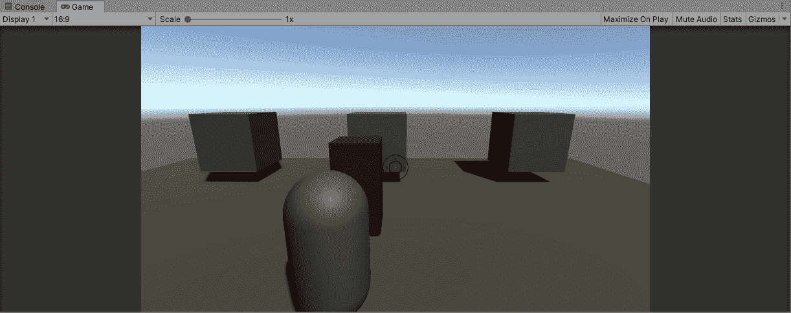

# 在 Unity 中创建子弹飞溅效果

> 原文：<https://medium.com/nerd-for-tech/creating-bullet-splash-effects-in-unity-1a0b0f218c2e?source=collection_archive---------2----------------------->

我正在创建一个第三人称生存游戏。我已经创建了射击系统，现在我将解释我是如何为子弹创建血溅效果的。

首先，我将介绍重组攻击碰撞器的步骤，以使效果正常工作。您将需要创建一个新的空游戏对象，并将攻击碰撞器添加到这个游戏对象中。这个游戏对象将是敌人游戏对象的子对象。

为敌人的攻击创建一个脚本，并用攻击碰撞器将其添加到游戏对象中。

这个脚本会通过调用敌方 AI 脚本中的公共游戏对象来控制敌方所处的状态。

敌人攻击脚本

公共方法

现在我准备添加血液飞溅的效果。

首先，我使用 GameDevHQ 的 Filebase 包来选择一个血液飞溅的效果。

在我为敌人调用伤害方法的射击脚本中，我在光线投射的命中点实例化了血溅预设。你会想要告诉光线投射只检测你的敌人角色控制器碰撞器所在的层。然后，您将希望设置血液飞溅效果在一段时间后自行销毁。

这将在敌人被击中时产生血溅效果。

