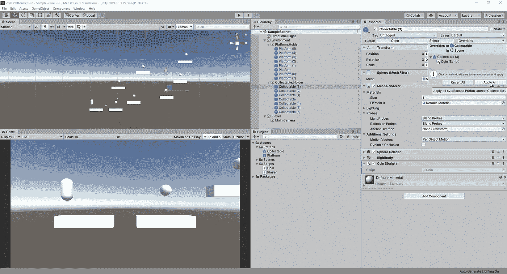
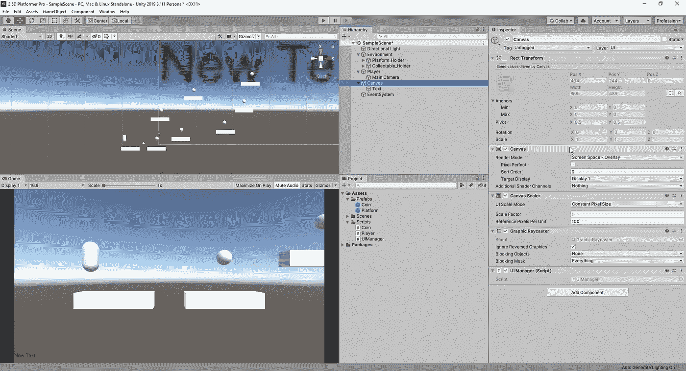
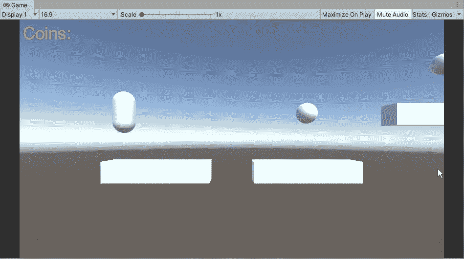
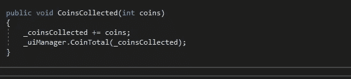
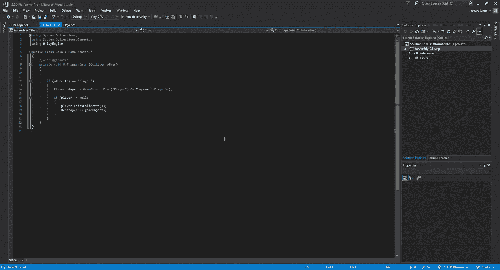
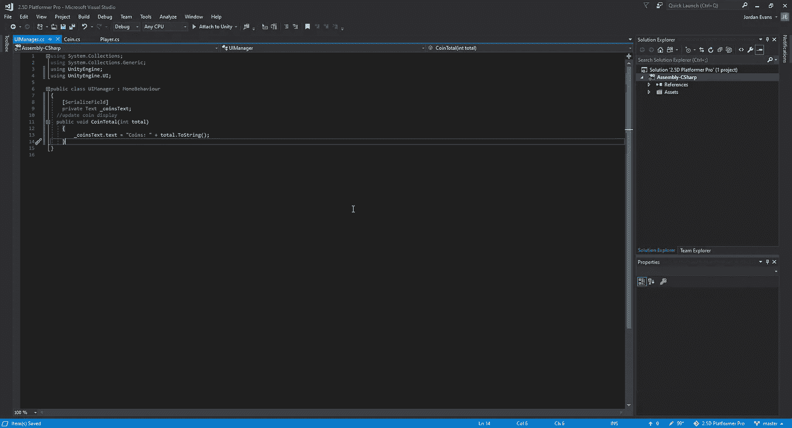
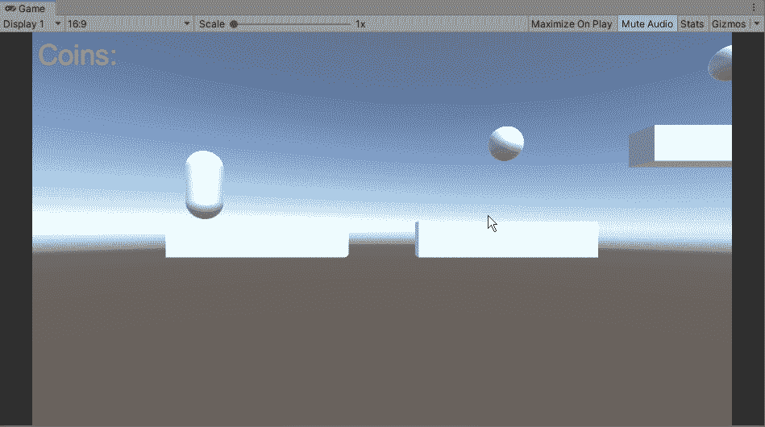

# 在 Unity 中创建收藏

> 原文：<https://medium.com/nerd-for-tech/creating-collectables-in-unity-4d9f8a2941b7?source=collection_archive---------15----------------------->

现在我们的玩家动作已经被充实了一点，让我们把游戏中的球体变成玩家的收藏品。首先，我们需要创建几个脚本，以及一个画布元素供我们使用。对于硬币，我们可以做的是将脚本应用于其中一个对象，然后将更改应用于所有对象:

在这里，我们可以将所有的 collectable 重命名为 coin，并创建一个 UIManager 脚本，将其附加到画布上:

从这里开始，我们将确定硬币追踪器的放置位置，以及要使用的尺寸和颜色:

现在开始编写我们的硬币收集方法的脚本。首先，我们知道我们希望我们的硬币有一个附加的触发方法，同时让我们的玩家知道它是否收集了硬币，并且 UI 元素在我们每次收集 1:

玩家脚本逻辑

对于我们的玩家脚本，我们只是简单地创建一个公共 void，我们的硬币脚本可以与之交互以添加到我们的总数中，然后可以将这个总数添加到我们的 UI 脚本中。我们还需要确保通过 getcomponent 创建与 UIManager 的连接，以便我们可以与该脚本进行交互:

接下来，在我们的硬币脚本中，我们需要创建这样的逻辑:当我们收集对象时，我们将 1 加到我们的硬币分数上，并销毁该对象，这样玩家就不能坐在 1 硬币上，人为地夸大他们的硬币总数:

最后，我们可以转到 UIManager 脚本，创建一个指向我们想要更改的文本的链接，这样每当收集到硬币时，我们就可以在屏幕上更新它。一旦我们把这些都准备好了，我们就可以在我们的游戏中检验它了:

现在我们有了一个功能正常的硬币收集系统，我们可以设计一些移动平台来帮助我们的玩家到达新的地方。