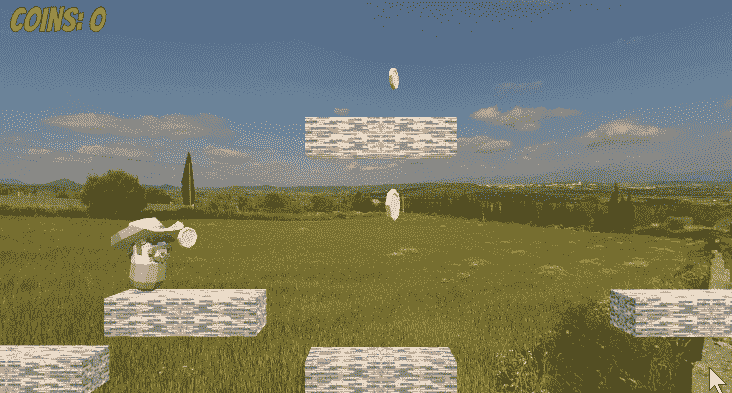
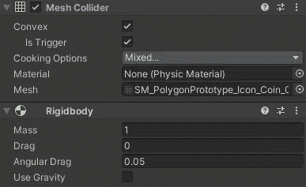
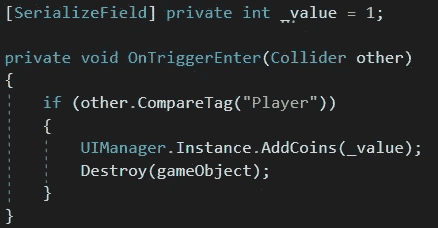
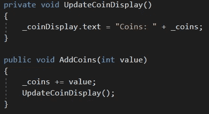

# 在 Unity 中创建收藏

> 原文：<https://medium.com/nerd-for-tech/creating-collectables-in-unity-50caf49efbd6?source=collection_archive---------10----------------------->

**目标:**创造玩家可以拾取和收集的物品。

首先，我们将确保我们的可收集物品有一个*碰撞器*组件，并且*被触发*被选中。我们还需要一个*刚体*组件，并且可能希望*不使用重力*，除非我们想让收藏品掉到地上。

现在我们将创建*collectible*脚本来附加到我们的收藏中。在这种情况下，我们正在创建硬币，所以我们将给它们一个可以在*检查器*中分配的*_ 值*。这样，我们可以创造不同面额的硬币。

当玩家触摸我们的 collectable 时，collectable 将调用 *UIManager 的* *AddCoins* 方法，传入硬币的值。收藏品将会自我毁灭。如果我们想给拾音器添加粒子或声音效果，我们会把它们放在*毁灭*命令之前。

*UIManager 的 AddCoins* 方法将硬币的值添加到当前计数中，然后调用其 *UpdateCoinDisplay* 方法，用新的计数更新文本。

在一个有更多可收集物品的更复杂的游戏中，我们可以使用一个*游戏管理器*来跟踪收集的物品，并让它告诉 *UIManager* 更新什么。