# 创作收藏品| Unity

> 原文：<https://medium.com/nerd-for-tech/creating-collectables-unity-ccb59ea0c191?source=collection_archive---------7----------------------->

## 统一指南

## 关于如何使用 Unity 创建收藏的快速指南

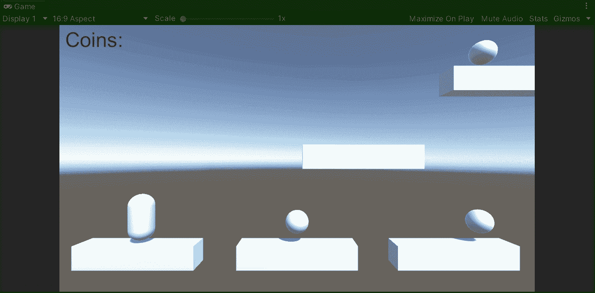

**目标**:创建收藏品，并实施统一收集系统。

在上一篇文章中，我介绍了[如何用 Unity](/nerd-for-tech/implementing-a-double-jump-unity-87a1e55e4e72) 实现双跳。现在，是时候实现一些收藏品和显示我们的平台游戏总数的方法了。

# 收藏品

为了表示收藏品，我们将使用原始资产。正如你在下一张图中看到的，我们在平台上方放置了 3 个球体来代表一件可收藏的物品:

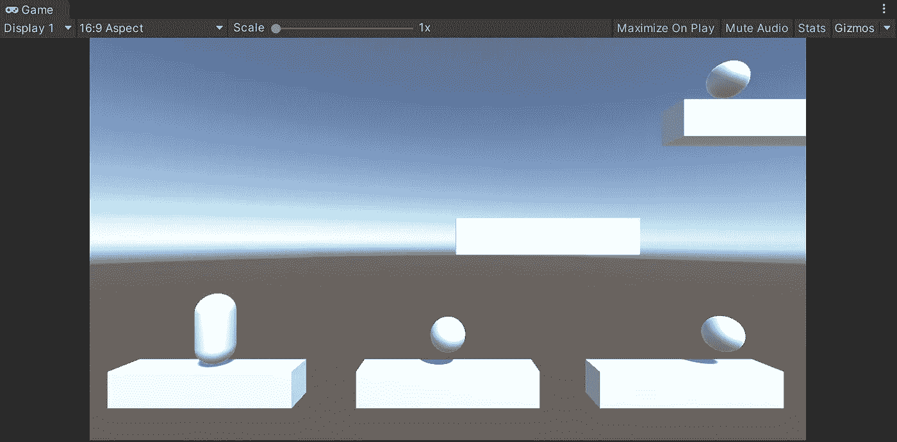

# 实现收集机制

然后，为了实现收集机制，让我们创建 2 个新脚本:

*   可收集的

来处理这个可收集的技工。

*   UIManager

处理将显示已收集项目总数的用户界面。

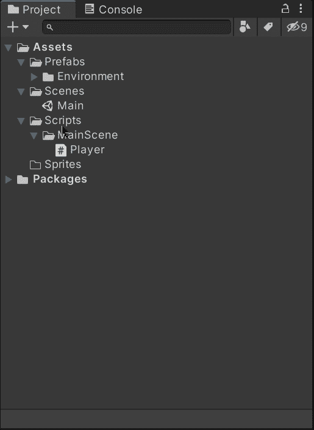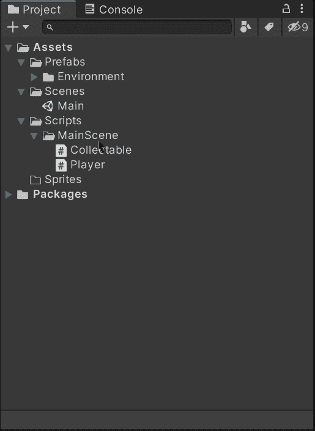

现在，让我们确保每个球体:

*   在碰撞器组件中启用了 ***是否触发*** 属性
*   包含一个刚体(不使用重力)
*   会附加相应的脚本

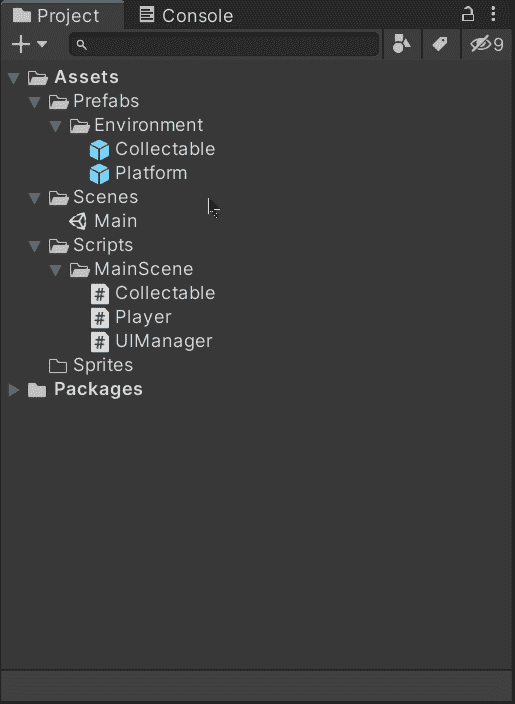

然后，让我们创建一个新的文本元素来显示有多少收藏品(硬币、电源等。)难道玩家已经收集了:

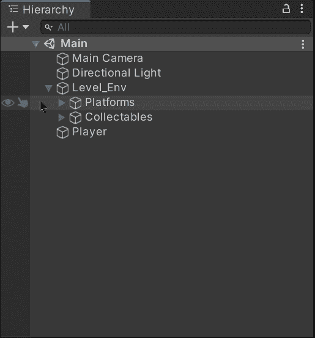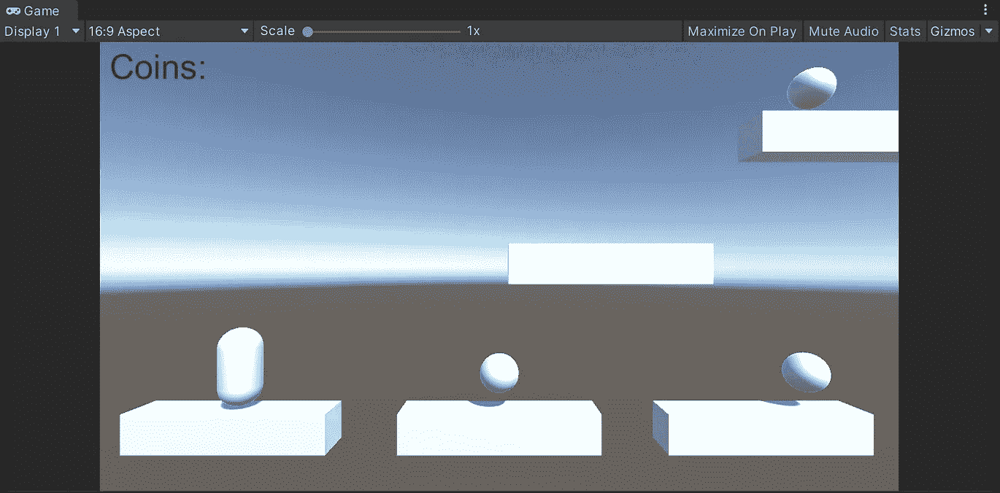

同样，让我们将 **UIManager** 脚本附加到画布上，这样我们就可以用脚本处理用户界面:

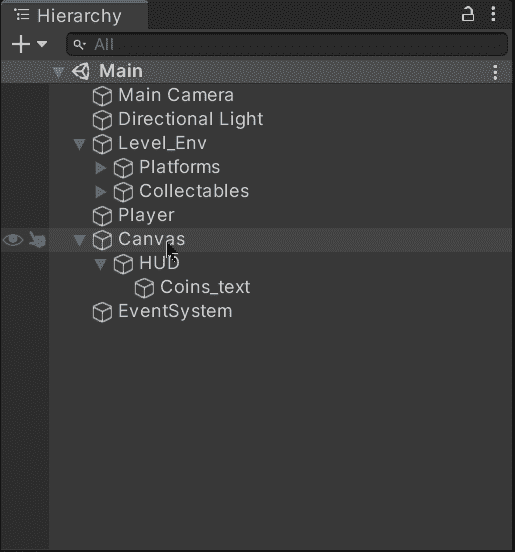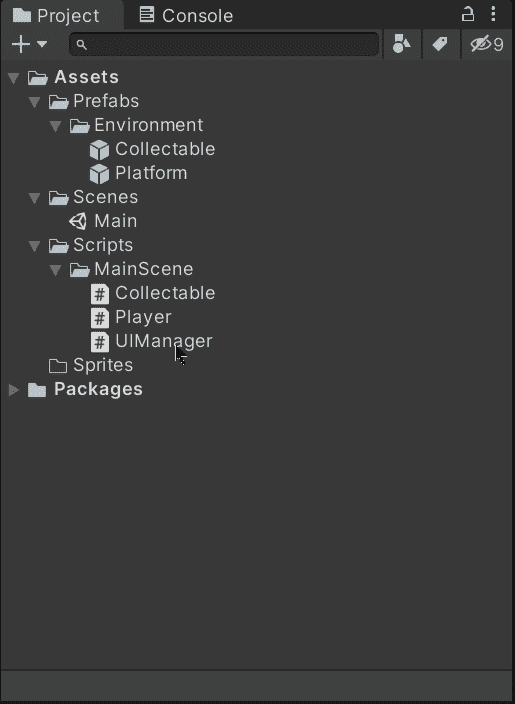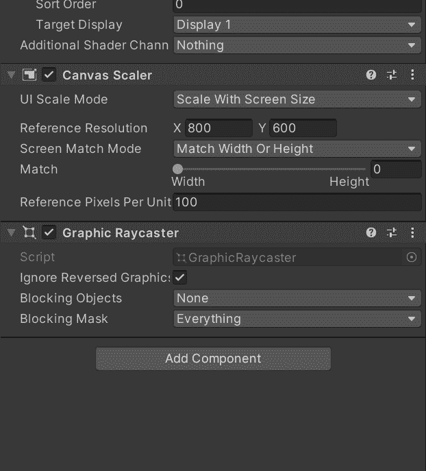

接下来，让我们打开可收集的脚本并添加下一个名称空间，这样我们就能够使用 [C#动作委托](https://docs.microsoft.com/en-us/dotnet/api/system.action?view=net-5.0)来处理收集机制:

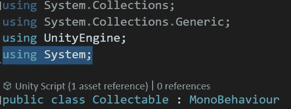

然后，让我们创建一个公共静态动作委托，在收集硬币时在其他脚本中执行相应的动作:

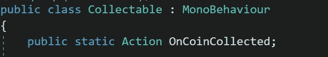

现在，为了实现收集机制，我们将使用 **OnTriggerEnter** 方法并检查另一个碰撞器是否属于玩家。如果是这种情况，让我们调用动作委托(如果它对于最佳实践来说不为空),然后销毁可收集的对象:

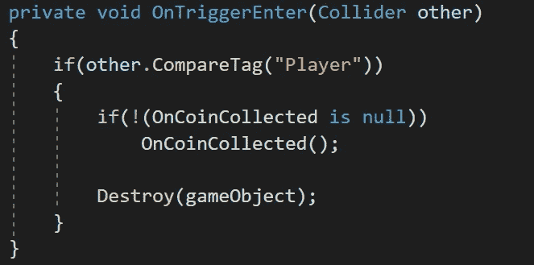

> 注意:玩家必须贴上 ***玩家*** 标签，以便与收藏品发生碰撞时识别。

一旦在 collectable 类中创建了**动作委托**，让我们打开**播放器**脚本并添加:

*   存储硬币数量的私有变量
*   仅返回私有变量的值的公共属性

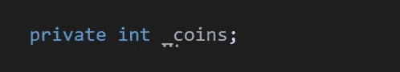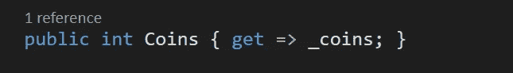

然后，让我们创建一个新方法，它将在每次被调用时添加一个硬币:

现在，让我们将该方法添加到来自**collectible**类的**静态动作委托**中，以便能够在每次收集硬币时调用它:

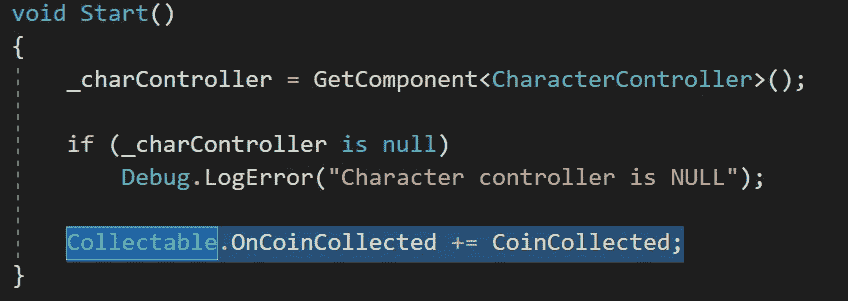

最后，作为一个好的实践，当玩家使用 **OnDestroy** 方法被破坏时，让我们从动作委托中移除该方法:

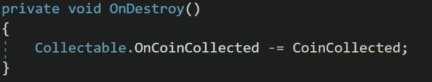

# 显示总数

现在，为了显示玩家收集的硬币总数，让我们打开 **UIManager** 类并添加 **UnityEngine。UI** 命名空间能够处理来自代码的 UI 元素:

然后，让我们创建变量来:

*   存储对 UI 文本元素的引用
*   存储对播放器脚本的引用

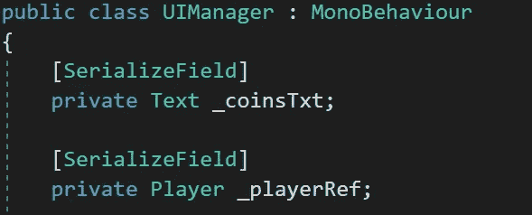

> 注意:很可能我会将硬币的数量存储在一个游戏管理器中，而不是存储在玩家本身中。现在我将存储一个对**玩家**脚本的引用。不要忘记使用**【serialize field】**通过检查器设置引用。

接下来，让我们通过检查器获取对 UI Manager 组件的引用:

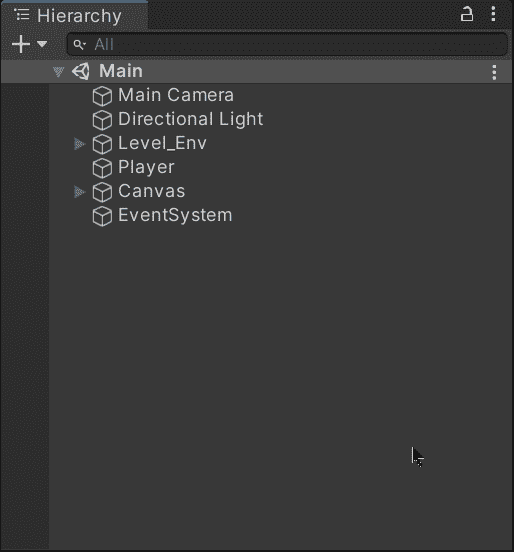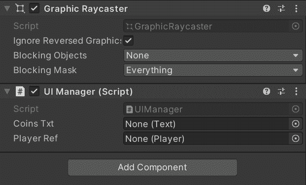

现在，让我们创建一个新方法来更新显示硬币总数的文本元素。这将通过调用**播放器**脚本的属性来修改文本:

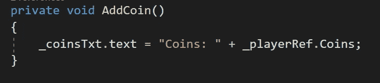

最后，让我们将各自的方法添加到来自**collectible**类的 **Action Delegate** 中，这样每次收集硬币时文本元素都会更新。另外，不要忘记使用 **OnDestroy** 方法移除该方法:

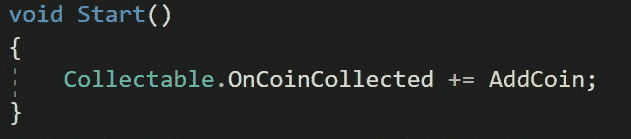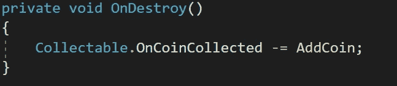

如果我们用 Unity 运行游戏，我们将能够收集球体，UI 元素将显示收集的总数:

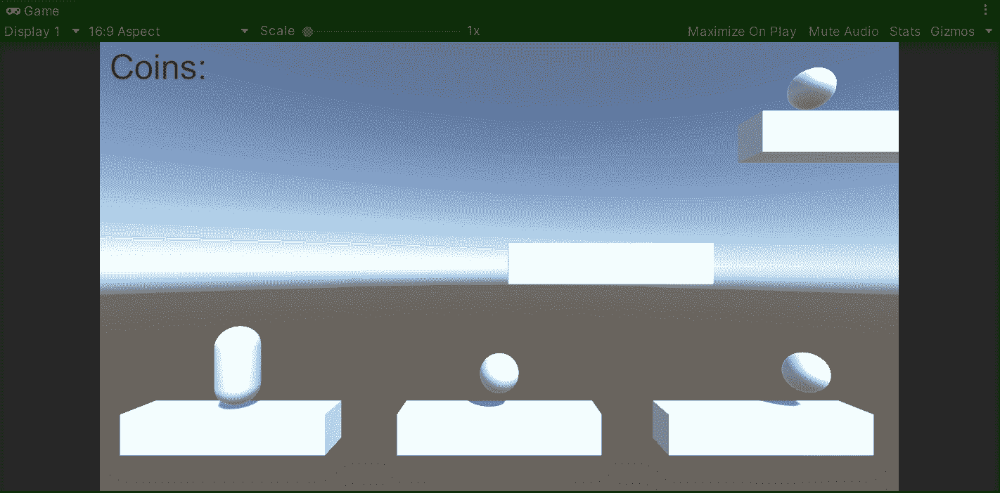

就这样，我们用 Unity 创造了可收藏的物品！:d .我会在下一篇文章中看到你，在那里我将展示如何使用 Unity 为我们的平台游戏移动平台。

> *如果你想了解我更多，欢迎登陆*[***LinkedIn***](https://www.linkedin.com/in/fas444/)**或访问我的* [***网站***](http://fernandoalcasan.com/) *:D**