# 在 Unity 中创建收藏品

> 原文：<https://medium.com/nerd-for-tech/creating-collectibles-in-unity-3314ed1e0ffd?source=collection_archive---------2----------------------->

我们的下一个挑战是让玩家收集硬币并在屏幕上更新用户界面。

我首先创建了一个可收集的脚本，并将其附加到球体/硬币上

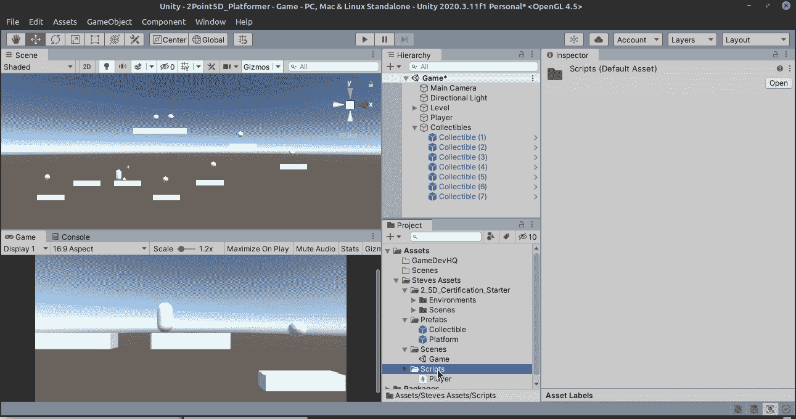

我们刚刚开始编写这个脚本，所以我们将进行一个初步的检查，看看击中收藏品的是不是玩家，如果是，那么我们打印玩家有一枚硬币，并销毁硬币对象。

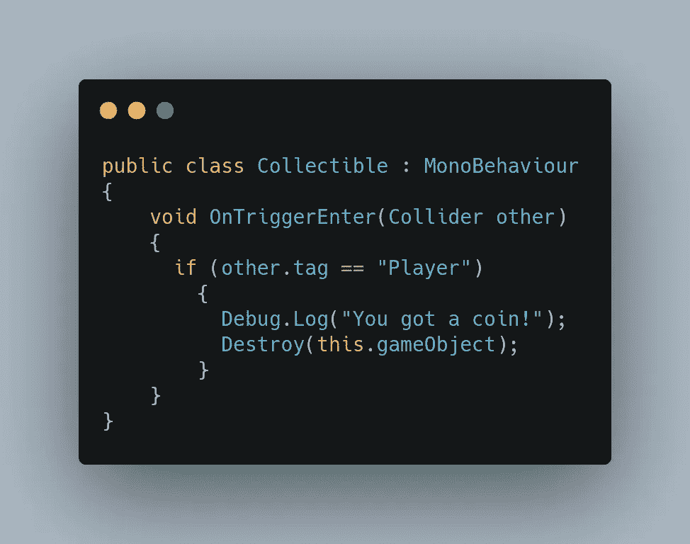

让我们看看目前为止我们有什么。

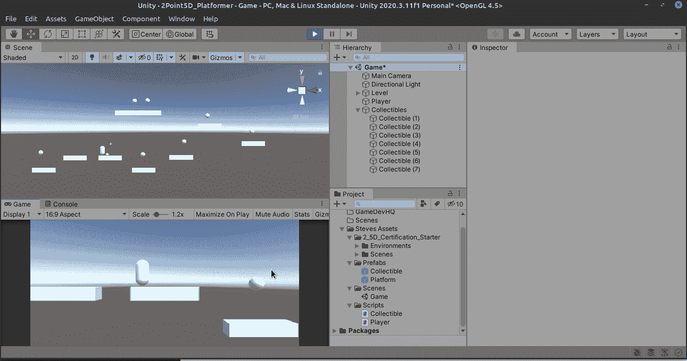

太好了！所以我们的“硬币”消失了，我们从我们的 OnTriggerEnter 方法得到一个确认，我们将得到一个硬币！

接下来，让我们转到播放器脚本，创建一个名为 _coins 的新变量。

当我们这样做的时候，让我们的玩家成为一个独生子。那会使事情变得容易。

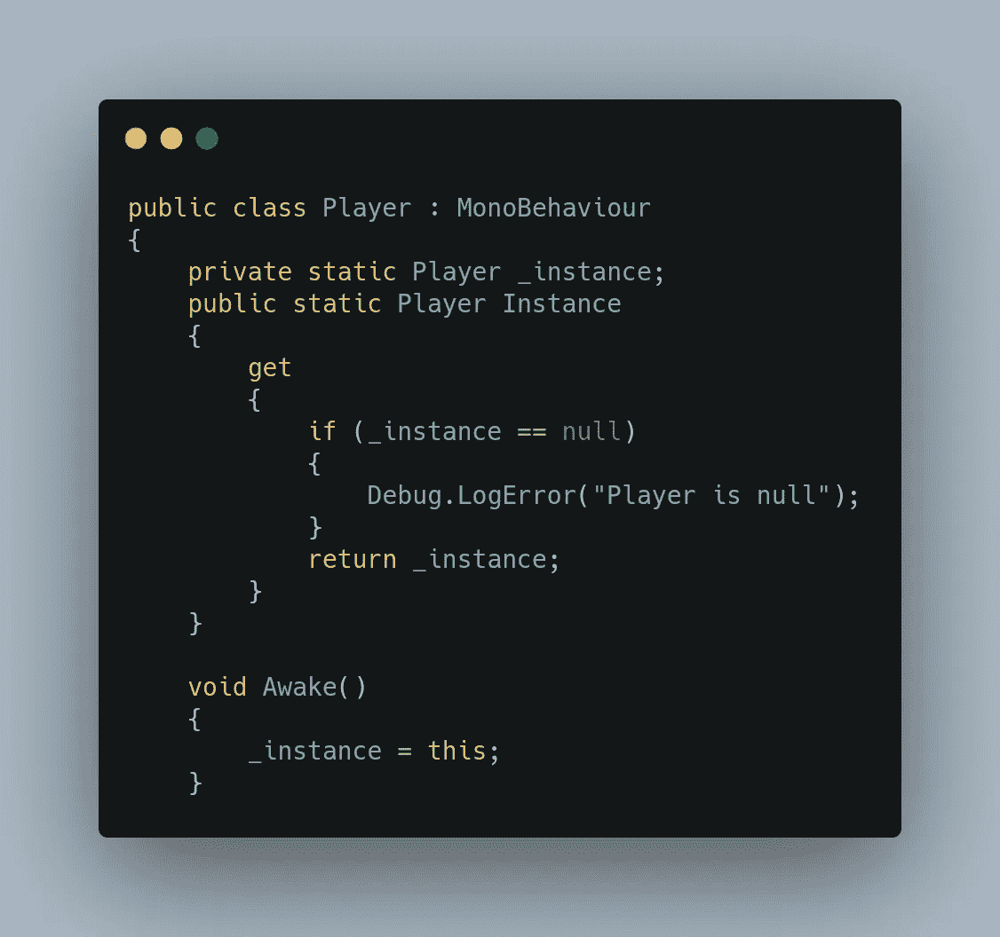

厉害！现在播放器将非常容易从收藏品和 UI 脚本中访问。

我们还将为玩家创造一个增加硬币的方法:

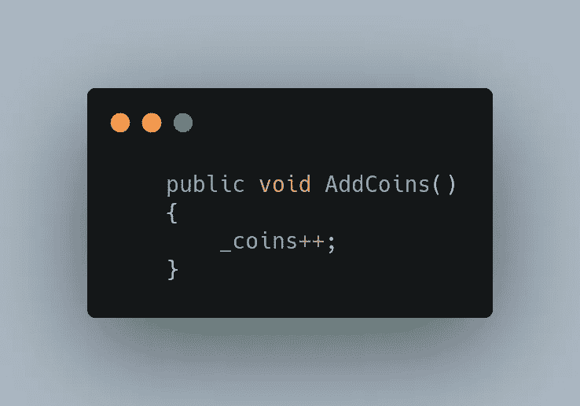

所以还是回到收藏剧本，给玩家一枚硬币吧！

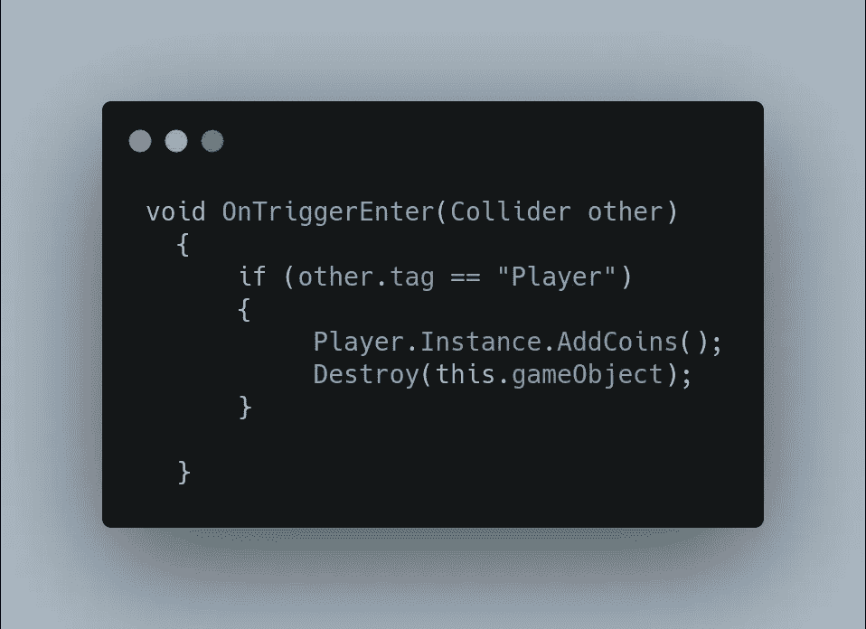

太好了！让我们看看我们的玩家现在是否真的在收集硬币:

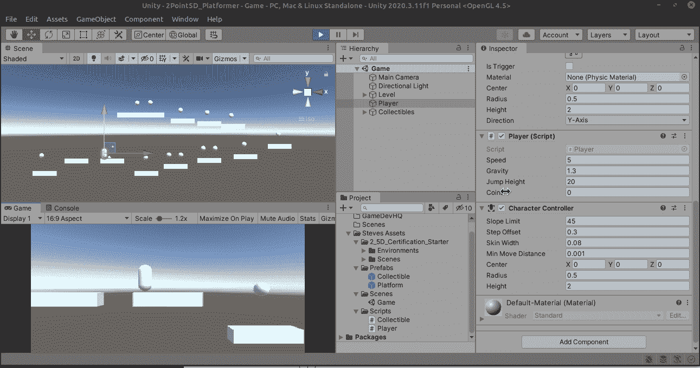

是啊！如果你看一下检查员，玩家每收集一枚硬币，硬币变量就加一！任务完成了一半！

接下来，我们需要在屏幕上放置一个 UI 画布，并通过附加到画布上的 UIManager 脚本来访问它。你可以跳过几个步骤，直接创建 UI/Text，它会为你创建画布。还要确保将文本重命名为 CoinText 或其他可识别的名称。

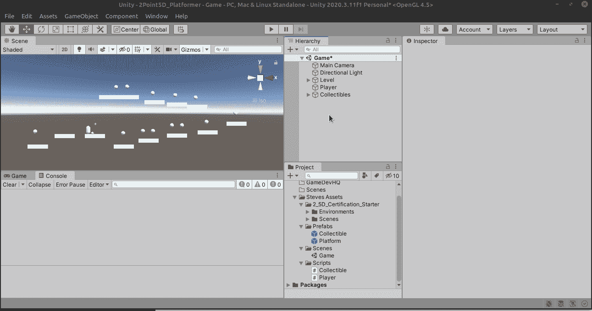

从这里，我们只需调整文本的位置，将颜色改为白色，使它稍微大一点，并调整框的大小，使其适合，我们将它锚定在左上角。我们还将初始文本更改为 Coins: 0 或留空也可以。

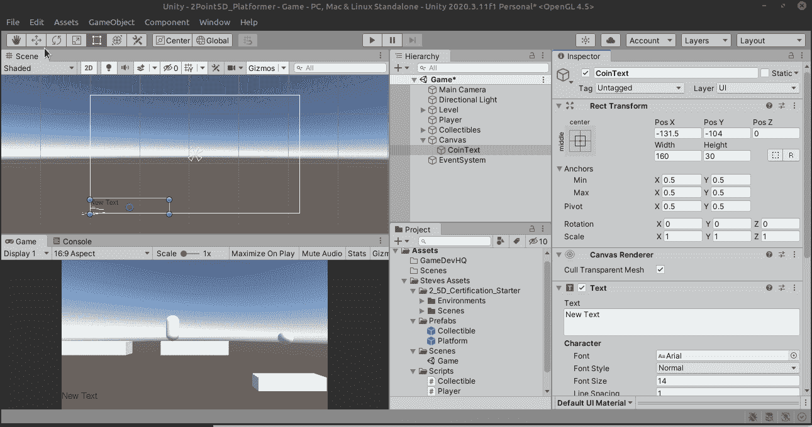

让我们把 UIManager 也做成单例的。它们让我们的生活更轻松。

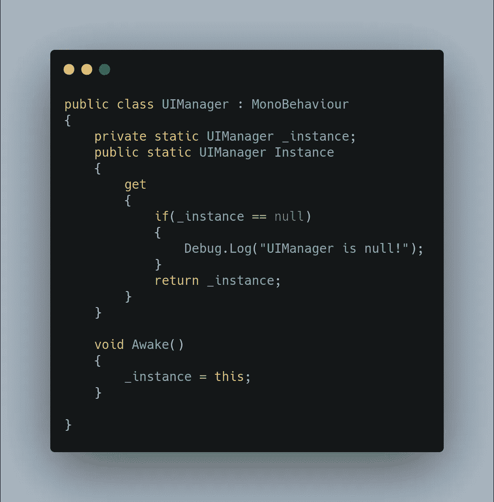

因为我们将访问 UI，所以让我们添加名称空间。

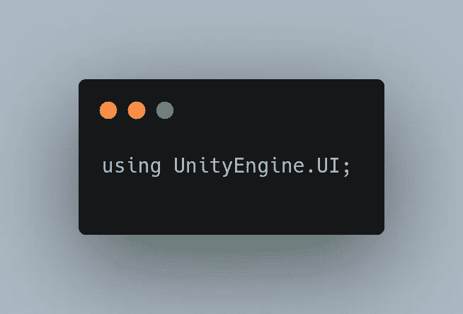

接下来，让我们为 UI 文本对象创建一个占位符:

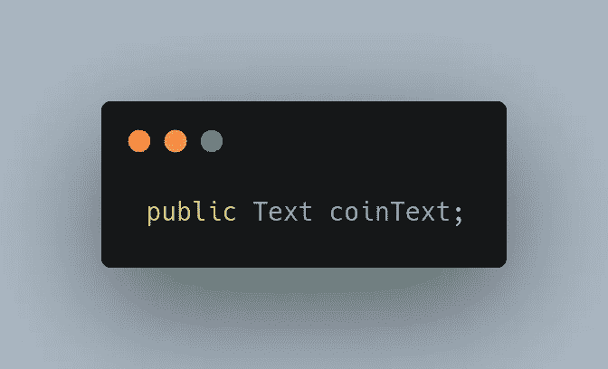

自然地，我们现在将实际的文本对象拖入其中:

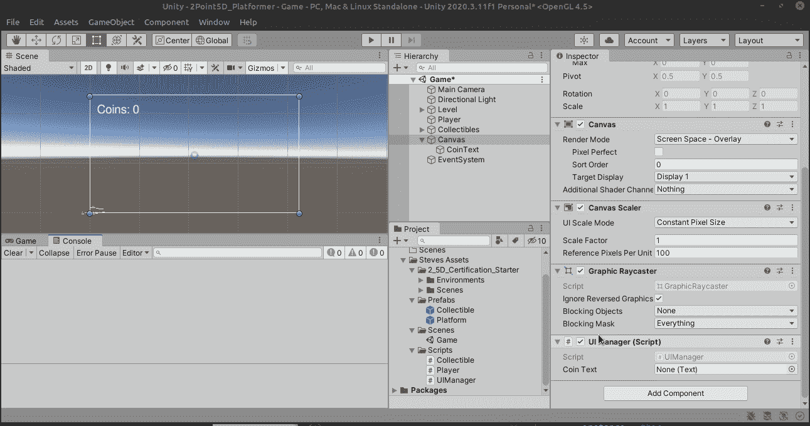

现在让我们创建一个函数，玩家可以访问它来更新 UI。

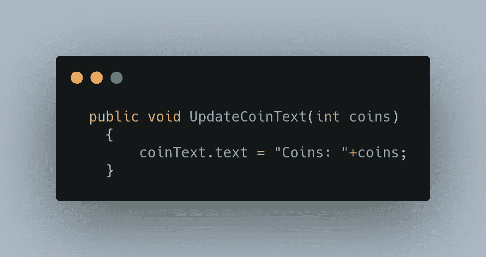

如您所见，我们将传入一个名为 coins 的整数，然后将其显示在文本中。很简单！

回到播放器，让我们在 Start()函数中将硬币初始化为 0。

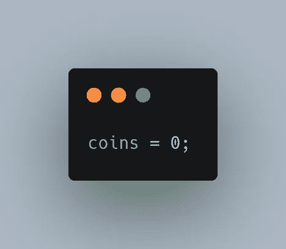

并将这一行放在我们的 Update()函数中。

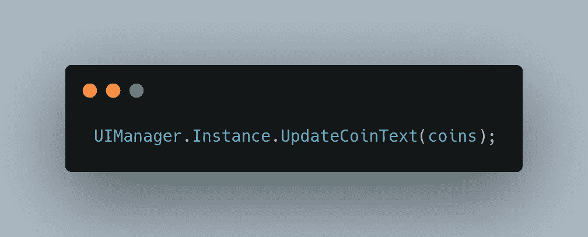

让我们来看看它的实际应用:

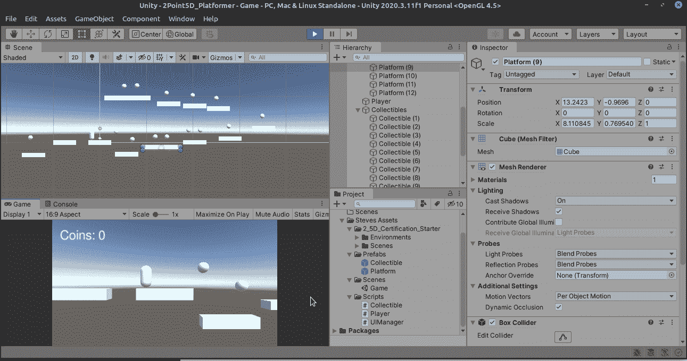

嗯，我们的玩家不幸死亡，但从好的方面来看，我们知道他们在短暂的生命中获得了多少硬币！所以你有它！一个可收集的硬币系统，在不同的类之间传递数据！

如果镜头跟着球员就好了，明天再说吧！