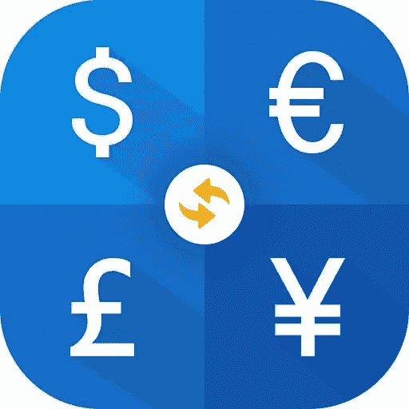
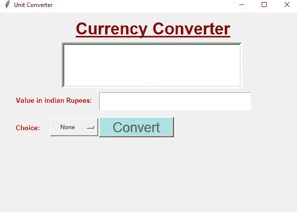
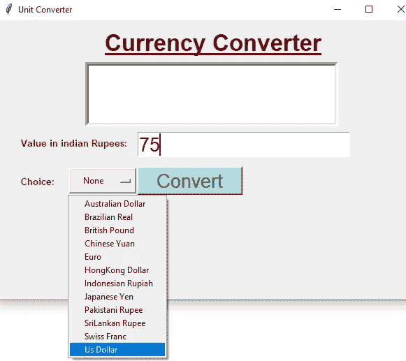
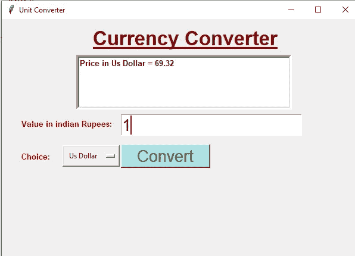

# 借助 Tkinter(Python GUI)创建货币转换器

> 原文：<https://medium.com/nerd-for-tech/creating-currency-converter-with-the-help-of-tkinter-python-gui-9497f808fe3b?source=collection_archive---------3----------------------->

让我们在 **Tkinter** (一个 **Python GUI** 模块)的帮助下创建一个**货币转换器** r

为什么我们需要一个**货币转换器**？

我们需要一个**货币转换器**，因为世界上有数百种货币，每种货币都有自己独特的价值。因此，我们需要一个货币转换器来转换我们的货币价值到另一种货币。

*(*[*)https://en.wikipedia.org/wiki/Currency*](https://en.wikipedia.org/wiki/Currency)*)*

在这里，我们将开发一个基于 GUI 的货币转换器，它接受印度卢比作为输入值，并将该值转换成美元、澳元、巴西雷亚尔、英镑、人民币等。当用户点击隐蔽按钮时。我们将使用项目的当前汇率。(汇率是一种货币对另一种货币的价格)。

**例如，**1 美元的价值等于 72.60 ₹印度卢比。

# 让我们开始吧，一个使用 Python GUI 进行货币转换的项目是:

# 项目代码:

***关于本项目的代码点击下面的链接:***

***(***[***https://github . com/platform uma/medium _ blog/blob/865915 D4 BF 9436 da 547 c 49 AAA 06952 c 6 dff 7 f 621/currency % 20 converter . py***](https://github.com/Platforuma/medium_blog/blob/865915d4bf9436da547c49aaa06952c6dff7f621/currency%20converter.py)***)***

# 定义代码工作:-

**Tkinter** 是 Python 中 GUI 库的名字。使用 **Tkinter** 创建 GUI 应用程序是一项简单的任务。

在这一行代码中，我们从 Python GUI 库中导入 ttk 模块。 [ttk](https://docs.python.org/3/library/tkinter.ttk.html#module-tkinter.ttk) 模块提供了对 tk 主题小部件集的访问。

> ***转换器= Tk()***
> 
> ***【货币转换器】***
> 
> ***【600 x400】***

Tk 类用于创建一个根窗口。这里 converter 是根窗口的名称。在这些步骤中，我们给出了 GUI 根窗口的标题。Tkinter 提供了许多方法，其中之一是 geometry()方法。

> ***选项= {***
> 
> ***【澳元】:49.10，***
> 
> ***【巴西雷亚尔】:17.30，***
> 
> ***【英镑】:90.92，***
> 
> ***【中国元】:10.29，***
> 
> ***【欧元】:77.85，***
> 
> ***【港币】:8.83，***
> 
> ***【印尼盾】:0.004864，***
> 
> ***【日元】:0.628，***
> 
> ***【巴基斯坦卢比】:0.49，***
> 
> ***【斯里兰卡卢比】:0.39，***
> 
> ***【瑞士法郎】:69.62，***
> 
> ***【美元】:69.32***
> 
> ***}***

在**字典**中，我们存储了国家名称及其货币值等数据。这里字典的名称是 OPTIONS。

> ***def ok():***
> 
> ***价格=卢比. get()***
> 
> ***答案= variable1.get()***
> 
> ***DICT = OPTIONS.get(答案，无)***
> 
> ***转换后= float(DICT)* float(price)***
> 
> ***result.delete(1.0，结束)***
> 
> ***result.insert(插入，"价格 in "，插入，回答，插入，" = "，插入，转换)***

在这一行代码中，我们定义了函数名为 ok 的**函数**。同样，我们定义价格变量来保存卢比对象的值。Get 函数提供从任何对象或任何变量获取数据。现在我们再次定义答案变量来保存**变量 1** 对象的值。

在这一行代码中，定义 DICT 变量来保存选项值，这里选项值从答案变量中获取值。我们创建**转换后的变量**。转换后的变量包含 DICT*price 值，我们对 DICT 或 price 变量执行乘法运算。**删除方法**提供了删除 Tkinter 文本框的内容。Insert 方法允许在文本框中插入文本。

> ***appName = Label(Converter，text="Currency Converter "，font=("arial "，25，" bold "，" underline ")，fg="dark red")***
> 
> ***appName.place(x=150，y=10)***
> 
> ***结果=文本(转换器，高度=5，宽度=50，字体=("arial "，10，" bold ")，bd=5)***
> 
> **result . place(x = 125，y = 60)**

现在来看 GUI 项目的**设计部分。这里我们在一个项目中使用了一些**标签、输入框和按钮**。因此，让我们开始逐行理解项目代码。**

在这里，我们在 GUI 窗口上定义 Label 方法的 appName 对象，在 appName 对象上写入文本，设置字体，并设置对象的 fg、bg 或 width。方法，分配 appName 对象的位置。在这里，我们定义了 text 方法的 result 对象，设置了文本框的高度和宽度，并设置了 font 和 bd。使用 x 或 y 坐标值指定结果对象的位置。

> ***印度= Label(converter，text= "以印度卢比表示的值:"，font=("arial "，10，" bold ")，fg="red")***
> 
> **India . place(x = 30，y = 165)**
> 
> ***【卢比=条目(转换器，font=("arial "，20))***
> 
> ***卢比. place(x=200，y=160)***
> 
> ***Choice = Label(converter，text="Choice:"，font=("arial "，10，" bold ")，fg="red")***
> 
> ***(x = 30，y=220)***

现在，我们再次在 GUI 窗口上定义 Label 方法的 India 对象，在标签上书写文本，并设置标签的字体和 fg。使用 x 或 y 坐标值指定印度对象的位置。我们定义了输入法的卢比对象，并设置了输入法的字体。使用 x 或 y 坐标值指定卢比对象的位置。

在这一行代码中，我们定义了 Label 方法的 choice 对象，并在标签上写入文本，设置标签的字体和 fg。再次使用 x 或 y 坐标值指定选择对象的位置。

> ***variable1 = StringVar(转换器)***
> 
> ***variable1.set(无)***
> 
> ***option = OptionMenu(转换器，变量 1，*选项)***
> 
> ***option.place(x=100，y=210，宽度=100，高度=40)***

现在来看下一行代码，我们定义变量 1。在这行代码中，将 variable1 的值设置为 None。这里我们定义 OptionMenu 方法来保存 variable1 对象和 **OPTIONS** 对象的值。使用 x 或 y 坐标值指定 OptionMenu 方法的位置，并设置宽度或高度。

> ***Button = Button(converter，text="Convert "，fg="green "，font=("arial "，20)，bg= "粉蓝"，command=ok)***
> 
> ***button.place(x=200，y=210，高度=40，宽度=150)***
> 
> ***converter . main loop()***

现在来看项目的按钮部分，我们正在按钮上执行一个操作。那么让我们从 Button 是如何工作的开始**？**

按钮方法，并在按钮上发出 ok 命令，以便在单击按钮时执行操作。使用 x 或 y 坐标值指定按钮对象的位置，并设置高度和宽度。

项目的最后一行代码是提供无限循环的**主循环函数**。所以让我们开始理解它是如何工作的。 **mainloop()** 是一个用来运行应用程序的无限循环，使用这个函数窗口只要不关闭。

在这里，我们使用 Python Tkinter 模块和 ttk 模块完成了一个完整的 **GUI 项目。**

# 请通过下面的链接参考我们关于 Python 的更多博客:

 [## Platforuma 印度-中型

### 想开始设计，但不知道从哪里开始设计？这些课程和练习将帮助你开始设计…

medium.com](/@platforuma) 

# 访问我们的网站:

 [## 学习、创新和激励-平台

### Platforuma 是一家位于印多尔的教育科技初创公司，提供学习和 Arduino 培训、Python 学习、机器人技术…

www.platforuma.com](https://www.platforuma.com/) 

**作者:** [**普里扬卡**](https://www.instagram.com/p_i_h_u_9754/)

**编辑:** [**丽雅·帕蒂达尔**](https://www.instagram.com/riyapatidar002/) **，** [**德温德拉·帕蒂达尔**](https://www.instagram.com/dev__ptdr/) **，** [**阿苏托什**](https://www.instagram.com/ashutosh_.i/)