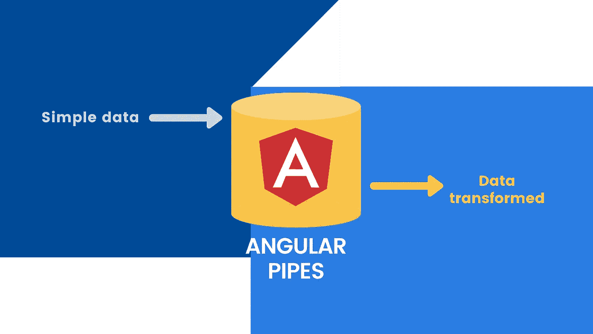
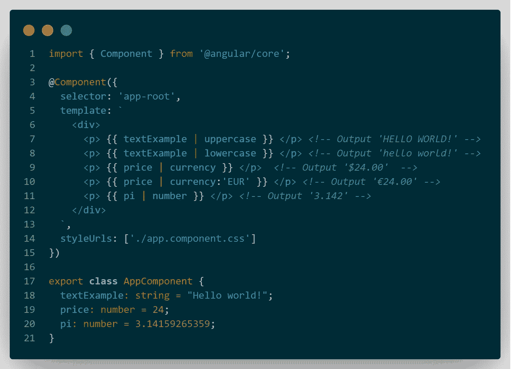
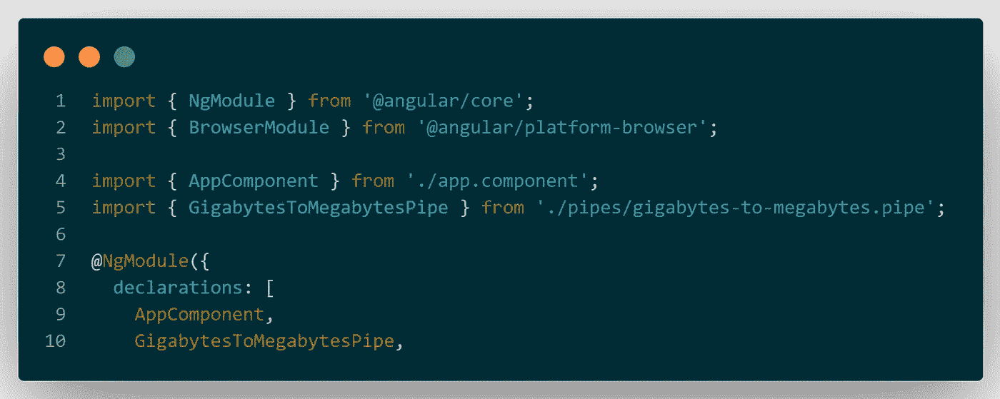
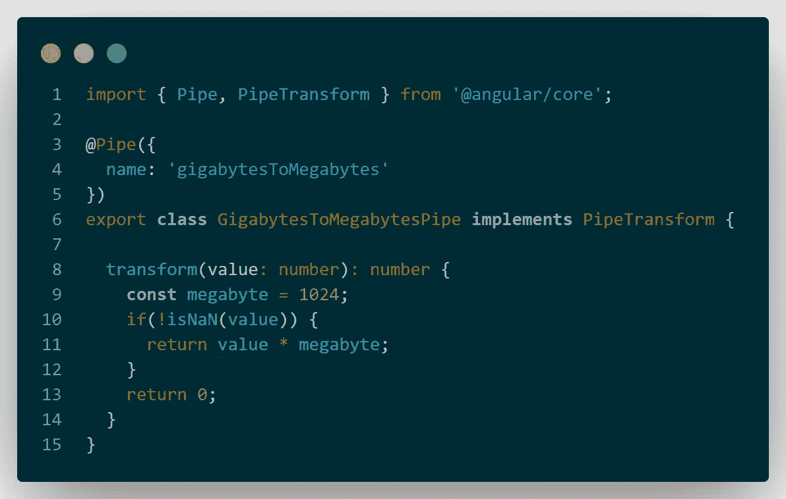
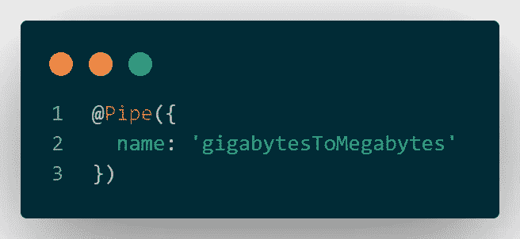
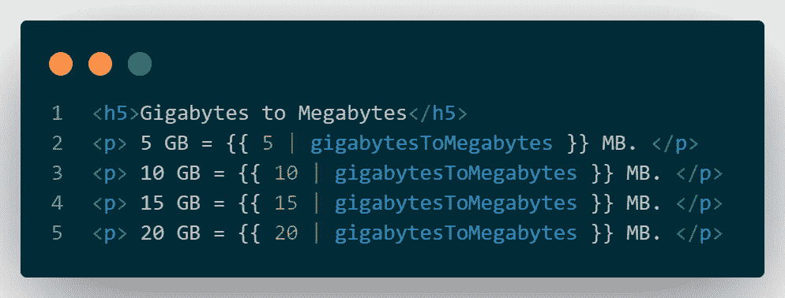

# 在 Angular 11 中创建自定义管道

> 原文：<https://medium.com/nerd-for-tech/creating-custom-pipes-in-angular-11-d4468da38168?source=collection_archive---------3----------------------->

# **内置管道**

管道是在角度模板中转换数据的一种神奇、有用和干净的方式。Angular 提供了许多用于数据格式化的**内置管道**，这些管道可以在我们的应用程序中使用。我会给你四个在 Angular 中使用的常见管道的例子，但是如果你想了解更多关于它的信息，请看管道 API 文档。

**四根普通管道:**

1.  **大写字母:**将文本转换为全部大写。
2.  **小写字母:**将文本转换为全部小写。
3.  **CurrencyPipe:** 将一个数字转换为货币字符串，根据区域设置规则进行格式化。
4.  **DecimalPipe:** 将一个数字转换成一个带小数点的字符串，根据地区规则格式化，等等。

为了转换数据，我们使用**{ { variableName | pipeName } }**。看看下面的例子。

现在我们的四个管道开始工作了。

这些内置管道带有棱角，它们只是**准备使用**，**不需要配置。**

# 自定义管道

现在，如果我们想要一个定制的转换显示在我们的模板中，但是 Angular 目前没有提供我们需要的管道，会发生什么呢？我们做什么呢我们可以创建自定义管道吗？

没错！Angular 为我们提供了这一惊人的功能。事实上，我们可以创建自己的管道。看看下面的教程。

> 在这个例子中，我们将创建一个将千兆字节(GB)转换为兆字节(MB)的管道。1GB 有 1024 MB 吧？

记住这些值，现在让我们创建我们的 typescript 文件，它将包含我们的自定义管道的所有代码。我们可以使用 CLI 并键入下一个命令来创建它。

ng 生成管道管道名称

如果您注意到，该命令将生成两个文件，其中一个文件将被更新:

1.  千兆字节转兆字节. pipe.spec.ts **(测试文件)**
2.  千兆字节转兆字节. pipe.ts **(要编辑的文件)**

但是什么文件会被更新呢？该命令还会将新的定制管道添加到 **app.module.ts** 文件中的 **@NgModule** 声明中。检查一下！

现在，在我们的**千兆字节到兆字节. pipe.ts** 文件中，我们需要实现我们的自定义代码来执行转换操作。我们的文件现在应该如下所示:

抓住你了！我们已经创建了自定义管道。顺便说一下，记住下一步的管道名称:

下一步是什么？在我们想要使用这个管道的组件 html 文件中，我们需要添加以下表达式:

要查看结果，是时候用 **ng serve** 运行 angular 了，一旦代码编译完毕，您将在浏览器中看到如下结果:

# 最佳实践？

**是啊！**我会给你三个关于角管的最佳做法。

> **1。总是尽量使用纯管道:**默认**所有管道都是纯的**。不纯的管道对性能有巨大的负面影响。阅读一本 [ngular 的指南。](https://angular.io/guide/pipes#pure-and-impure-pipes)
> 
> **2。管道名称使用 camel case**:当然是在模板中，而不是在类名中。示例:“**千兆字节数**”。Angular 团队使用它，它对于保持一致性非常有用。
> 
> **3。在共享文件夹中创建管道。**整个应用程序所需的所有实用程序都应创建在一个共享文件夹中，例如:管道、模型等。

# 你准备好了吗？

此时，您已经了解了一些关于管道以及如何创建自定义管道的知识。好的，这个例子非常简单，但是当你想要创建更复杂的管道时，管道创建的基本原理是一样的。

> 请记住:如果已经存在一个内置管道来完成您想要做的事情，请使用它！

为我的第一篇文章和你的新发现干杯！🍻

感谢阅读！