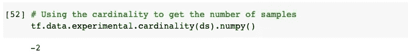
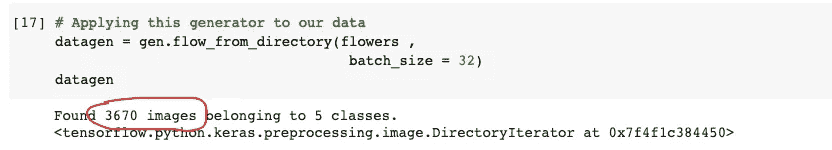
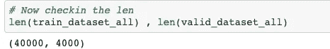

# 从 TensorFlow 图像数据生成器创建数据集

> 原文：<https://medium.com/nerd-for-tech/creating-dataset-from-tensorflow-imagedatagenerator-31ce5706612b?source=collection_archive---------5----------------------->

将您的 ImageDataGenerators 转换为数据集


托马斯·耶茨在 [Unsplash](https://unsplash.com/t/experimental?utm_source=unsplash&utm_medium=referral&utm_content=creditCopyText) 上拍摄的照片

对于这个实验，我们将使用来自人工智能群体竞赛(live now)的数据集[https://www . AI Crowd . com/challenges/AI-blitz-8/problems/f1-team-classification](https://www.aicrowd.com/challenges/ai-blitz-8/problems/f1-team-classification)

这只是为了实验目的，学习如何使用`tf.data.Dataset.from_generators()`，这个数据集似乎是一个合适的实验对象。

因为我是 TensorFlow 新手，所以我对 API 不太熟悉。用高级 API 构建东西很容易，但随着时间的推移，性能成了问题，我觉得做事受到了限制。也没有多少乐趣，结果也很差。

哦，是的，然后我开始研究`tf.data` API，一开始有点困惑，但是花时间在这上面让我意识到这可以帮助我编写描述性的和高效的输入管道。此外，我们可以通过使用预取、并行数据转换和其他酷方法来优化数据管道的性能。

**`**tf.data**`**API 使您能够从简单的、可重用的部分构建复杂的输入管道。****

**我不确定如何建造复杂的管道。使用`ImageDataGenerator`很容易，特别是使用目录和数据框的方法来加载图像，使事情变得更容易，没有任何麻烦。**

**我发现了这个方便的方法`[tf.data.Dataset.from_generator()](https://www.tensorflow.org/api_docs/python/tf/data/Dataset#from_generator)`，它帮助我们从 ImageDatagenerator 对象本身创建一个 dataset 对象。**

**多酷？**

**让我说明为什么我认为这很酷，我们可以使用[**imagedata generator**](https://www.tensorflow.org/api_docs/python/tf/keras/preprocessing/image/ImageDataGenerator#used-in-the-notebooks)**作为工具来加载图像，尤其是当您的图像 ID 在数据框和目录中时。好了，说够了，让我们进入代码！****

****首先，我们需要创建一个 **ImageDataGenerator** 对象，在这个例子中，我将从一个数据帧中解析图像 ID，因为从一个目录中获取图像比这更常见。请记住，不要在这里应用你的增强，因为这些图像数据生成器计算是在 CPU 上完成的，因此它会使训练变慢。****

****我们已经创建了生成器，现在是时候使用`[.flow_from_dataframe()](https://www.tensorflow.org/api_docs/python/tf/keras/preprocessing/image/ImageDataGenerator#flow_from_dataframe)`将它应用到我们的数据中了****

****酷毙了。我们已经完成了生成器对象的创建，您可以继续建模，但是让我们看看这个神奇的函数，它将帮助我们将它转换成一个**数据集。******

****我们将看到`tf.data.Dataset.from_generator()`函数，它接受 3 个输入并返回一个数据集。****

****需要注意的事项:****

*   ****在`lambda`的地方使用你的数据生成器对象。****
*   ******output_shapes** 非常重要，因为我们的数据集对象将返回我们在`output_shapes`中提到的精确形状。****

****这就是我们在构建生成器时检查数据类型和形状的原因。****

```
**from_generator(
    generator, output_types=None, output_shapes=None, args=None,
    output_signature=None
)**
```

*   ******生成器**:必须是可调用对象，返回支持`iter()`协议的对象(如生成器函数)。****
*   ******output_type** :您希望 X 和 y 的输出类型。****
*   ******output_shape** :您想要的数据输出形状，在创建 ImageDataGenerator 时，确保检查您的数据的输出形状。****

****让我们把这个应用到我们的发电机上，看看效果如何。****

****这将为我们返回一个名为 **FlatMapDataset** 的数据集对象，它存储了我们的张量和带有我们想要的输出形状的标签。****

```
**(<FlatMapDataset shapes: ((32, 256, 256, 3), (32,)), types: (tf.float32, tf.float32)>, <FlatMapDataset shapes: ((32, 256, 256, 3), (32,)), types: (tf.float32, tf.float32)>)**
```

****但是现在有一个问题，因为我们已经从一个生成器中导出了我们的数据集对象，我们将不能使用`len()`函数来知道我们的数据集中的样本数。****

****我们可以使用基数来获得数据集中的样本数。这是因为在我们的例子中，在转换之后，长度是未知的和无限的。让我们使用 TensorFlow 的基数函数来返回数据集中的样本数。****

****`tf.data.experimental.cardinality(dataset)` [函数](https://www.tensorflow.org/api_docs/python/tf/data/experimental/cardinality)将返回数据集中的样本数，尽管我们使用 **len** 函数时未知。****

********

****因为我们的长度是未知的，当你从生成器转换到数据集对象时，这是常见的情况，但是不要担心，我们甚至可以通过使用类似的函数来解决这个问题。我们可以明确地输入我们的样本数量，甚至更好的是，我们现在可以在我们的数据集上使用`len()`函数，****

****`[tf.data.experimental.assert_cardinality(expected_cardinality)](https://www.tensorflow.org/api_docs/python/tf/data/experimental/assert_cardinality)`函数将帮助我们断言输入数据集的基数。****

*   ******预期基数** →输入数据集的预期基数。****

****我们可以通过使用`apply()`函数将它应用到我们的数据集。****

****我们之所以使用 **40000** 和 **4000** 作为数据集的基数，是因为这是分别在我们的训练和验证数据集中可用的样本(图像)数量。****

****我们可以在创建 ImageDataGenerator 对象时检查图像(样本)的数量。****

********

****您甚至可以在我们的数据集上使用`len()`函数。****

********

****现在，我们成功地将 ImageDataGenerator 对象转换为数据集，我们可以用它来训练我们的模型等等。像**预取**和**并行化**这样的方法现在可以应用于我们的数据集，以便使我们的训练更快，并更好地优化内存。****

****你可以看看我在工作期间在论坛上提出的这个[帖子](https://discuss.tensorflow.org/t/typeerror-dataset-length-is-unknown-tensorflow/948/2)。****

****希望你喜欢这个博客，我在下面附上了整个笔记本的链接，里面有一个真实的工作示例，你可以参考并应用到你的问题中。****

****[](https://github.com/ashikshafi08/Learning_Tensorflow/blob/main/Experiments/Generator_to_Dataset.ipynb) [## ashikshafi 08/Learning _ tensor flow

### 在 GitHub 上创建一个帐户，为 ashikshafi 08/Learning _ tensor flow 开发做贡献。

github.com](https://github.com/ashikshafi08/Learning_Tensorflow/blob/main/Experiments/Generator_to_Dataset.ipynb) 

在那之前，

不断学习，不断创造。****