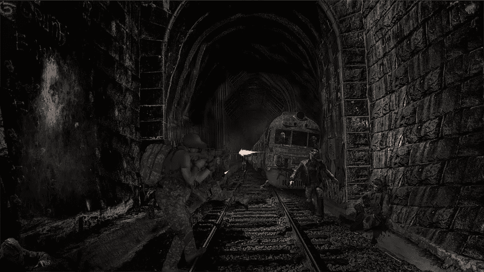
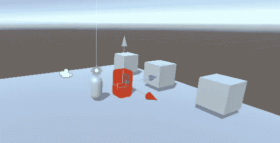
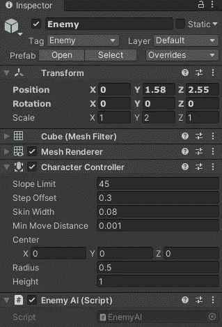
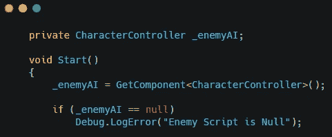
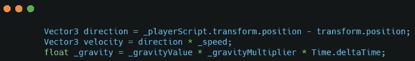
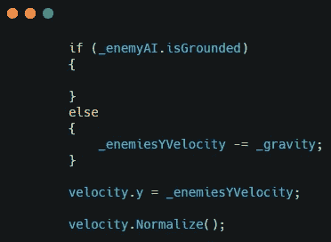
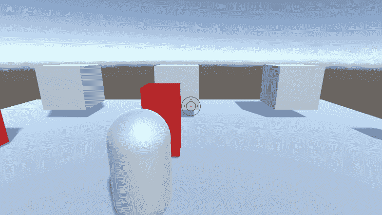

# 在 Unity 中创造敌人 AI

> 原文：<https://medium.com/nerd-for-tech/creating-enemy-ai-in-unity-4180a2ac03ba?source=collection_archive---------0----------------------->

我正在开发一款第三人称僵尸生存游戏。我已经设置好了玩家，现在是时候对付敌人了。我从创造追逐的人工智能开始。

我首先用一个立方体创造了一个基本的敌人。敌人将会使用一个角色控制器，所以我添加并删除了碰撞器。我还创建了敌人脚本，并将其附加到敌人身上。

为了让敌人移动，我需要参考角色控制器。

我还需要一个球员的参考。

类似于玩家的移动，我得到移动的方向，然后乘以一个速度变量。在这种情况下移动的方向是玩家和敌人之间的距离。敌人也需要为自己计算重力。

如果敌人不接地，重力将被应用。然后，我们将设置敌人的 y 值，并对速度向量进行归一化。我们将向量归一化，使其长度为 1，并给敌人适当的追逐速度。

现在我们旋转敌人面对玩家，移动敌人。

这会给敌人一个漂亮的追击 AI。

