# 制造敌人的爆炸

> 原文：<https://medium.com/nerd-for-tech/creating-enemy-explosions-6b4101491d21?source=collection_archive---------33----------------------->

知道你的敌人已经被消灭了，还有什么比这更令人满意的方法呢？现在，所有发生的是敌人死亡后从屏幕上消失，但现在我们将看看如何给敌人添加一个爆炸效果。首先，让我们创建爆炸效果的动画，看看当我们玩游戏时会发生什么:

应用动画

现在让我们看看玩游戏后会发生什么:

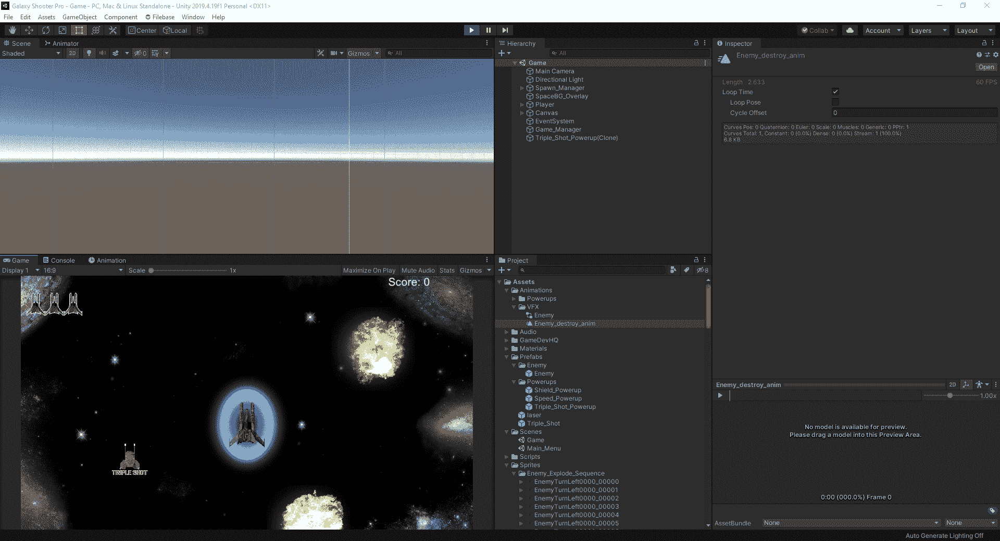

正如我们所看到的，所有正在发生的是我们的敌人在进入游戏时爆炸，并且效果一次又一次地循环。视觉上，看起来令人兴奋，但实际上相当无用。那么，我们如何着手解决这个问题呢？首先，我们将关闭循环，同时在我们的动画制作工具中创建一个空连接:

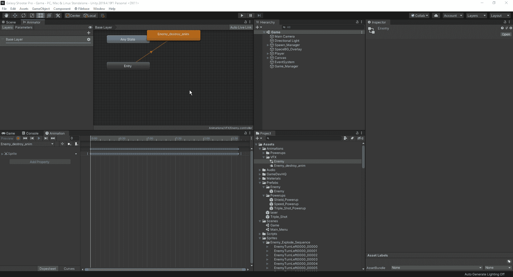

现在我们已经创建了一个新的状态，让我们将它连接到我们的毁灭动画，看看它在游戏中的样子:

现在稍微延迟了一点，但还是没有做到我们想要的。原因是我们需要为我们的动画设置一个参数来激活:

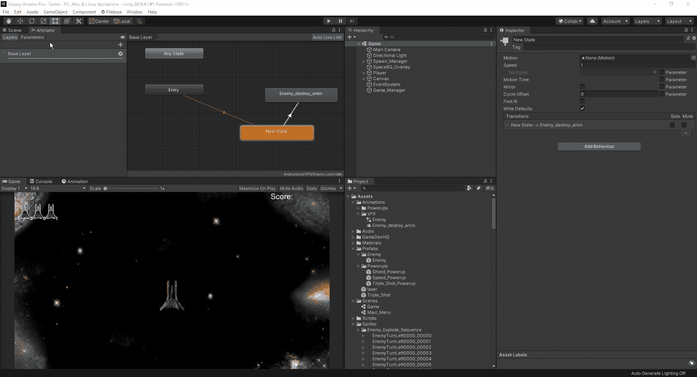

正如我们从上面看到的，我们可以为它设置 4 种类型的参数，这是我们使用的 4 个基本变量，分别是 Int、Float、Bool 和 Trigger。在这种情况下，我们要选择触发器。我们可以在游戏中测试它，并手动触发它，看看在我们的动画师中将它应用到过渡线后会发生什么。

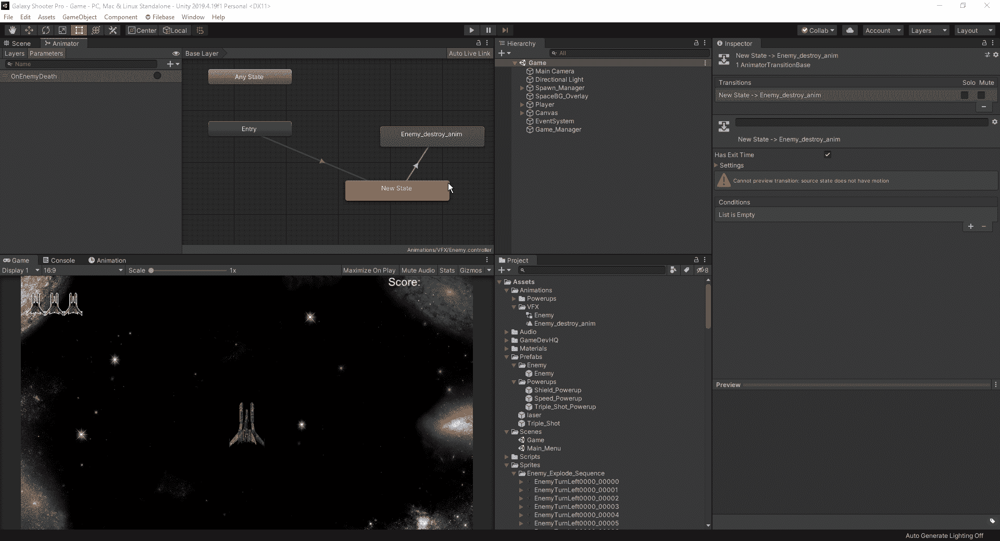

既然我们知道触发参数起作用，我们必须创建一个代码来启动触发器，这样当我们的激光击中目标时它就会起作用。如果我们在 Unity script API 中搜索，我们可以看到动画师可以使用的各种方法。我们正在寻找的是 SetTrigger 方法，以及我们需要为它使用的代码:

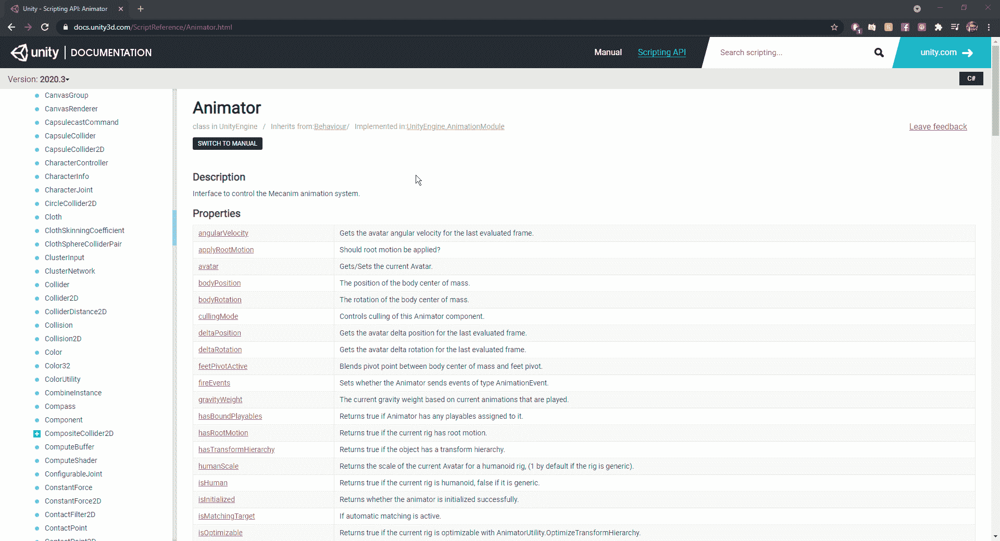

现在我们知道了需要查找的内容，并且知道了代码应该是什么样子，让我们转到脚本，在需要构建代码的位置写出一些伪代码，并从那里开始工作:

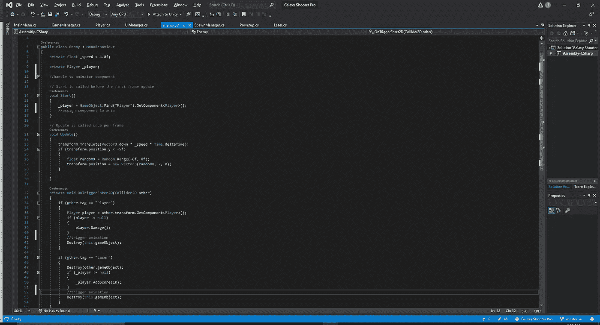

正如我们所看到的，我们需要为我们的动画创建一个句柄，分配组件，然后用播放器和激光触发动画。一旦我们完成了所有这些，它应该看起来像这样:

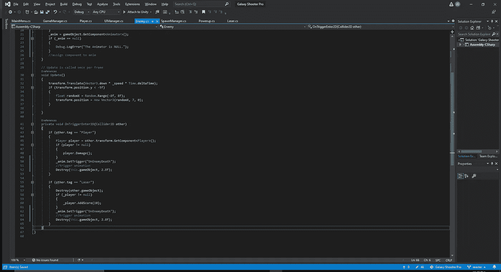

现在我们已经输入了所有这些，让我们在游戏中测试一下，看看效果如何:

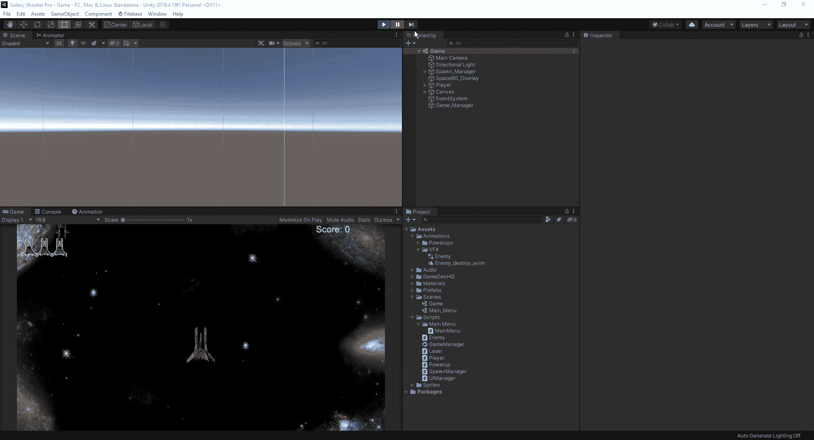

因此，正如我们所看到的，触发参数起作用，但有几个问题。首先，敌人在被摧毁后继续移动，即使我们射击它，尾随爆炸会导致我们对我们的玩家造成伤害。同样，在敌人被摧毁和爆炸发生的时间上有一个延迟。首先，让我们从敌人被消灭的时间开始。如果我们转到动画上的一个活跃的敌人单位，我们可以看到我们创建的新状态有一个酒吧循环加载时间:

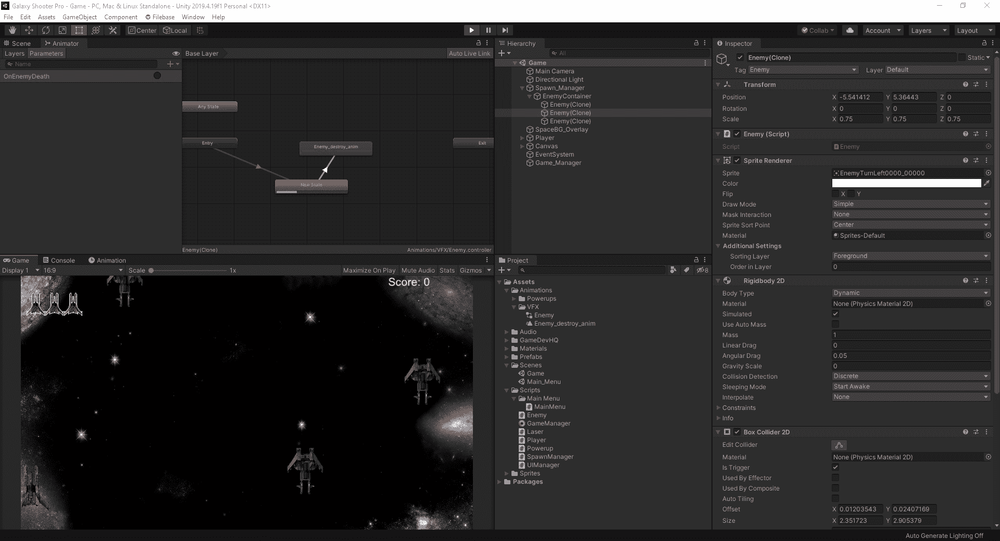

这段时间表示的是从继续到下一步需要多长时间，或退出时间。我们可以随意调整它，但在这种情况下，我们只需关闭退出时间，这样所有需要发生的就是触发事件:

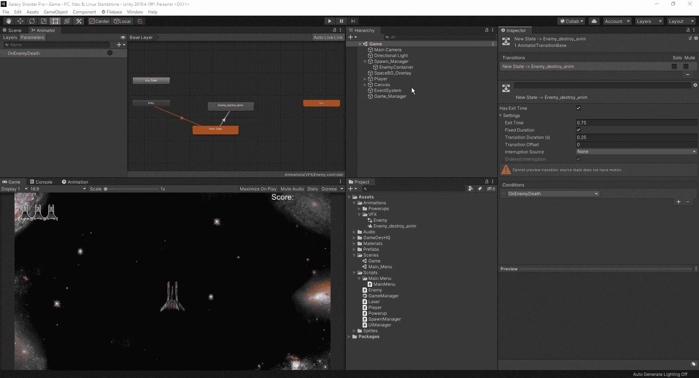

现在，我们如何防止玩家受到空间飞行爆炸的伤害。好吧，我们可以简单地说这是游戏的一个设计，就此打住，但这可能会让我们的玩家相当沮丧。因此，我们可以简单地做的是在我们的代码中，改变敌人的速度为 0 时，它会爆炸，而不是只是停留在原地:

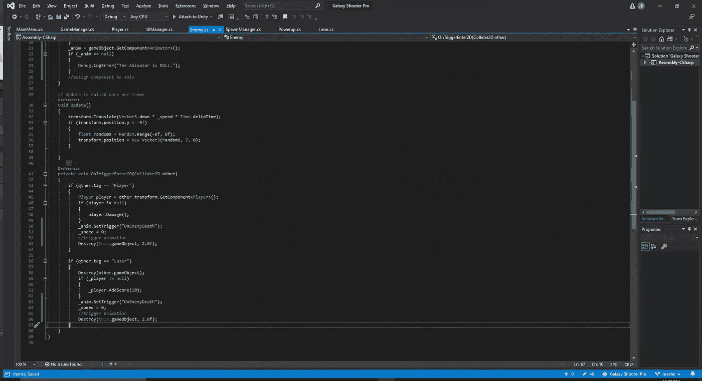

现在我们已经调整了代码，让我们看看我们在游戏中的结果:

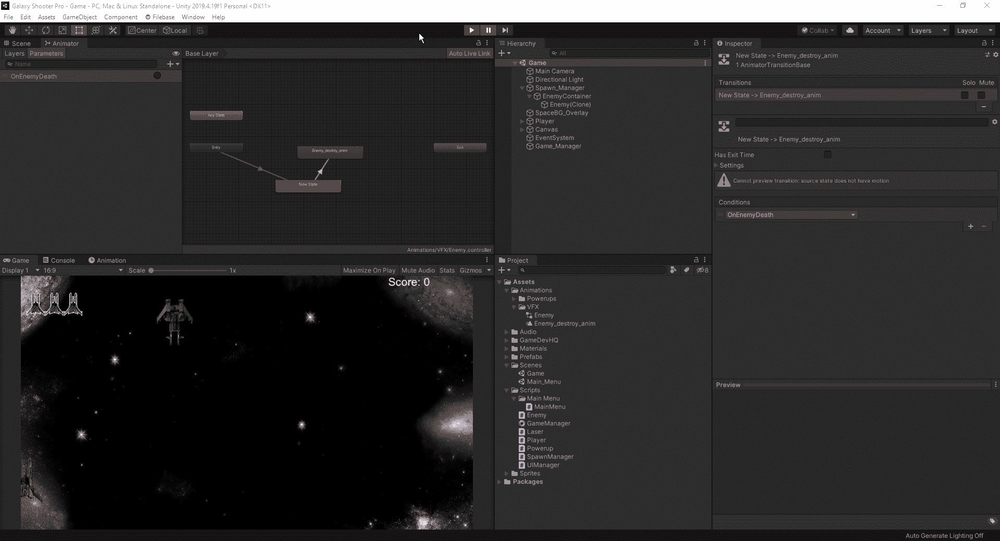

现在我们有了。我们现在已经不再让敌人在被摧毁时从屏幕上消失，而是加入了它爆炸成碎片的动画。从这里，我们可以看看添加和障碍，我们的球员要避免，随着创造一些动画添加到我们的球员，所以它看起来更有趣。