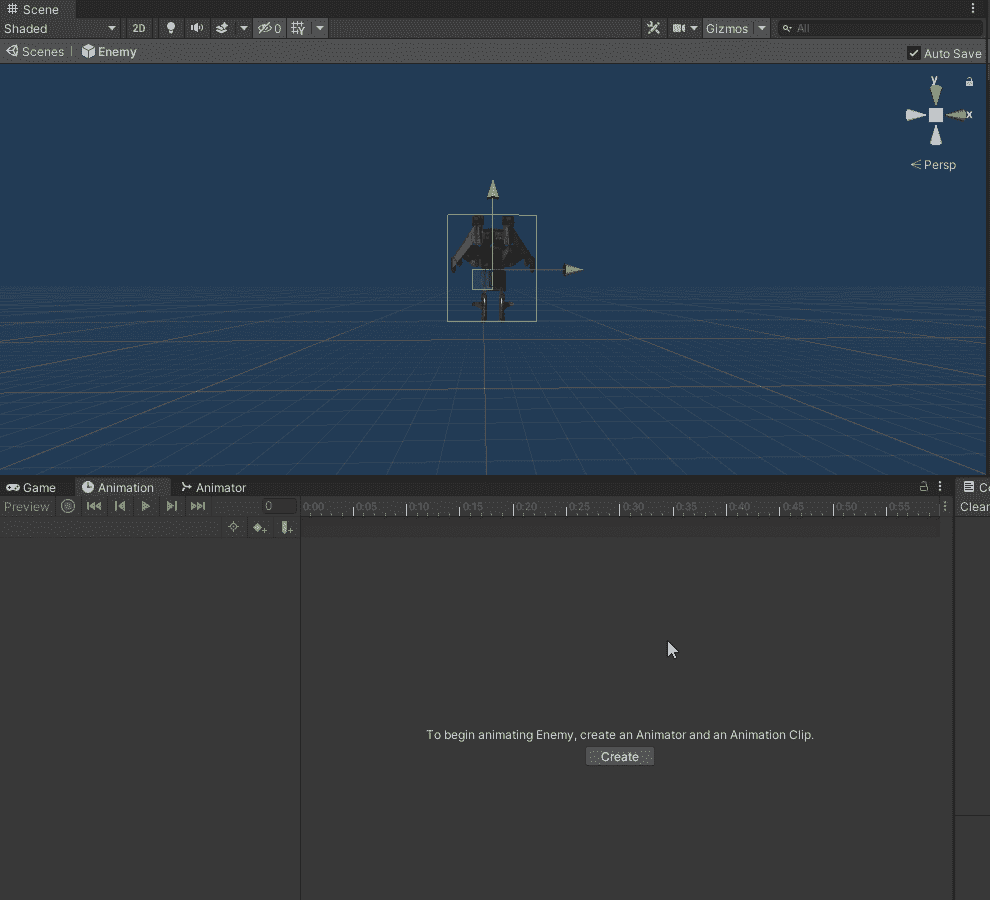
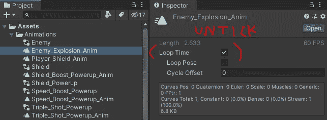
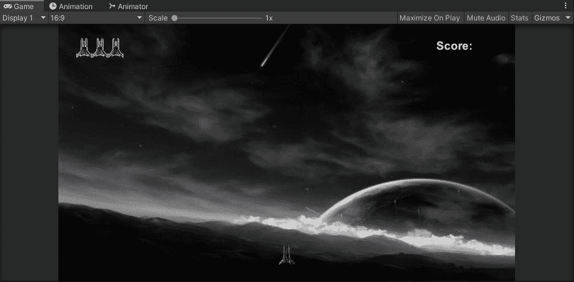
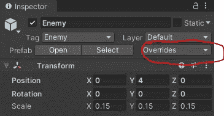
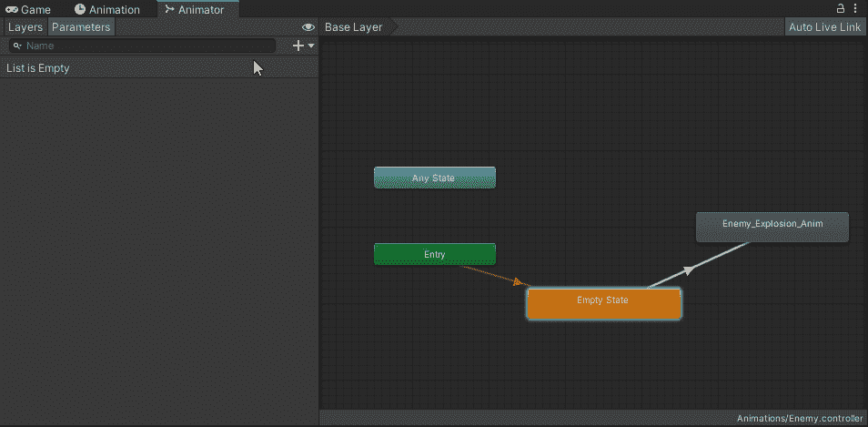
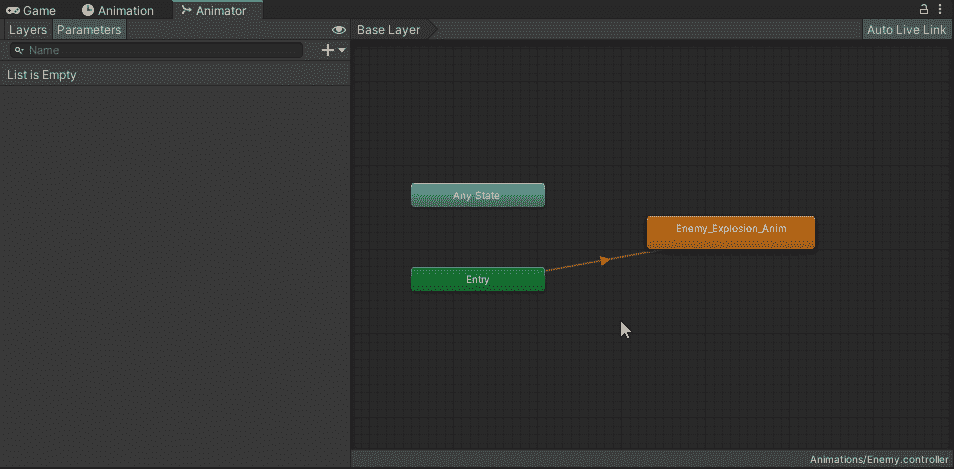
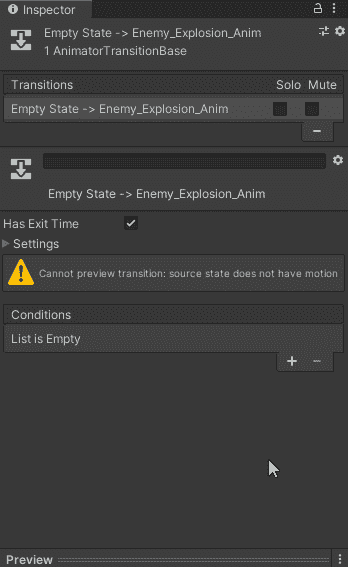

# 在 Unity 中制造敌人爆炸第 1 部分

> 原文：<https://medium.com/nerd-for-tech/creating-enemy-explosions-in-unity-part-01-787438b9a951?source=collection_archive---------15----------------------->

**目标**:在敌人被消灭时制造一次敌人爆炸！

接下来我们将通过精灵创建一个**敌人** **爆炸动画**，用于当**敌人**被**激光**击中或者撞上**玩家**而被摧毁时。

## 动画

首先，让我们从创建**动画**序列开始。要做到这一点，请确保突出敌人的预设游戏对象，然后点击“**动画**”标签。点击'**创建**，然后命名为'**敌人 _ 爆炸 _ 动画**'。从这里，点击**记录**按钮，然后拖动序列中的所有精灵。当您对结果满意时，请务必再次按下**记录**。

现在默认情况下 **Unity** 会将这个动画设置为“**循环**”，我们将关闭它，因为我们只希望当**敌人**死亡时这个序列运行一次。

我们还有一个问题，如果我们点击'**播放**，敌人会立即爆炸，因为我们没有创建任何逻辑来判断**敌人爆炸**应该在什么时候发生。

**Unity** 也会自动将一个**动画师**组件附加到敌人身上，但是我们需要通过点击勾选框来启用它。你还会看到**动画师**已经附加了**敌人控制器**，所以我们不需要添加它。如果你在预设之外工作，请确保保存你的更改:

## 在动画师内部创建逻辑

现在让我们来看看在**动画**组件中使用一些参数。我们想要创建一个**触发器**，当**敌人**死亡时，它将切换并播放**动画**。因此，让我们点击**动画师**窗口，并在参数下点击 **+** 按钮，我们要添加一个**触发器。**我们将把这个**触发器叫做**’**OnEnemyDeath**。

接下来在**控制器**部分，让我们右击并点击**创建状态→清空**，然后将其重命名为**清空状态**。让我们也把它设为**层的默认状态**，并给**敌人 _ 爆炸 _ 动画**添加一个过渡，这样我们就可以控制逻辑了。

然后，我们将按下**空状态**和**敌人 _ 爆炸 _ 动画**之间的箭头，我们将添加我们创建的**触发**条件:

现在，在**检查器**中，我们能够添加我们创建的**触发**条件:

***接下来的*** *:我们来看看制作这个动画触发器的脚本方面！*