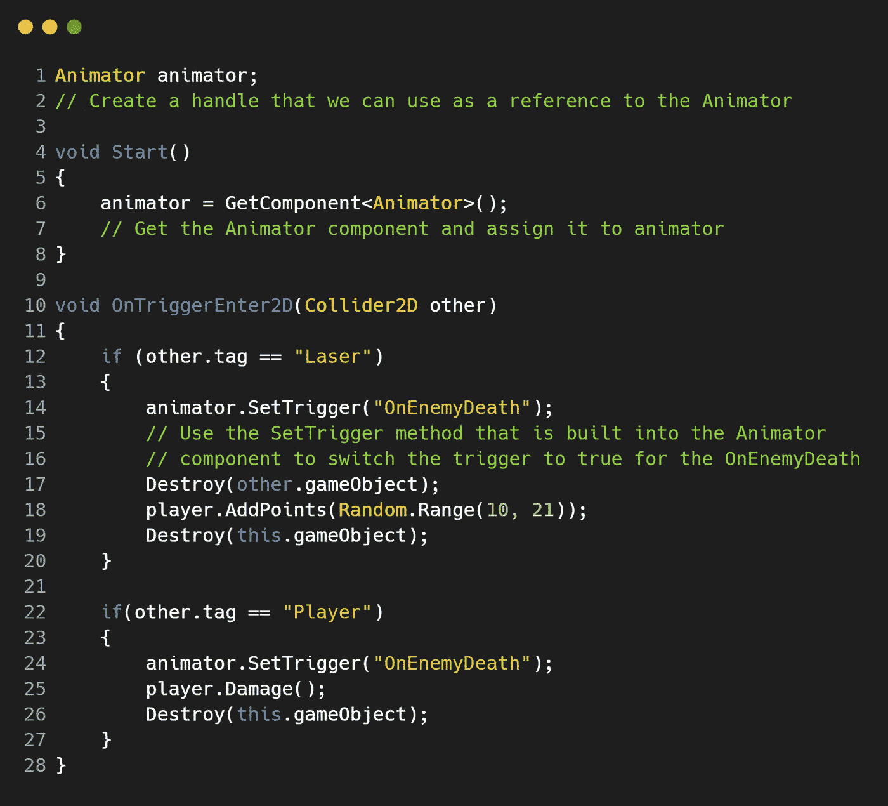
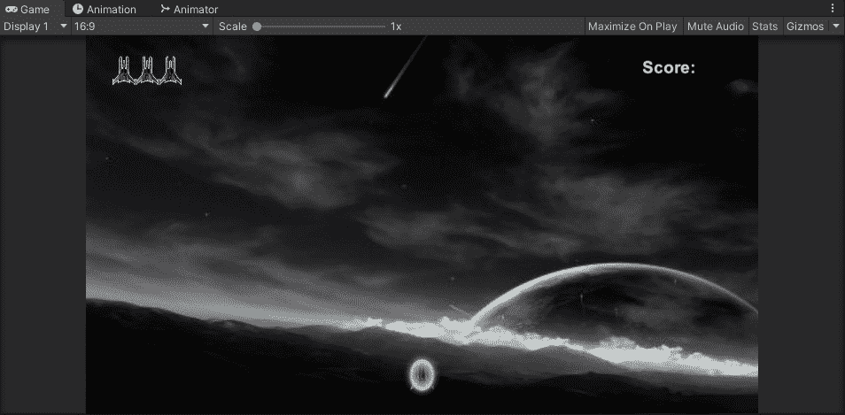
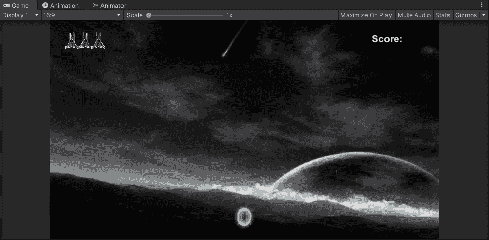
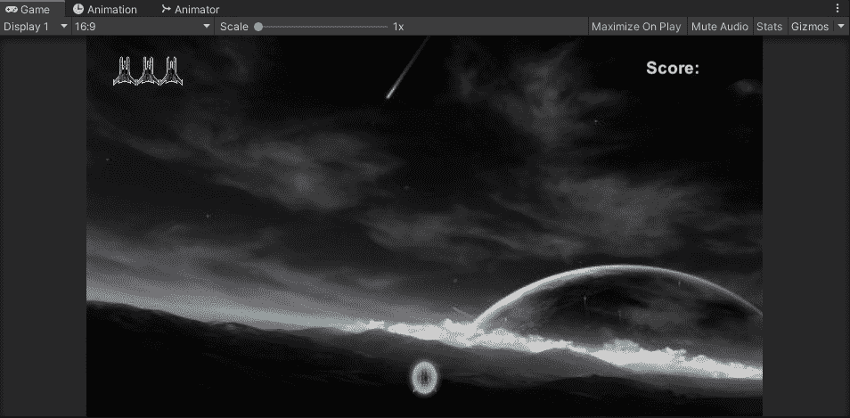

# 在 Unity 中制造敌人爆炸第 2 部分

> 原文：<https://medium.com/nerd-for-tech/creating-enemy-explosions-in-unity-part-02-ec0728b0ee95?source=collection_archive---------22----------------------->

**目标:**在**团结中创造一个**敌爆**的后续文章！**

继上一篇文章之后，是时候看看触发这个**动画**播放的脚本方面了。让我们打开我们的'**敌人**'脚本，在 **OnTriggerEnter2D()** 部分中，我们将添加一些代码，这些代码将把 **OnEnemyDeath** 触发器从 false 设置为 true。目前默认情况下，它是假的。

首先，让我们创建一个**动画师**组件的句柄，不要忘记**获取组件**动画师。

接下来，在 **OnTriggerEnter2D()** 方法中，当**敌人**与**激光**和**玩家**碰撞时，让我们使用一个来自 **Animator** 组件的内置方法，它将**设置触发器**设置为真。我们只需要在括号内输入**字符串**格式的触发器名称。

现在，这已经造成了一个相当独特的游戏错误，因为在我们调用我们的方法来开始播放**动画**的同时，我们正在销毁**敌人**游戏对象及其组件，因此**动画**不会运行。

我们如何解决这个问题？我们有几种方法来看待这个问题:

## **延迟游戏物体被摧毁**

**解决方案:**首先我们可以通过增加一个延迟**毁灭**的新参数来延迟**毁灭(this.gameobject，2.633f)** 内的时间。在这个例子中，我放入新参数的时间是精灵**动画的长度。** 
**问题:**然而，这给游戏引入了一个新的 bug，那就是我们的游戏对象在那段时间内仍然留在场景中。如果**玩家**意外撞上那个游戏对象，即使他们已经炸飞了**敌人**，他们也会被扣除一条生命:

## **改变敌人的速度**

**解决方案:**当**激光**或**玩家**与**敌人**相撞时，我们可以将**敌人**的速度设置为 **0** 或 **0.25f，**某个可以阻止**敌人**或显著减慢其移动速度**的东西。

问题:**然而，这并没有解决游戏对象仍然存在于场景中的问题，并且能够在播放**动画**的 **2.633** 秒内损坏我们的玩家。

但是，如果**敌人**在那几秒钟内是静止的，希望我们不会撞上他们！

直到我在这个阶段找到一个更好的解决方案，这将是它如何运作…

今天学到的一课是，我们不可能每天都赢，总会有问题需要解决或改进=)