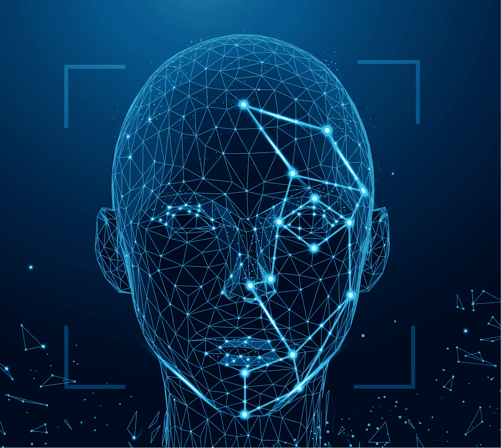
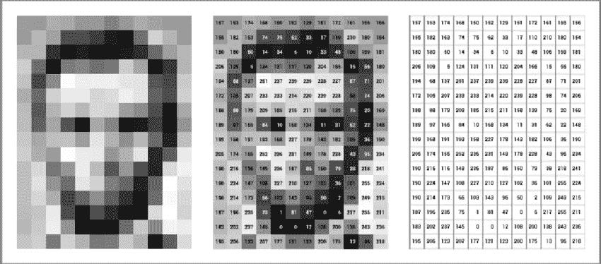
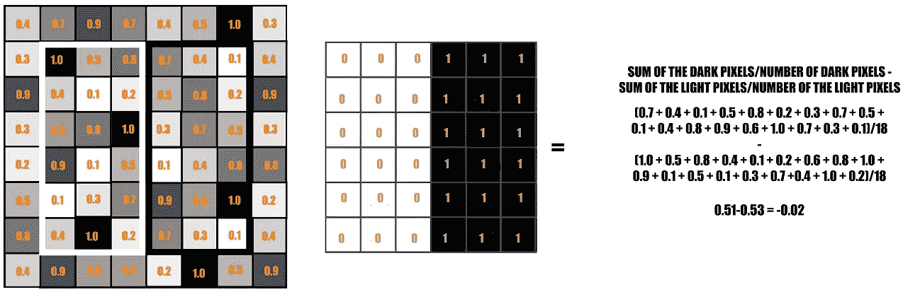
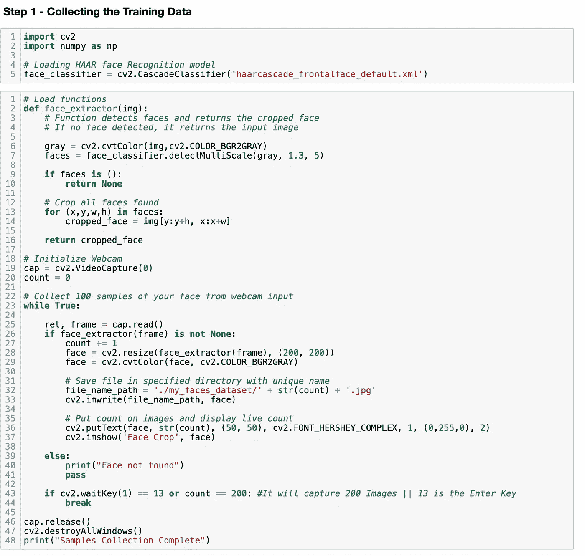
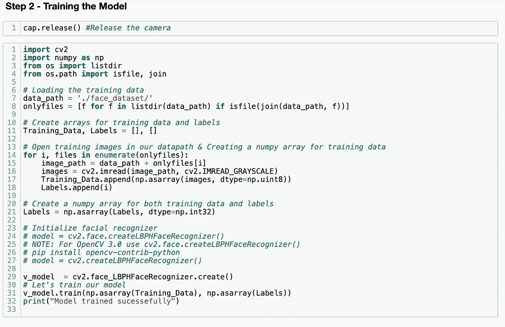
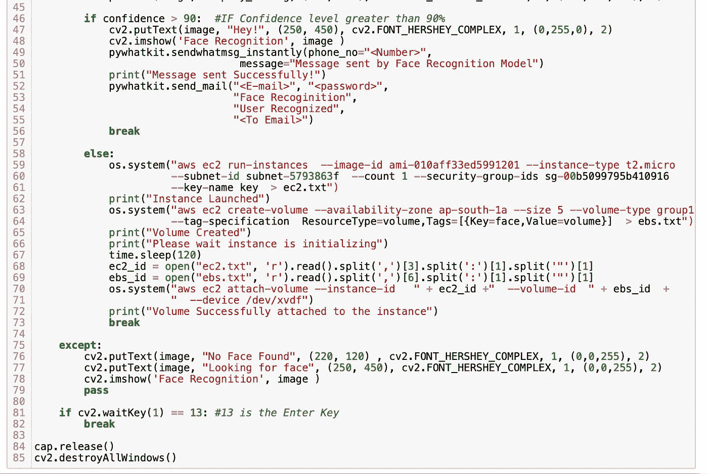

# 创建人脸识别模型并将其连接到 AWS 等

> 原文：<https://medium.com/nerd-for-tech/creating-face-recognition-model-connecting-it-to-aws-and-more-ddbdb58b46ff?source=collection_archive---------7----------------------->

任务描述📄

❄️创建了一个程序，在识别特定人脸时执行下述任务。

📌当它认出你的脸时👉它发送邮件到你的邮箱。
👉其次，它发送 whatsapp 信息给你的朋友。

📌当它识别第二张脸时，它可能是你朋友或家人的脸。
👉在 AWS 中创建 EC2 实例。
👉创建 5 GB EBS 卷并将其连接到实例。

## 在这里，我们将在 Python 和 AWS 中使用计算机视觉。

首先让我们看看什么是计算机视觉，

计算机视觉是人工智能的一个领域，它训练计算机解释和理解视觉世界。使用来自相机和视频的数字图像以及深度学习模型，机器可以准确地识别和分类对象，然后对他们“看到的”做出反应。

计算机组装视觉图像的方式就像你组装拼图游戏一样。

想想你是如何处理拼图游戏的。你有所有这些片段，你需要把它们组合成一个图像。这就是计算机视觉的神经网络的工作原理。他们区分图像的许多不同部分，识别边缘，然后建立子组件的模型。通过深层网络层的过滤和一系列操作，他们可以将图像的所有部分拼凑在一起，就像你玩拼图游戏一样。

电脑不会在一个谜题盒子的顶部给出一个最终的图像——但通常会被输入成百上千个相关的图像来训练它识别特定的物体。

程序员不是训练计算机寻找胡须、尾巴和尖耳朵来识别猫，而是上传数百万张猫的照片，然后模型自己学习构成猫的不同特征。

这些进步对计算机视觉领域的影响令人震惊。在不到十年的时间里，物体识别和分类的准确率已经从 50%上升到 99 %,而且今天的系统在快速检测视觉输入并做出反应方面比人更准确。

许多行业的计算机视觉用户正在看到真实的结果——我们在这张信息图中记录了其中的许多结果。例如，您是否知道:

*   计算机视觉可以区分阶段性和真正的汽车损坏。
*   计算机视觉支持面向安全应用的面部识别。
*   计算机视觉使现代零售店的自动结账成为可能。

# 计算机视觉如何工作

计算机视觉分为三个基本步骤:

**获取图像:**可以通过视频、照片或 3D 技术实时获取图像，甚至是大型数据集，以便进行分析。

**处理图像:**深度学习模型自动完成了这一过程的大部分，但这些模型通常是通过首先输入数千张标记或预先识别的图像来训练的。

**理解图像:**最后一步是解释步骤，对物体进行识别或分类。

有许多类型的计算机视觉以不同的方式使用:

*   图像分割将图像分割成多个区域或片段，以分别进行检查。
*   对象检测识别图像中的特定对象。先进的对象检测识别单个图像中的许多对象:足球场、进攻球员、防守球员、球等。这些模型使用 X，Y 坐标来创建一个边界框，并识别框内的所有内容。
*   面部识别是一种高级类型的对象检测，它不仅可以识别图像中的人脸，还可以识别特定的个人。
*   边缘检测是一种用于识别对象或风景的外部边缘的技术，以更好地识别图像中的内容。
*   模式检测是识别图像中重复的形状、颜色和其他视觉指示器的过程。
*   图像分类将图像分为不同的类别。
*   特征匹配是一种模式检测，它匹配图像中的相似性以帮助对它们进行分类。

计算机视觉的简单应用可能只使用这些技术中的一种，但更高级的应用，如自动驾驶汽车的计算机视觉，需要依赖多种技术来实现目标。

下面是存储亚伯拉罕·林肯图像的灰度图像缓冲区的简单说明。每个像素的亮度由一个 8 位数字表示，范围从 0(黑色)到 255(白色):

来源:ResearchGate

这种存储图像数据的方式可能与你的期望背道而驰，因为数据在显示时肯定*看起来*是二维的。然而，事实就是如此，因为计算机内存只是由一个不断增长的线性地址空间列表组成。

# 训练对象检测模型

## 维奥拉和琼斯接近了

有许多方法可以解决目标检测的挑战。多年来，流行的方法是由保罗·维奥拉和迈克尔·琼斯在论文 [**中提出的鲁棒实时对象检测**](http://www.hpl.hp.com/techreports/Compaq-DEC/CRL-2001-1.pdf) 。

虽然它可以被训练来检测各种各样的对象类别，但该方法最初是由人脸检测的目标所驱动的。它如此快速和直接，以至于它是在傻瓜相机中实现的算法，这允许用很少的处理能力进行实时人脸检测。

该方法的核心特征是基于 **Haar 特征**用潜在的大量二元分类器进行训练。这些特征表示边缘和线条，并且在扫描图像时计算起来非常简单。

哈尔特征

虽然非常基本，但在人脸的特定情况下，这些特征允许捕捉重要的元素，如鼻子、嘴或眉毛之间的距离。这是一种受监督的方法，需要辨别对象类型的许多正面和反面的例子。

## 基于 CNN 的方法

深度学习已经成为机器学习领域真正的游戏规则改变者，特别是在计算机视觉领域，基于深度学习的方法现在已经成为许多日常任务的前沿。

在为完成对象检测而提出的不同深度学习方法中， **R-CNN** (具有 CNN 特征的区域)特别容易理解。这项工作的作者提出了一个三阶段的过程:

1.  使用区域提议方法提取可能的对象。
2.  使用 CNN 识别每个区域的特征。
3.  利用**支持向量机**对每个区域进行分类。

来源:https://arxiv.org/abs/1311.2524

原始工作中选择的区域提议方法是**选择性搜索**，尽管 R-CNN 算法对于所采用的特定区域提议方法是不可知的。步骤 3 非常重要，因为它减少了候选对象的数量，这使得该方法的计算成本更低。

这里提取的特征不如前面提到的 Haar 特征直观。总之，使用 CNN 从每个区域提议中提取 4096 维特征向量。鉴于 CNN 的性质，输入必须始终具有相同的维度。这通常是 CNN 的弱点之一，各种方法以不同的方式解决这个问题。对于 R-CNN 方法，经过训练的 CNN 架构需要 227 × 227 像素的固定区域输入。由于建议区域的大小与此不同，作者的方法只是扭曲图像，使它们符合所需的尺寸。

## 我们将使用哈尔人脸分类器来完成这项任务

左边的矩形是像素值为 0.0 到 1.0 的图像的示例表示。中间的矩形是一个哈尔核，所有亮像素在左边，所有暗像素在右边。哈尔计算是通过找出较暗区域的像素值的平均值和较亮区域的像素值的平均值之差来完成的。如果差值接近 1，则 haar 特征检测到边缘。

哈尔特征中较暗的区域是值为 1 的像素，较亮的区域是值为 0 的像素。每一个都负责找出图像中的一个特定特征。例如边缘、线或图像中强度突然变化的任何结构。为了前任。在上图中，haar 功能可以检测到右侧像素较暗、左侧像素较亮的垂直边缘。

这里的目的是找出 ***位于哈尔特征*** 的较暗区域的所有图像像素的总和和 ***位于哈尔特征*** 的较亮区域的所有图像像素的总和。然后找出它们的区别。现在，如果图像有一个边缘将右边的暗像素和左边的亮像素分开，那么 haar 值将更接近 1。这意味着，如果 haar 值更接近 1，我们说存在检测到的边缘。在上面的例子中，没有边，因为 haar 值远离 1。

这只是分隔垂直边缘的特定哈尔特征的一种表示。现在还有其他的哈尔特征，可以检测其他方向的边缘和任何其他图像结构。为了检测图像中任何地方的边缘，haar 特征需要遍历整个图像。

> 了解 OpenCV:[https://python . plain English . io/image-processing-using-OpenCV-in-python-857 c8 CB 21767](https://python.plainenglish.io/image-processing-using-opencv-in-python-857c8cb21767)

**首先我们将收集训练数据。我们将使用网络摄像头捕捉 200 张图像来训练我们的模型**

**现在，我们将加载捕获的 200 张图像，并训练模型**

**训练完模型后，我们将运行人脸识别进行检测，它也会显示识别后的置信度**

**现在，根据任务描述，在检测到用户后，它将使用 WhatsApp web app 发送 WhatsApp 消息，并发送电子邮件。为此，置信度得分需要大于 90%。如果它检测到任何其他人，如朋友或家庭成员，它将在 AWS 中启动 EC2 实例，它将创建 5 GB EBS 卷并将其附加到实例(我们需要事先在终端或命令提示符下使用 AWS CLI 登录 AWS 帐户)。该程序将等待 120 秒，即启动 EBS 块之前的 2 分钟，以便初始化 EC2 实例，并且在连接时没有错误。**

我们只需要按回车键就可以关闭程序。