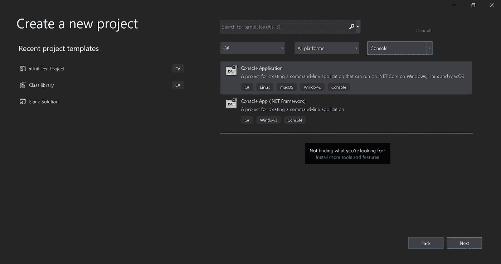
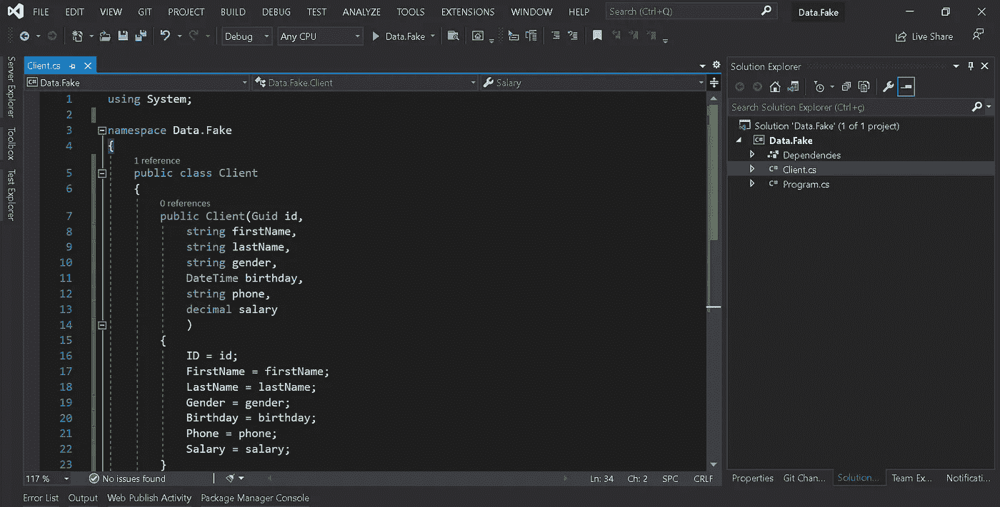
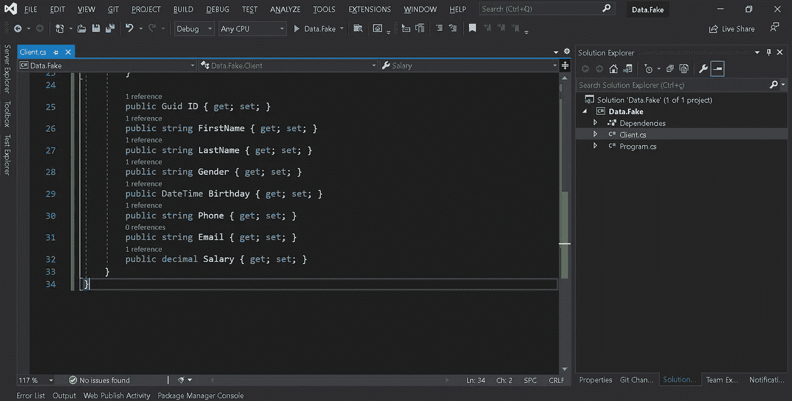
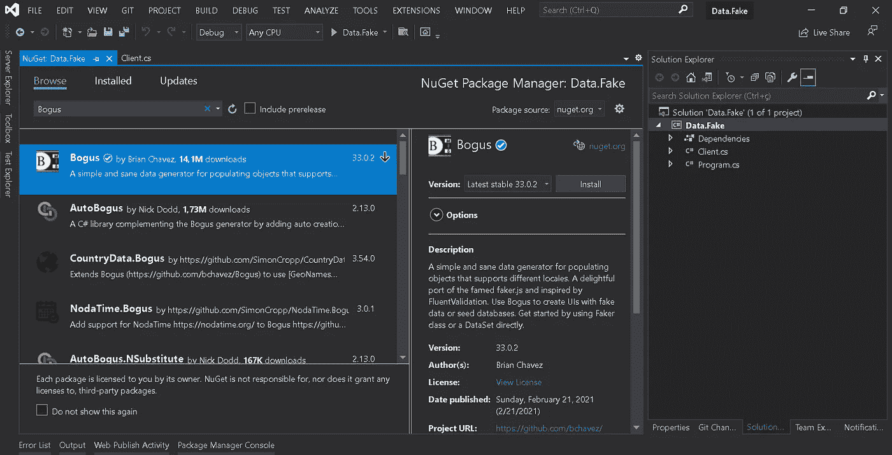
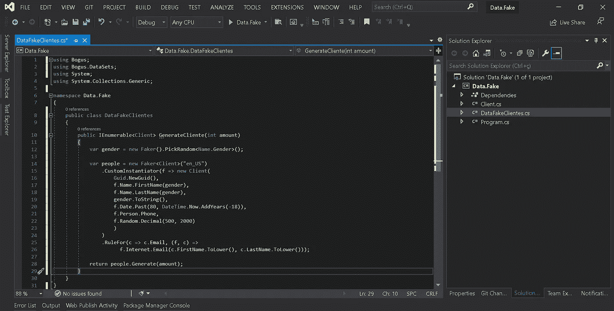
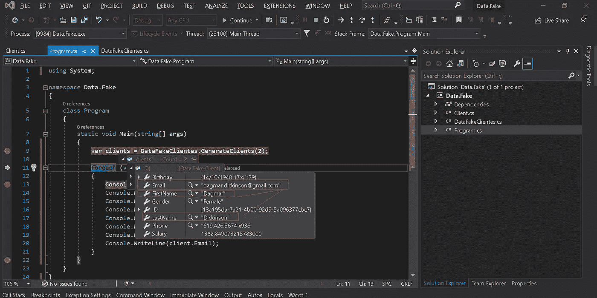
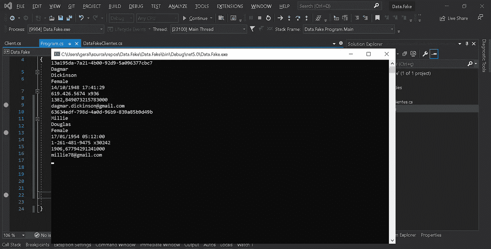

# 用 xUnit 和 Bogus 创建假数据

> 原文：<https://medium.com/nerd-for-tech/creating-fake-data-with-xunit-and-bogus-515d4fea83d8?source=collection_archive---------13----------------------->

由 Brian Chavez 创建的 Bogus 是一个库，其目的是生成用于测试的假数据。

让我们创建一个类似控制台的项目来学习更多关于伪。净 5。

让我们创建一个简单的“Client”类，它具有该类固有的属性。

要使用 Nuget 发行版，只需在您的项目中安装该包，如下图所示。

让我们用 GenerateClients 方法创建 DataFakeClientes 类。

在第 12 行，我们创建了随机性别类型。

伪库支持几十种语言，在本例中的第 14 行，我们将使用美国英语“ **en_US** ”。

在第 17 行和第 18 行，我们根据随机创建的性别创建了名和姓。

在第 19 行中，我们包含了前面生成的随机亏格。

在第 20 行中，我们生成出生日期，范围从 18 年到 80 年。

在第 21 行，我们生成了电话。

第 22 行是工资。

最后，在第 25 行中，我们使用 RuleFor 特性，该特性允许基于规则生成随机对象，这样我们就可以基于之前创建的名字和名字生成一封随机电子邮件，如下图所示。

我们的测试结果可以在下图中看到。

**结论** 目前所展示的只是这个库容量的一小部分，还有很多可能性，全看你了。您可以通过访问此处的文档[来查看文档。](https://github.com/bchavez/Bogus)

**完整源代码**:
[https://github.com/geraldsimon/xUnit-and-Bogus](https://github.com/geraldsimon/xUnit-and-Bogus)

**参考**:
https://github.com/bchavez/Bogus