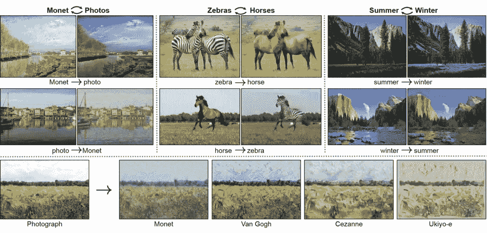
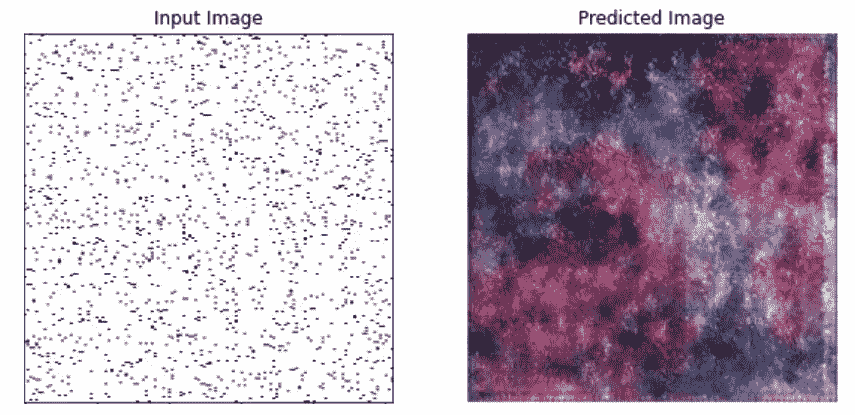
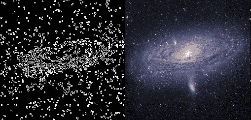
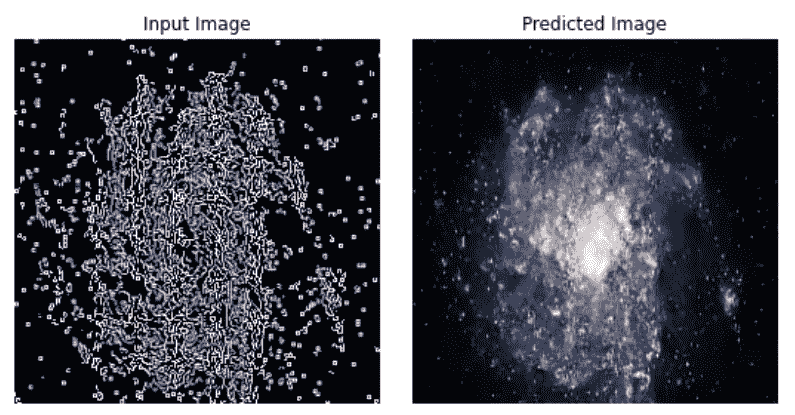
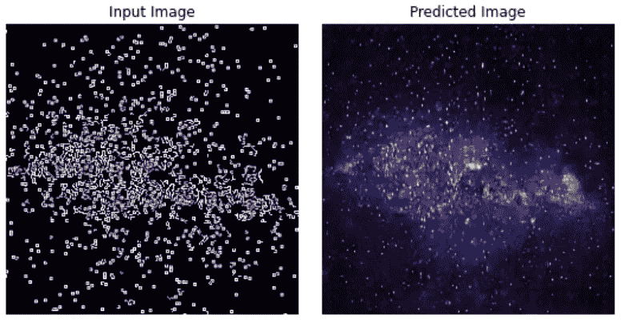
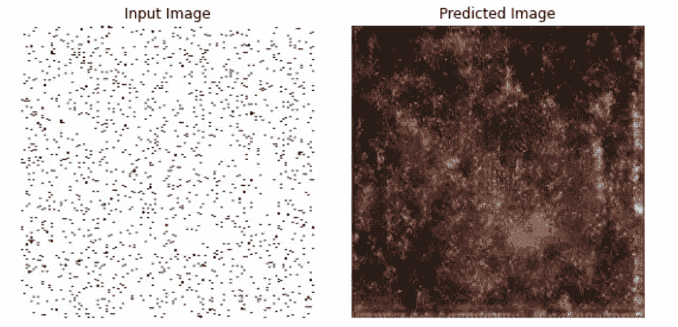
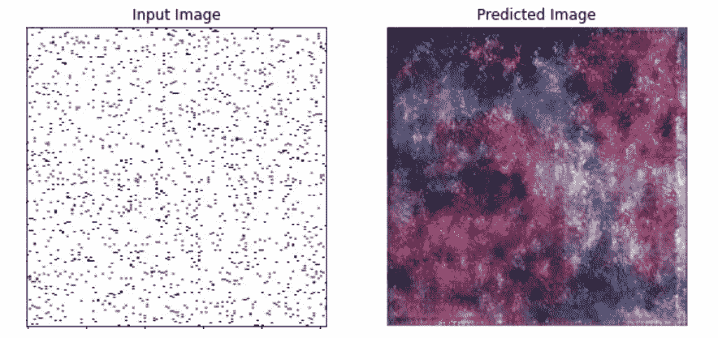
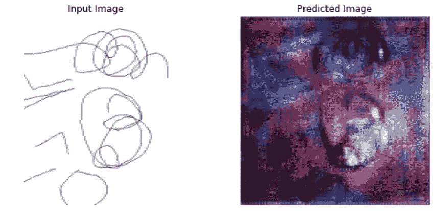
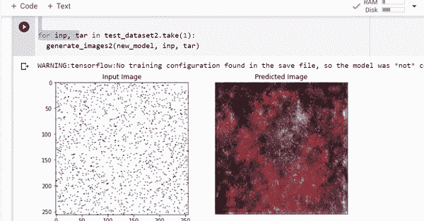

# 用 GANs 创建星系图像

> 原文：<https://medium.com/nerd-for-tech/creating-galaxy-images-with-gans-a9374b3bc8e2?source=collection_archive---------10----------------------->

Pix2Pix GANs 用于**图像到图像**的转换。**图像到图像**转换将输入图像的样式改变为目标样式:它试图映射输入图像→输出图像。

图片转图片翻译(来源:[https://towards data science . com/image-to-image-translation-69 C10 C18 F6 ff](https://towardsdatascience.com/image-to-image-translation-69c10c18f6ff))

在这篇文章中，我们将看到如何建立一个模型，从嘈杂的图片创建星系图像。下面是一个例子:

左:嘈杂的图像，右:生成的星系图像

# 数据集生成

我不得不从头开始创建一个数据集，因为有很多星系图像数据集，但没有一个真正适合这个目的。经过一番思考，我想到了一个主意。首先，很多 galaxy 图片都是从 google images 下载的。对于每张图像，我已经使用 **Canny 边缘检测创建了一个**边缘图**。基于阈值的强度，我们得到不同质量的边缘图。用一个较弱的阈值，我们得到一个**有噪声的图像**，它粗略地勾勒出了星系的轮廓。**

输入:右侧星系的 Canny 边缘图像，目标:右侧星系

Canny 边缘图像看起来有噪声，我们将创建这样的训练对:(星系的 Canny 边缘图像，原始星系图像)

**图像到图像的翻译任务是将有噪声的图像翻译成银河风格的图像。**

# 培养

为了训练我的 GAN，我遵循了经典的 Tensorflow 教程: [pix2pix:使用条件 GAN 进行图像到图像的翻译](https://www.tensorflow.org/tutorials/generative/pix2pix) *

代码嵌入在下面，但您也可以在这里找到它。

# 结果

训练后，h5 模型被保存并用于预测，如下所示。

代码可以在这里找到[。](https://github.com/jojo96/Python-programming-scripts/blob/master/GalaxyModelPrediction.ipynb)

# 走廊

现场预测