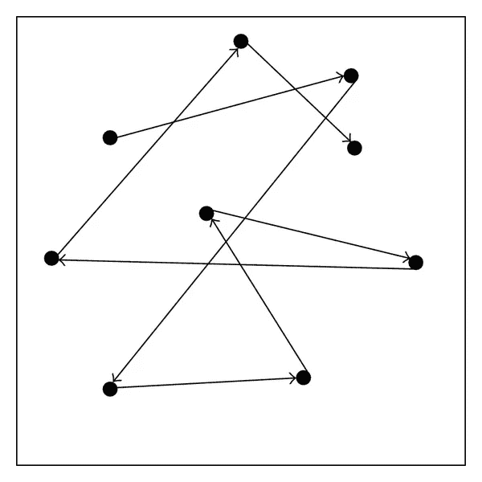
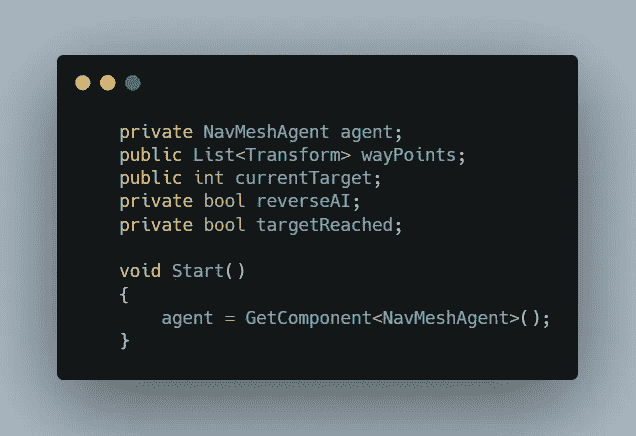
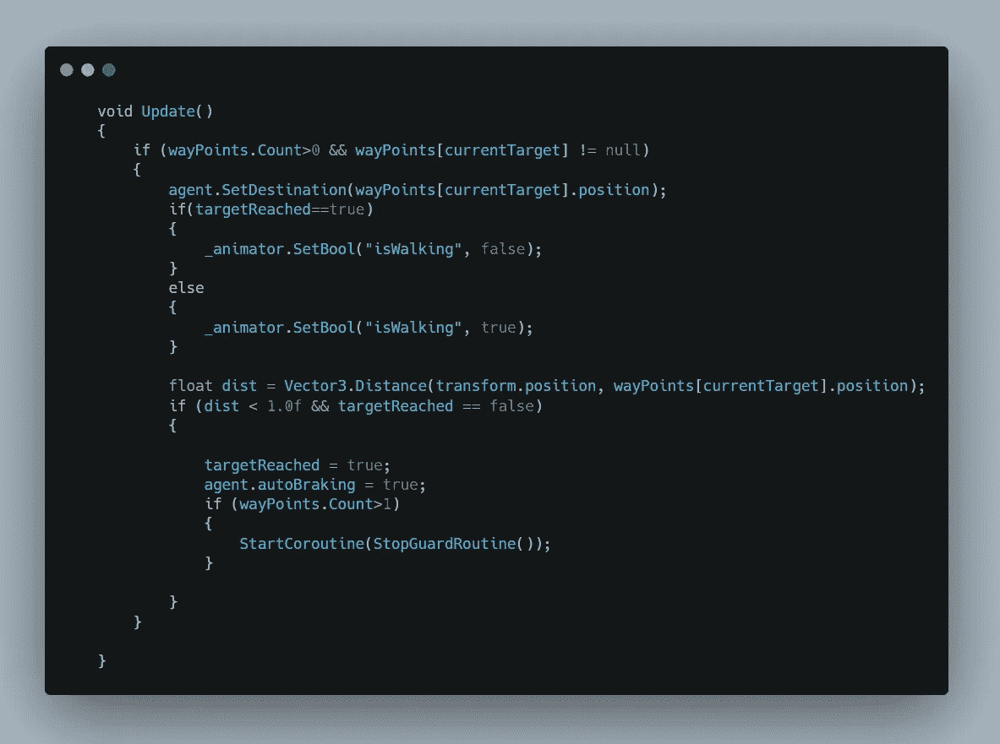
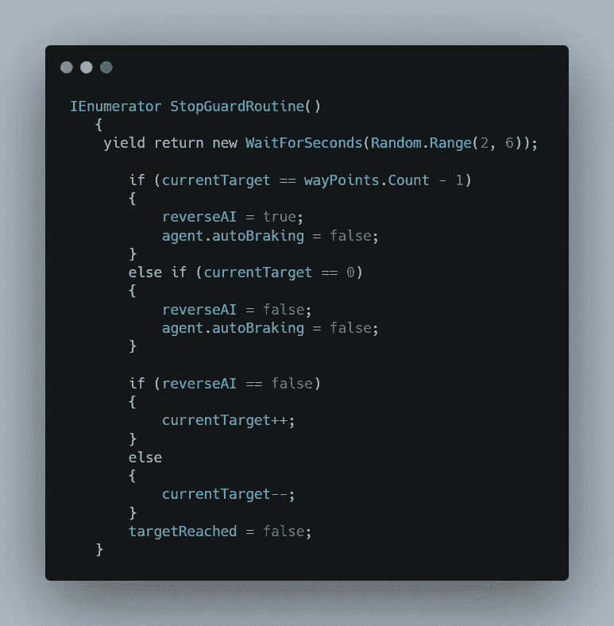
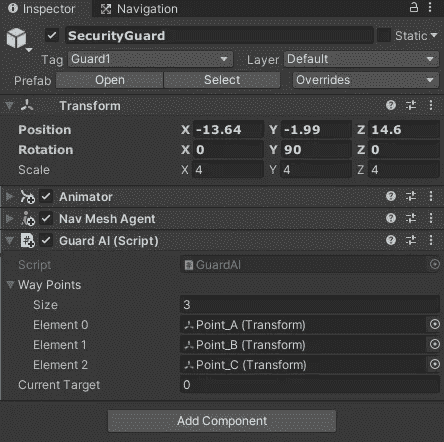
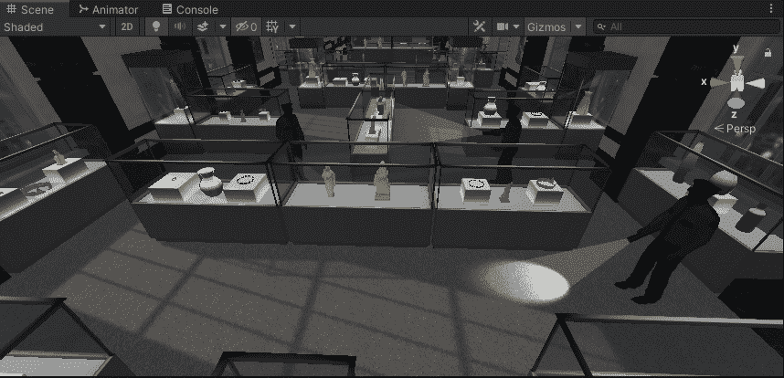

# 在 Unity 中创建模块化航路点系统

> 原文：<https://medium.com/nerd-for-tech/creating-modular-waypoint-system-in-unity-33ef8be576c0?source=collection_archive---------21----------------------->

秘密游戏和电影摄影

**目标:**创建一个模块化的航点

要创建一个模块化的路点，让我们首先在场景视图中制作路点。创建一个游戏对象，并把它放在玩家要去的地方。还要注意的是，玩家要走最短的路线，所以如果你想让你的玩家沿着特定的方向移动，一定要在中间加点。还要给警卫添加一个导航网格代理，以便在导航网格中导航。

现在创建一个守卫 AI 脚本，因为我们正在创建一个守卫移动的路点。

在该脚本中，创建一个引用变量，指向添加到 guard 的 nav mesh 代理。此外，创建一个变换变量列表，用于存储每个路点的变换值。

然后创建一个 int 变量，它将定义在列表中访问哪个航路点。然后创建两个 bool 变量，一个用于定义守卫是移动到起点还是移动到定义的位置，另一个用于检查是否已经到达目标。

现在开始创建对导航网格代理的引用。

在内部更新中，我们将检查守卫是否有路点，以及当前目标索引列表中是否有路点。

如果两者都返回 true，那么将保护的目的地设置为航路点。我们有一个警卫行走和闲置的动画，所以如果警卫达到目标，然后设置动画为闲置，如果没有设置动画为行走。

现在检查目标位置和当前位置之间的距离，如果距离小于 1，警卫将调用协程。

现在，在协程中，设置时间，使防护在开始和结束时空闲，随机数在 2 到 5 秒之间。然后检查列表中的航路点位置。如果索引是最后一个，则将反向布尔值设置为真，否则为假。还要将自动制动设置为真，这样防护装置就不会四处移动。

然后检查后卫是否移动到终点或起点，并根据它增加或减少当前目标形式的指数值。

现在，当守卫再次开始移动时，将达到的目标设置为假。

拖动列表中的所有路点，让守卫向其移动。还要注意的是，每个守卫都有相同的脚本，但是他们有自己的功能，所以他们存储不同的路点，所以他们的目的地也是不同的。

这是最后的样子。