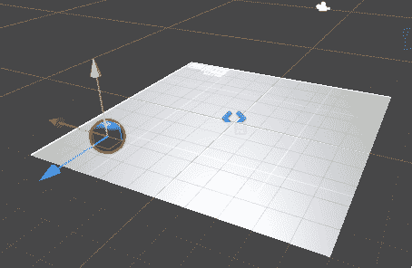

# 在 Unity 2021 中为敌方 AI 创建模块化航点系统

> 原文：<https://medium.com/nerd-for-tech/creating-modular-waypoint-system-in-unity-e9e56a25d58b?source=collection_archive---------4----------------------->

让 NavMesh 发挥作用

运行中的模块化航路点系统

昨天，我们深入到导航网格和导航网格代理中，展示我们如何自动移动敌人的物体。今天我们更进一步，给它一点有用的东西。

为了让导航网格为我们工作，我们需要更新我们的代码，从我们昨天有真正的坏线，只是保持…