# 创建 Terraform 模块以启动 EC2 实例

> 原文：<https://medium.com/nerd-for-tech/creating-modules-to-launch-an-ec2-instance-19be15a3d33a?source=collection_archive---------2----------------------->

## 地形、模块、AWS

## 在本文中，我将创建一个定制的 EC2 模块和一个定制的安全组模块，通过启动 Nginx 的引导脚本来启动 EC2 实例。

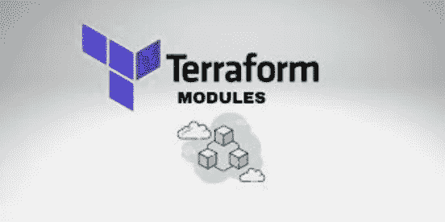

我需要做的第一件事是派生我团队的 Github repo。他们给了我们一点动力。如果你想找点乐子，可以在这里进行回购[https://github.com/LevelUpInTech/terraformec2.git](https://github.com/LevelUpInTech/terraformec2.git)

一旦我这样做了，我就打开了我的 IDE。我目前使用的是 Cloud9。进入我的终端后，我运行命令:

`git clone [https://github.com/LevelUpInTech/terraformec2.git](https://github.com/LevelUpInTech/terraformec2.git)`

我做的第一件事是更改主目录(父模块)的名称，以适应我的格式。我改成了 week_20_ec2_project。然后我开始制作我需要的子目录(子模块)和文件。

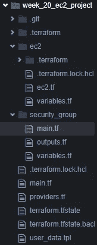

我在 week_20_ec2_project 中创建了两个目录，分别命名为 ec2 和 security_group。在 ec2 中，我创建了两个文件，variables.tf 和 ec2.tf，这是该目录的 main.tf 文件。我本想改名字，但是唉，我们现在就在这里。然后，在 security_group 目录中，我创建了 main.tf、outputs.tf 和 variables.tf 文件。我没有最终使用 variables 文件，但我已经准备好了以防万一。对于根文件，我创建了 main.tf、providers.tf 和 user_data.tpl。您在上面的截图中看到的所有其他文件都是在我的终端中工作时生成的。你应该知道我没有马上创建每个文件，因为我不确定我需要什么。但是，您通常可以依赖于所需的主、变量和提供者。

接下来，我需要检查我团队的代码，看看什么应该放在哪里。他们把所有东西都放在一个名为 ec2.tf 的文件中，如下图所示。

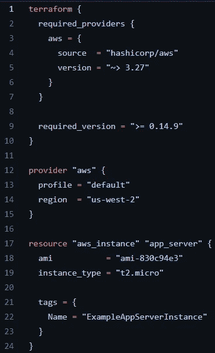

我将提供者移动到我的根 providers.tf 文件中，如下所示。

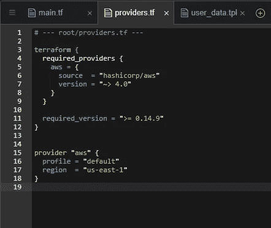

将它们命名在顶部是一个很好的习惯，这样很容易知道你在哪里工作。

然后，我将资源移动到 ec2 目录下的 ec2.tf 文件中。见下文。

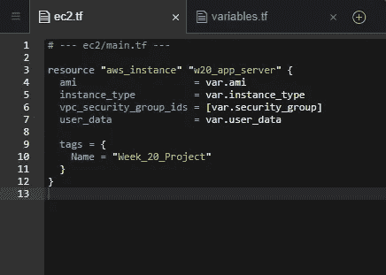

仅此而已。嗯，不是为了这个项目。他们一开始就给了我这么多。剩下的就看我的了。这是我工作空间的快照。我有我的根目录，也称为父模块打开，我的两个子模块打开；ec2 和安全组。

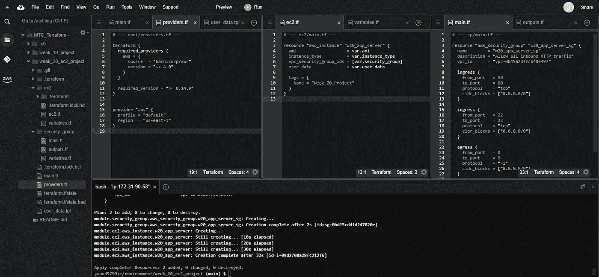

我做的下一件事是在我的子模块 ec2 中创建几个变量。我从 ami 和 instance_type 开始。见下文。

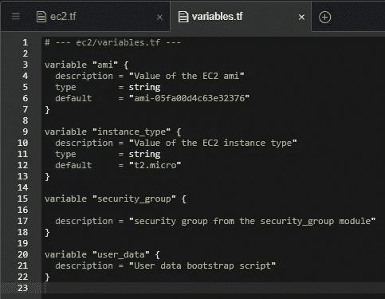

不要担心底部的两个变量。这些在后面会起作用。

然后，我进入我的父模块 main.tf 文件，添加我的 ec2 模块。这是它看起来的样子。

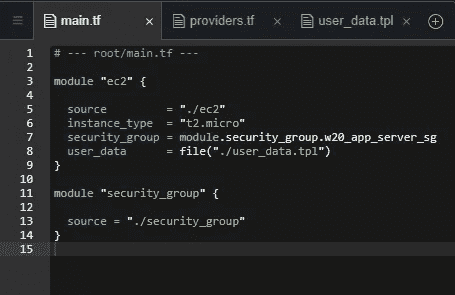

现在先别管 security_group 部分。一会儿就来。

我需要做的下一件事是开始构建我的 security_group 模块。我不需要端口 22，但我在打开 Nginx 页面时遇到了一些问题，所以即使我知道这不是答案，我还是添加了它。有时候我们这样做很有趣。原来 Nginx 不推出的问题是不耐烦。你必须等待你的 ec2 完全初始化…我的错。

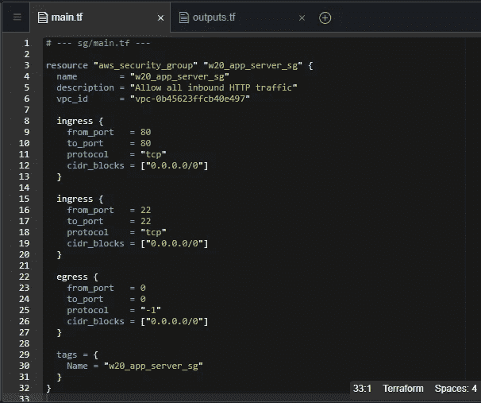

我还需要为我的安全组添加一个输出，如下所示。

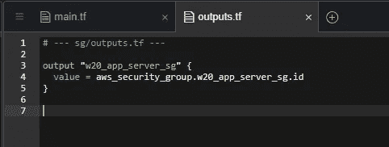

在构建了安全性之后，我需要从我的父模块中调用它。所以回到 week_20_ec2_project 添加到我的 main.tf 中。

接下来，我需要将安全组变量添加到 ec2 子模块中。最初的构建可能是乏味的，但是在未来重用它们的能力是非常惊人的。这才是这一切的真正意义所在。这对未来的自动化很有帮助。它很快，很敏捷。这里有一张图片。

先不要担心 user_data。那是下一个。

好了，最后一点编码要做。我在 user_data.tpl 文件中的根/父模块中添加了一个引导脚本，如下所示。

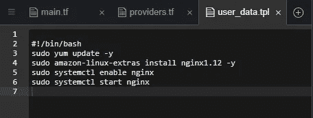

接下来，我需要将它作为变量添加到我的子模块 ec2 中。不需要另一个截图，你可以在这张上面的照片中看到。这就是代码。

很高兴你知道，在整个过程中，我一直在跑`init`、`validate`、`fmt -recursive`和`plan`。我甚至多次运行`apply`和`destroy`来检查我的控制台是否一切正常。我真的很难打开 Nginx。耐心是一种美德…

最后，我需要做的就是在我的终端上运行上面的前五个命令，让所有的东西都得到应用，然后检查我的 AWS 控制台进行确认。

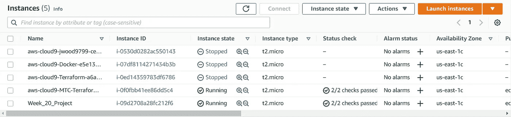

EC2 正在运行。

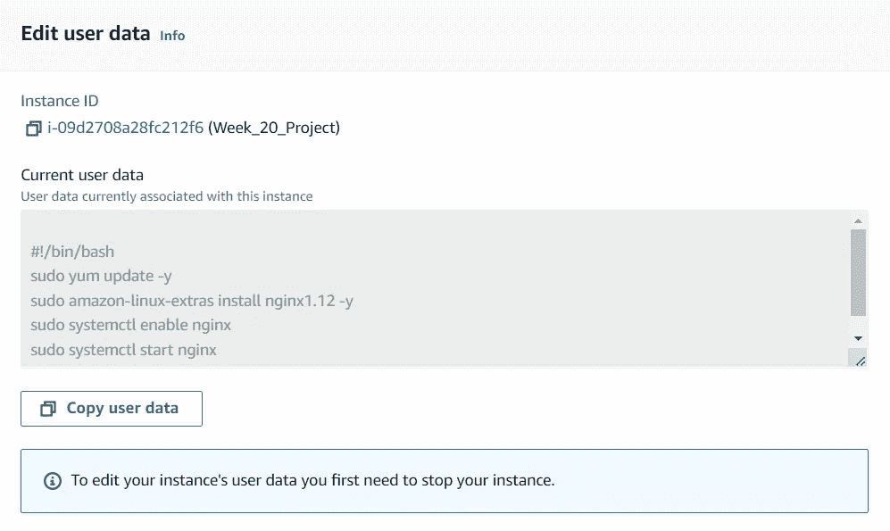

用户数据摆在那里，看起来不错。

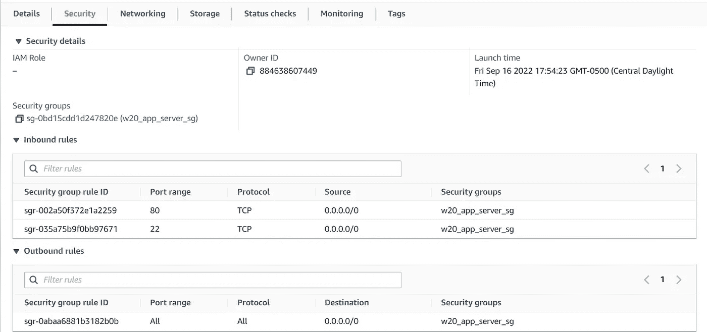

安保看起来不错。

但是，Nginx 推出了吗？

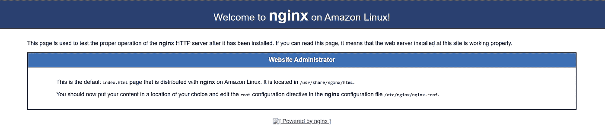

是的先生。我们可以走了！

嘣！完成了。这就是如何使用一个父模块和几个子模块启动一个带有引导脚本的 ec2 实例！

感谢阅读。我希望你喜欢它。杰森·伍德
@jwood9799