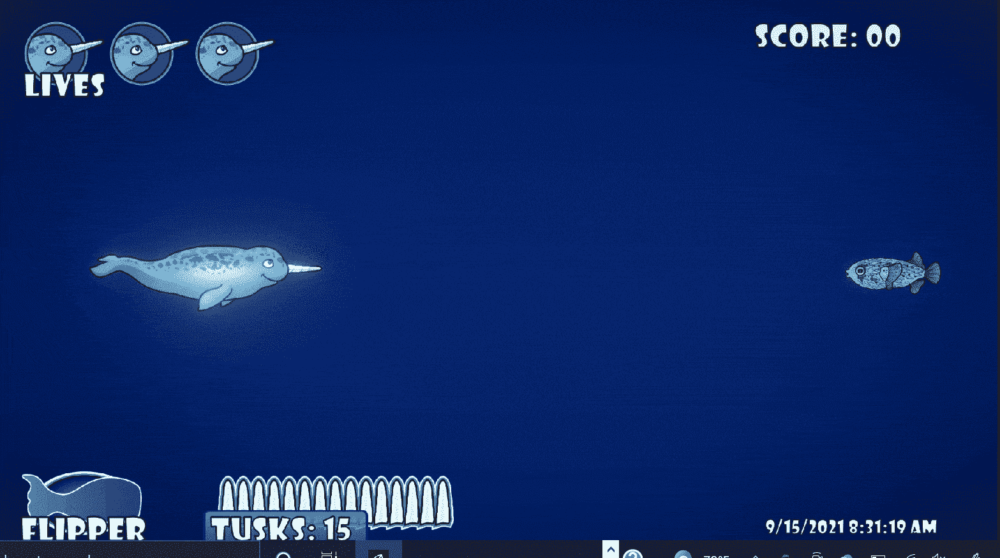

# 创造新的敌人类型:豪猪河豚第 4 部分-收尾工作

> 原文：<https://medium.com/nerd-for-tech/creating-new-enemy-types-the-porcupine-blowfish-part-4-finishing-touches-11f9ea95f2da?source=collection_archive---------6----------------------->

对于这篇短文，我的**目标**将是通过给它一个射击程序和一些动画来完成我的新河豚敌人类型。

在之前的一篇文章中，我介绍了为豪猪河豚制作动画的第一个*帧*和最后一个*帧*