# 用虚拟相机创造我们的场景

> 原文：<https://medium.com/nerd-for-tech/creating-our-scenes-with-virtual-cameras-8768528afccd?source=collection_archive---------30----------------------->

当我们在 Unity 中创建过场动画时，有两个部分，时间轴和电影胶片。时间轴是由一系列事件组成的动画轨迹。您可以将过场动画事件放入该轨道，无论是动画、声音还是摄像机操作。Cinemachine 就是镜头，或者说场景的导演。您可以使用虚拟相机创建动态相机系统，以创建电影镜头。它与时间轴一起工作，时间轴允许你将这些镜头混合在一起。为此，我们将制作一个指南，告诉大家我们打算如何处理一个睡着的警卫场景，以及我们将如何着手制作。这一场景，正如导演设想的草图所示，是这样的:

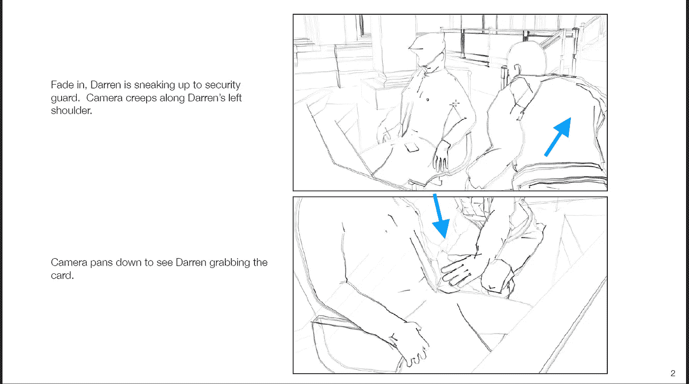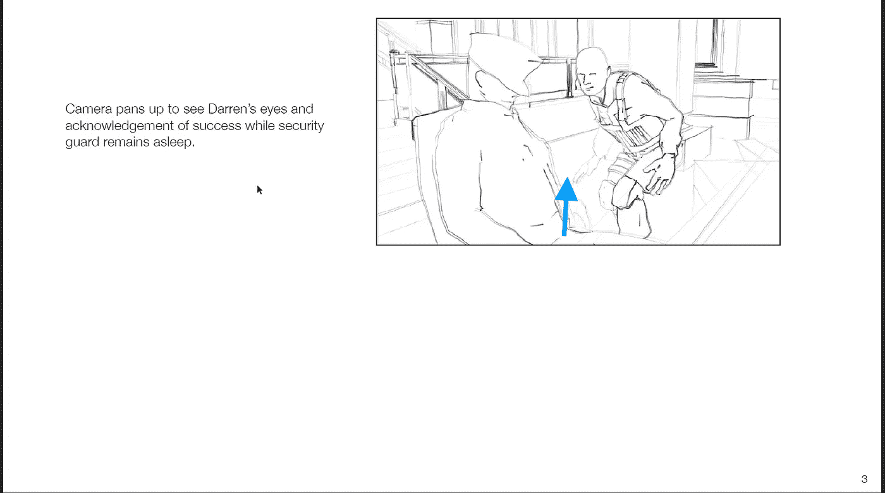

从这个电影开始，我们首先需要在场景中放置我们的“演员”:

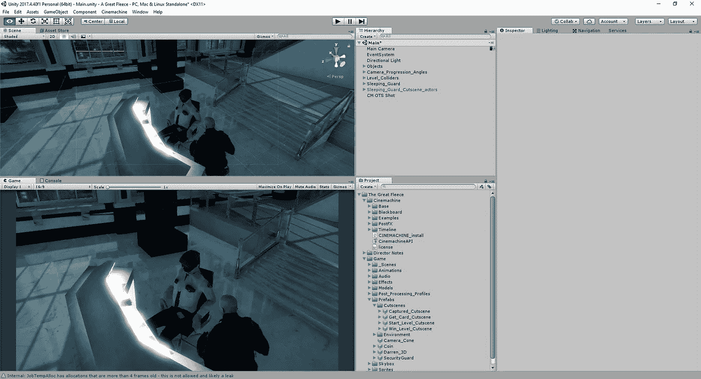

有了这个，我们可以看看动画是什么样子的，只是出于好奇:

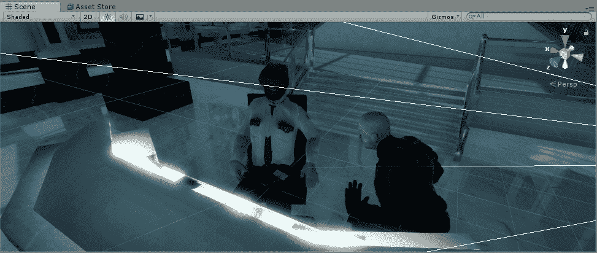

现在我们已经看到了过场动画，我们现在必须弄清楚如何设置不同的摄像机角度，以及在我们希望播放动画时激活我们的演员，然后在过场动画完成后再次隐藏他们。

首先，演员就位后，我们现在将创建一个虚拟摄像机，并将其放在导演视野中的第一个镜头的位置:

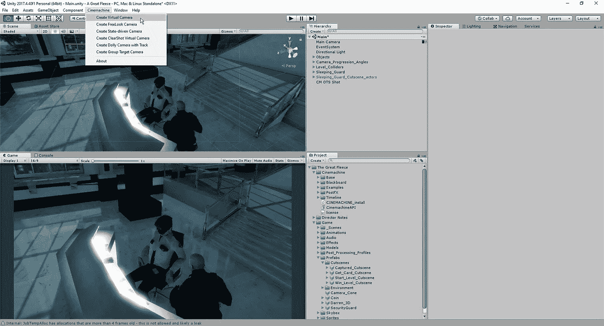

从这里开始，我们想把我们的虚拟摄像机移动到类似于导演的想法。有了 Unity，我们可以通过点击摄像机并使其与当前视图对齐来轻松做到这一点:

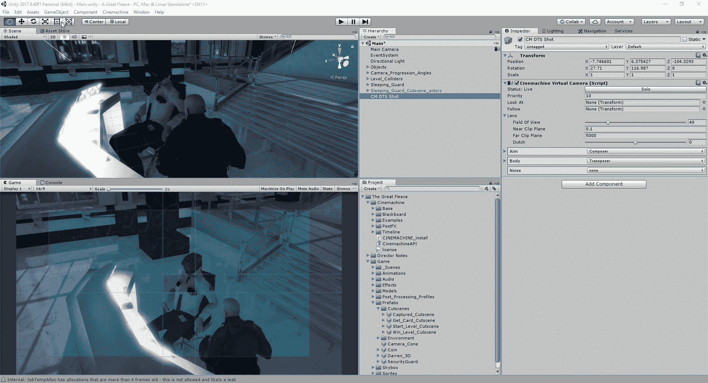

鉴于我们的初步拍摄，我们现在可以做一些小的调整，使它看起来更有吸引力。电影业普遍使用的一条规则叫做三分法。这条规则意味着你要将一个框架分成 9 个相等的部分，并将你的主要对象放在这个框架的相交线内:

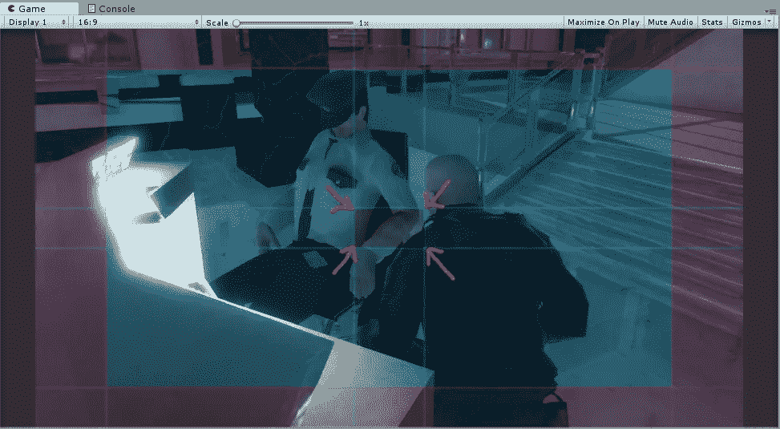

在这里，我们有我们的睡眠后卫和球员都在我们的中央“死区”的边缘，这是一个区域，只要目标在移动，摄像机就不会移动。
接下来，我们将创建电影的第二个角度，这是看到我们的玩家从警卫手中拿卡的前视图:

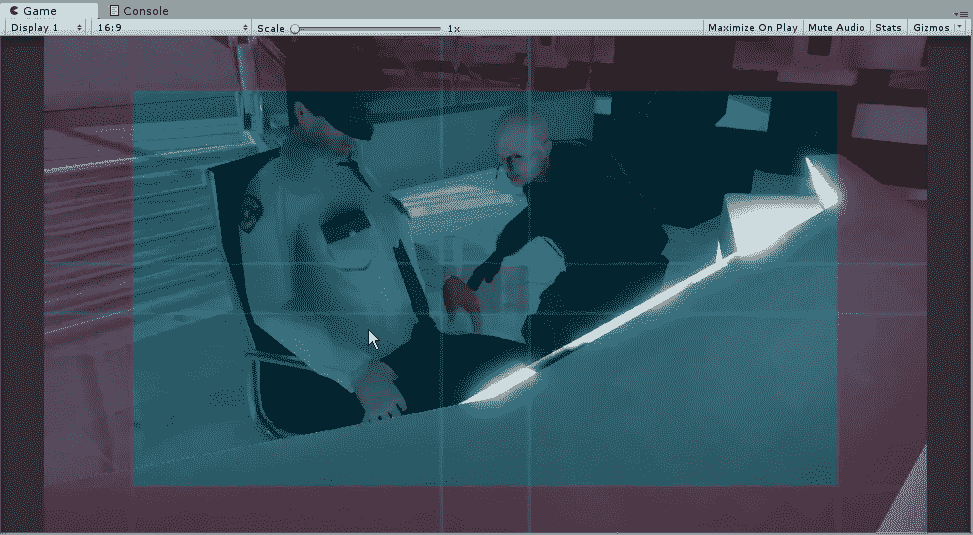

再一次，遵循三分法，我们的主要目标，钥匙卡，在死区的边缘，而我们的玩家在另一边。
有了这个，如果我们试着回到我们最初的镜头，我们最终会有和我们刚刚创建的镜头相同的视角:

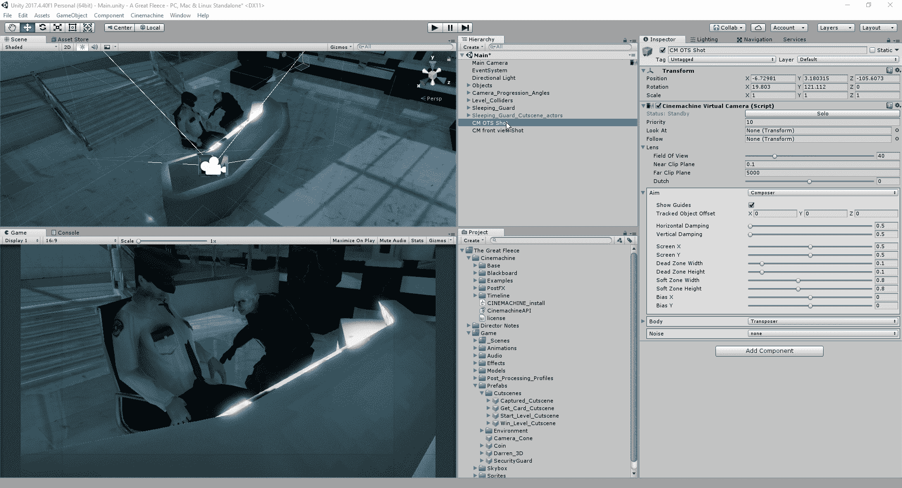

为了能够切换回我们创建的第一个相机的视图，我们可以采取一些方法。当我们选择初始摄像机并移动到检查器时，我们可以点击“solo”按钮让它切换到那个视图，或者改变我们希望摄像机出现的顺序。数字越大，越重要，意味着它将最先出现。

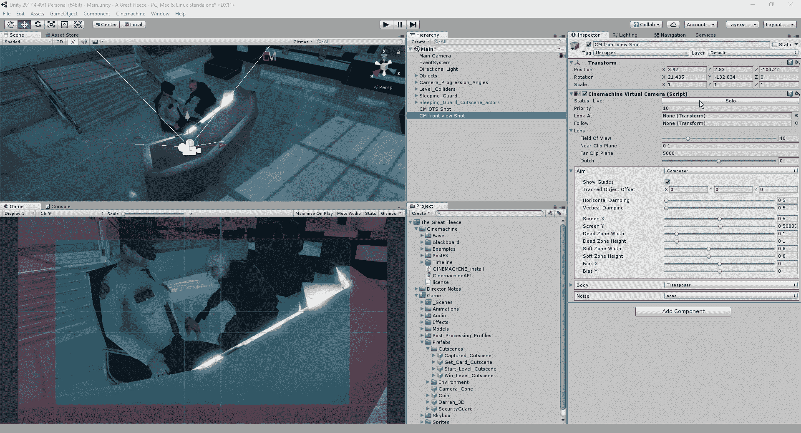

当我们创建这些虚拟摄像机时，会在主摄像机上创建一个新组件:

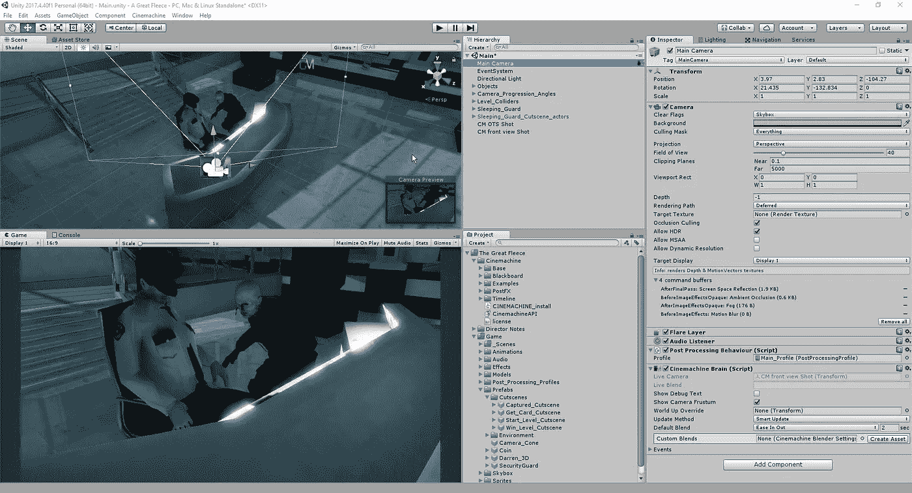

这个 cinemachine 大脑组件允许我们在虚拟摄像机之间切换，并将摄像机的位置和旋转带到虚拟摄像机的位置。
最后，我们将稍微清理一下我们的层级结构，这样我们就不会被过多的对象所占据，并且当它与我们正在寻找的特定零件相关时，我们可以轻松地找到它:

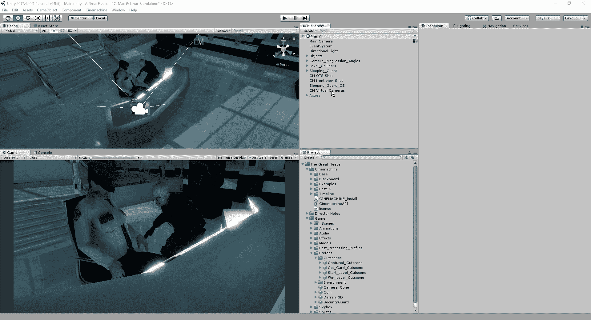

现在我们已经设置好了场景，我们可以期待使用时间轴来创建我们的剪辑，并给我们站立的演员一点点生命。