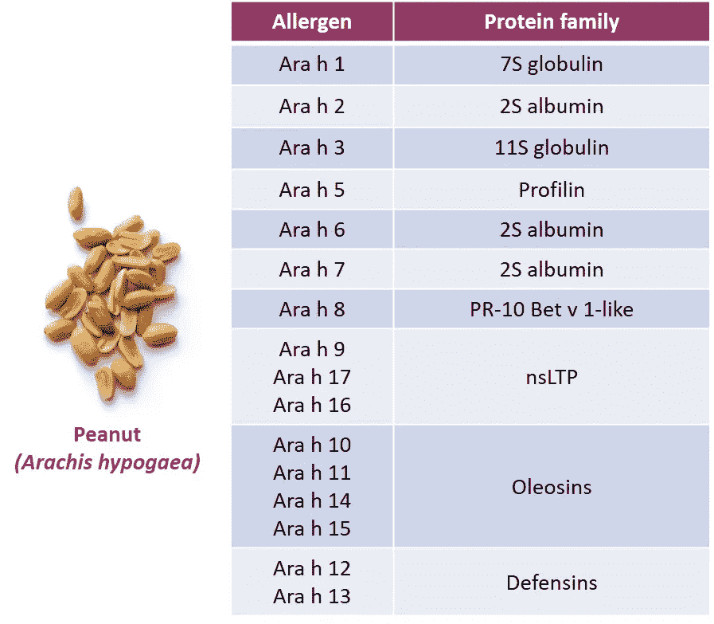
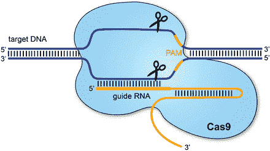
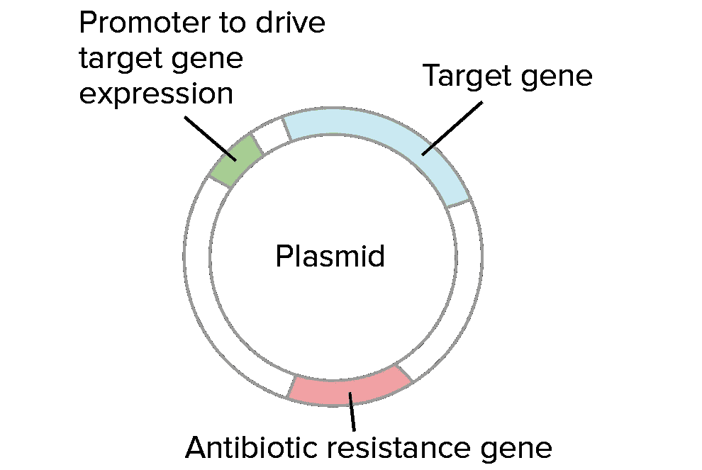
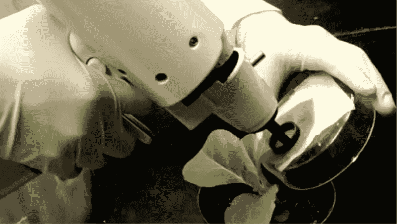
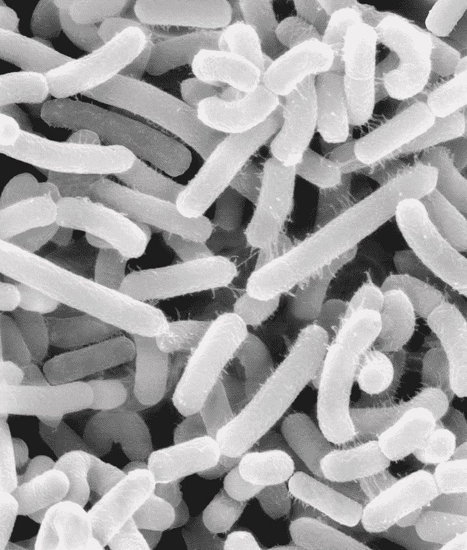
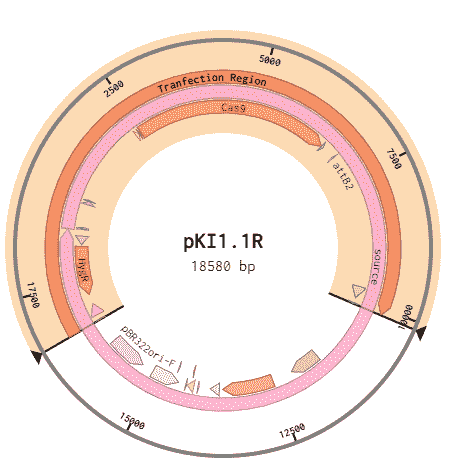

# 创造不会引起过敏的花生

> 原文：<https://medium.com/nerd-for-tech/creating-peanuts-that-dont-cause-allergies-e9fddedf896b?source=collection_archive---------27----------------------->

## 低过敏性花生

## 这听起来可能有点疯狂，但请听我说完。

[李中清](https://unsplash.com/@picsbyjameslee?utm_source=medium&utm_medium=referral)在 [Unsplash](https://unsplash.com?utm_source=medium&utm_medium=referral) 上拍照

“我能看看这里面的成分吗？”

每当我尝试新食物时，我都会这么问，因为我知道下一口可能是我的最后一口。有些人认为我是偏执狂，但我只是在努力[活下去](https://www.youtube.com/watch?v=I_izvAbhExY)。

我患有坚果过敏症，全世界超过 9600 万人(大约相当于越南的人口)都患有同样的疾病。

过敏可能是轻微的不便，也可能是致命的。花生处于这个范围的末端，每年导致数十万人死亡。每三分钟，就会有一名食物过敏反应患者被送进急诊室。

我一生都生活在这种过敏之中，我一直在思考如何潜在地解决这个问题。有一天，我突然想到。

如果我们可以对花生进行基因改造，使它们不会引起过敏反应，那会怎么样？

原来花生有几种不同的主要过敏原。 [花生中发现的前两种过敏原是 **Ara h 2** 和 **Ara h 6**](https://www.ncbi.nlm.nih.gov/pmc/articles/PMC4451826/) 。然而，在这两者中，大多数人对 Ara h 2 过敏。

## 过敏反应工作原理的过于简化的分解

假设你对 Ara h 2 过敏。让你感到恶心的不是 Ara h 2，而是你身体的免疫反应。当你摄入 Ara h 2 时，免疫系统会感觉到它的存在，并开始发出你身体的警报。然后，你的免疫系统开始产生导致肿胀和呕吐的化合物。

# 用 CRISPR-Cas9 基因敲除 Ara h 2

每一种蛋白质都有一个特定的相关基因。对于 Ara h 2(一种蛋白质)来说没什么不同。因此，如果我想摆脱 Ara h 2 蛋白，我需要敲除 Ara h 2 基因。幸运的是，CRISPR-Cas9 现在可以实现这一点，它本质上是一种基因搜索和删除机制。

## CRISPR 系统快速概览

*   CRISPR 系统由两部分组成: **Cas9** 和**引导 RNA** ( **gRNA** )
*   Cas9 是“分子剪刀”；gRNA 将这些剪刀导向一个特定的基因目标。
*   你可以通过创建一个相应的 gRNA 序列来定位一个基因序列。
*   Cas9 与 gRNA 形成复合物，搜索基因组直到找到目标序列。一旦它找到这个序列，它就把它切成两半。

所以，我开始工作，设计了一个可以针对 Ara h 2 基因的 gRNA 序列。我用一个叫做 [**ChopChop**](http://chopchop.cbu.uib.no/) 的网络应用做了这件事；你插入生物体，目标基因，Cas 酶的类型(Cas9 只是一种酶)，它使用一种算法吐出多个潜在的 gRNA 序列。

有了这个 gRNA，我可以针对 Ara h 2 基因和*敲它的存在*。但是不要担心，花生仍然有 99%是一样的，并且含有和以前一样多的营养成分。

# 农杆菌——又名邮差

质粒(环状 DNA)的简图

下一步是把所有东西都放到质粒上。质粒是包含基因的环状 DNA 片段。它经常被用于基因工程，将基因转移到生物体内。

这是一把基因枪。看起来不太令人愉快，不是吗？

但在此之前，我需要弄清楚如何将这些成分植入花生植株，这不是一个简单的过程。传递基因的一种方式是通过基因枪，就像它听起来的那样:一把向细胞发射基因的枪，希望它们能进入细胞核。

农杆菌的 TEM 图！

对于这个程序，我可以利用**农杆菌的能力！**在自然界中，土壤杆菌导致植物中形成肿瘤，然后以死亡的植物组织为食。有点像个混蛋，对吧？是的，那是自然。

更有趣的是土壤杆菌如何导致植物中肿瘤的形成。这个过程叫做**水平基因转移**。换句话说，微生物可以将其部分基因转移到植物细胞中。当然，它通常转移的部分会导致植物发生癌症。但是，你可以去掉这一部分，加入任何你想要的基因。这个部分(被转移到植物中)位于特定质粒(称为 Ti 质粒)的特定部分。

**高亮显示的**:质粒将被转染到植物细胞中的部分。这个区域含有 Cas9 和 gRNA 基因。**参考消息:这是一个 Ti 质粒。**

回到我的案例，我可以利用土壤杆菌的这种能力将基因插入花生植物细胞。将被插入的基因是 **a)** 参与产生 Cas9 的基因和 **b)** 参与产生 gRNA 的基因。你可以在上面质粒的突出部分看到这一点。

# 未来的步骤

这无疑是朝着正确方向迈出的一步，但我仍然需要在实验室里进行实验测试。理论上讲，是有道理的。但是，就像生活中的许多事情一样，事情从来没有那么简单。

我想到的另一个障碍是公众的看法。坚果过敏的人会吃低过敏性花生吗？这是我需要进一步调查的事情。

与此同时，在目前的设置下，我做的花生不会是真正的低过敏，因为它们仍然含有其他过敏原(尽管没有 Ara h 2 那么主要)。如果有人对 Ara h 6 过敏，他们仍然会受到这种花生的影响。在未来，随着基因编辑的进步和变得更好，可能会有一种方法可以靶向一个生物体内的多个基因(**注**:有多种方法可以靶向多个基因，但该过程的功效和准确性非常低)。

***嘿！感谢阅读。我希望你学到了新的东西！* 如果你想帮我完成这个项目，请在** [**LinkedIn**](https://www.linkedin.com/in/jibraan-kadri-1673751b6/) ，[**insta gram**](https://www.instagram.com/jibby_.k/)**，** **或**[**Twitter**](https://twitter.com/KadriJibraan)**上给我留言！我们聊聊吧！**😄💬