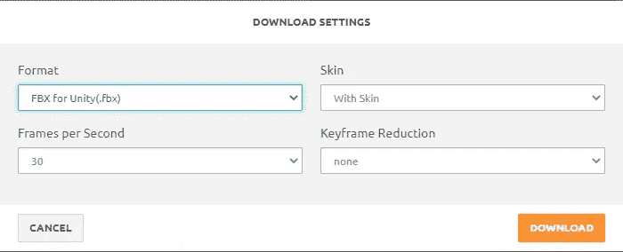
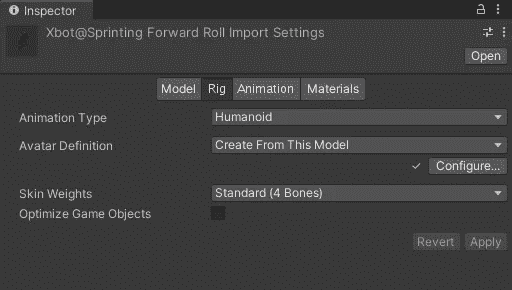
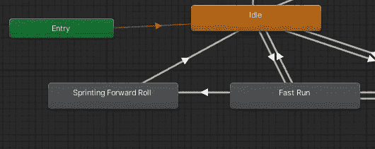
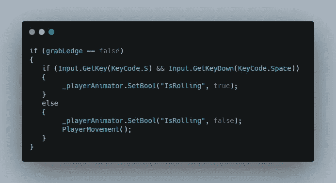
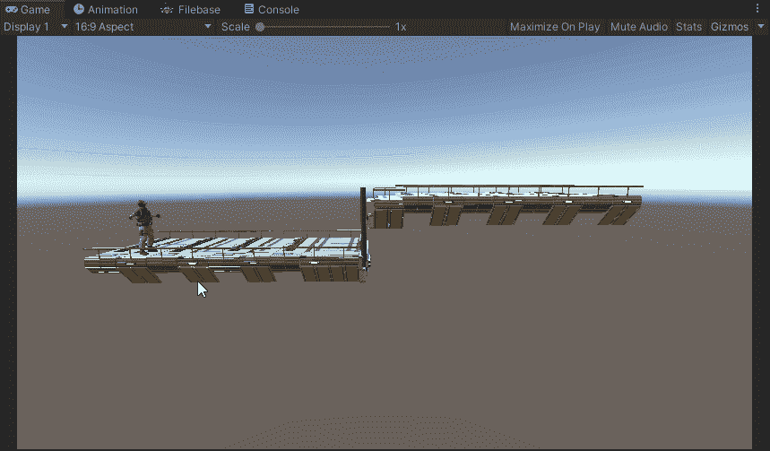

# 创建玩家滚动行为

> 原文：<https://medium.com/nerd-for-tech/creating-player-roll-behavior-4a1716c01402?source=collection_archive---------20----------------------->

2.5D 游戏开发

**目标:**允许玩家在地上打滚

为了制作动画，我们首先需要动画本身，所以我们去 mixamo.com 选择我们喜欢的动画

现在下载动画，设置如下

下载后，我们需要配置它在我们的游戏中工作，所以我们首先在 unity 中拖动下载的动画，选择文件并更改为如下

设置此设置后，选择应用保存设置。然后展开文件，你可以看到各种文件，其中有动画文件，所以选择带有动画名称的文件，用 **Ctrl+D.** 复制它

然后将动画拖动到动画制作程序中，设置动画条件。

使事务在 bool 值为真的条件下从运行状态变为空闲状态，在 bool 值为假的条件下从滚动动画变为空闲状态。

然后，在玩家脚本的更新功能中，我们需要设置启用滚动动画的条件，在本例中，滚动动画是玩家在奔跑时按住 S 键和空格键。

这是最终的结果。