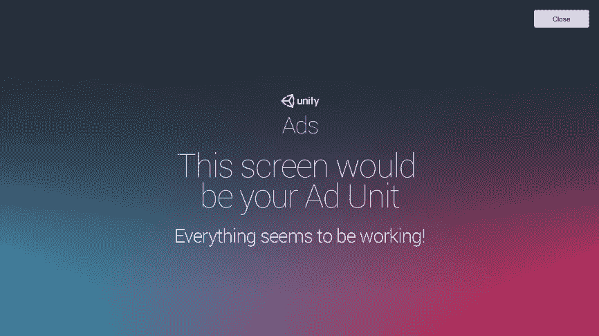
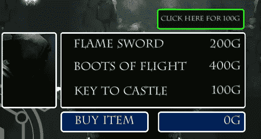
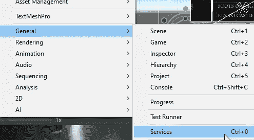
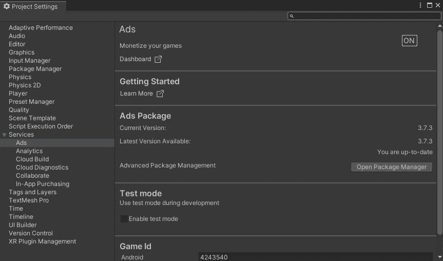
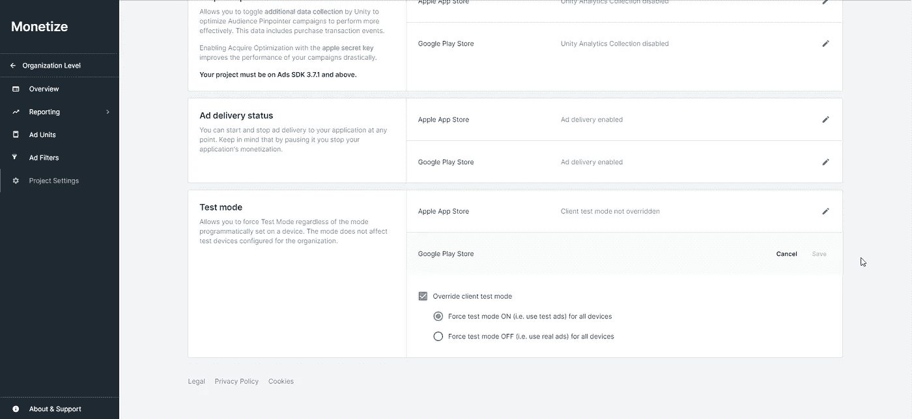
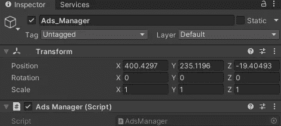
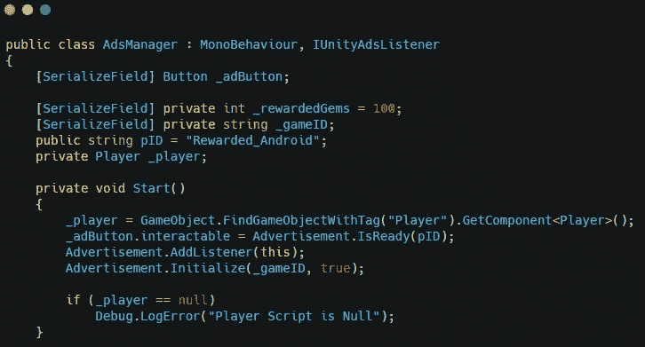
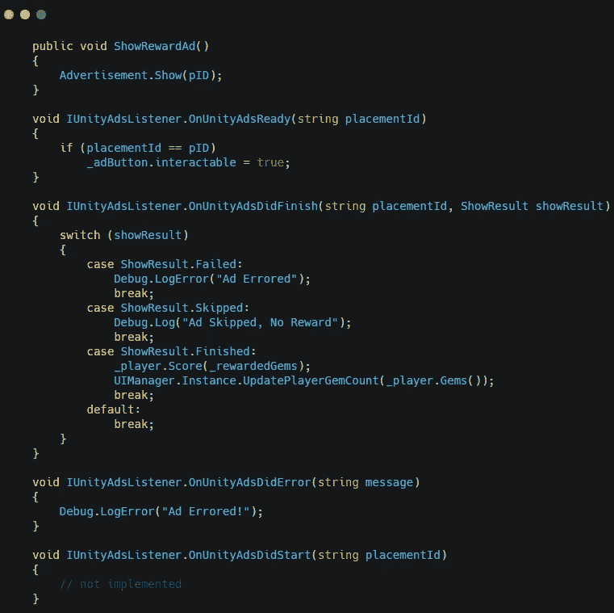
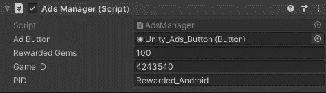
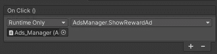

# 在 Unity 中创建奖励广告

> 原文：<https://medium.com/nerd-for-tech/creating-rewarded-ads-in-unity-a9bf7fb0aa01?source=collection_archive---------8----------------------->

要创建奖励广告，您可以做的第一件事是添加一个播放广告的按钮。

为此，我复制了购买按钮，并将其移动到商店的右上角。然后我把它改成了商店的文本，并改变了颜色。

现在，要启用广告，您需要进入**窗口= >常规= >服务**打开服务窗口。

现在点击广告按钮，它会为你打开一个窗口。你需要选择你的组织，然后你可以打开广告。

现在，您需要转到 unity 仪表盘。前往**货币化= >广告单元。**在项目设置的屏幕上，为您正在使用的平台启用测试模式。

在 unity 中创建一个新的空游戏对象，附带一个名为 AdsManager 的脚本。

在脚本中为按钮、奖励宝石数量、游戏 ID、位置 ID 和玩家脚本创建变量。另外，实现 IUnityAdsListener 接口。确保使用统一的引擎。广告命名空间。在 start 方法和 AddListener 方法中初始化游戏广告。

创建一个显示广告的方法。在界面中，方法添加了允许广告在被观看后给出奖励的逻辑。

在 unity 中，为游戏添加正确的 id。这些可在 unity 仪表盘的广告单元部分找到。

确保为广告管理器设置正确的点击方式。

这会让你的游戏播放广告。