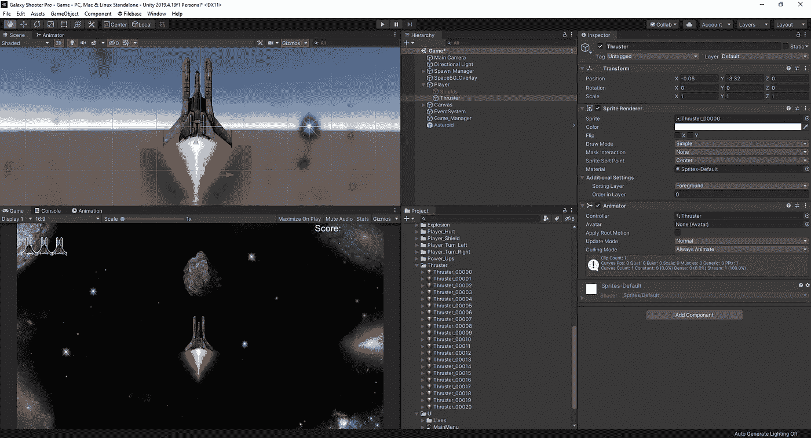
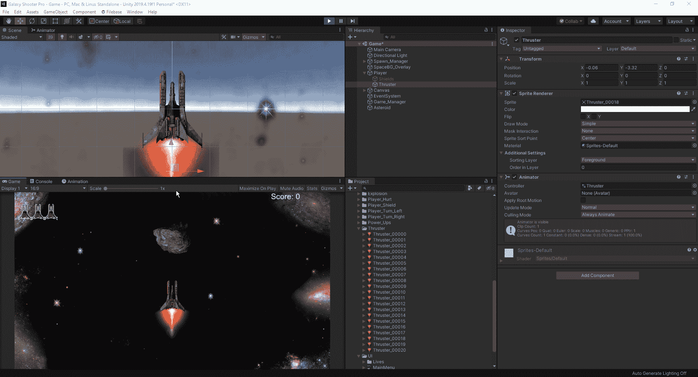
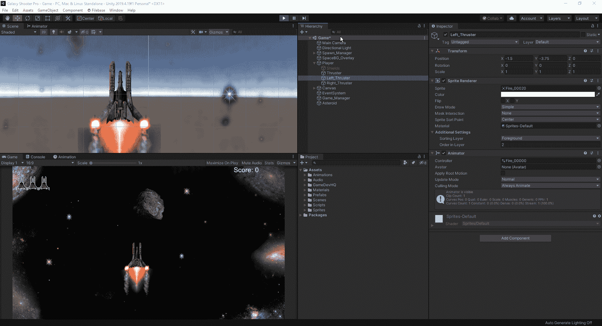
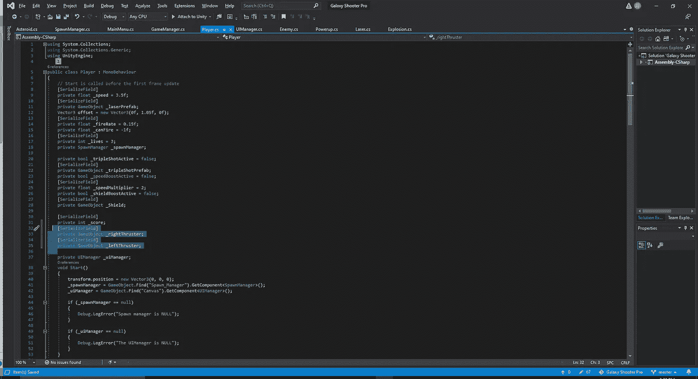
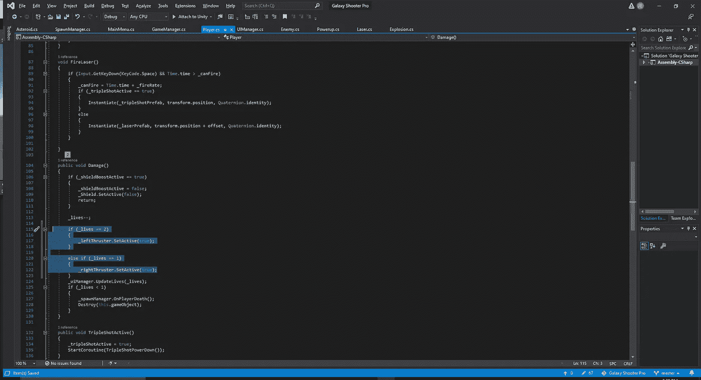
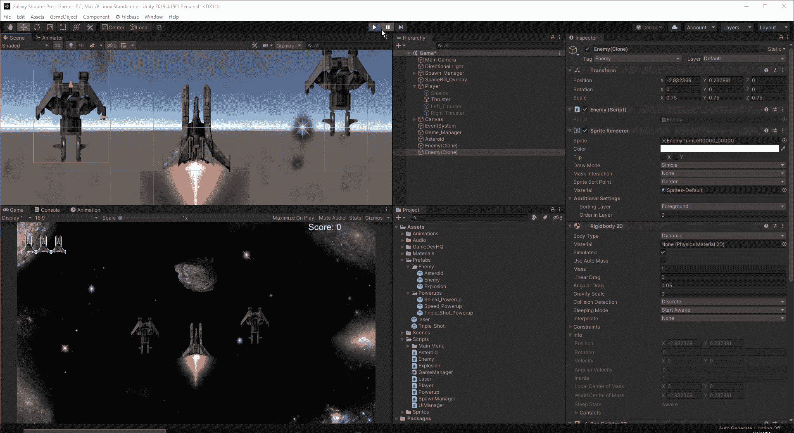

# 制造一些推进器并损坏 VFX

> 原文：<https://medium.com/nerd-for-tech/creating-some-thruster-and-damage-vfx-ccc68d3ed6e5?source=collection_archive---------35----------------------->

今天我们将很快为我们的玩家添加一些 VFX。首先，让我们给自己一些推进器，让它看起来好像我们正在前进，伴随着一个小动画。正如我们对我们的盾牌所做的那样，让我们快速地将推进器动画的第一张图片拖入层次中。从这里开始，我们将把玩家指定为父玩家，这样我们就可以让它跟随父玩家的移动，而不必担心编码问题:

接下来，让我们为推进器制作一些动画，并在游戏中进行测试:

现在我们已经有了推进器，让我们为我们的玩家受损时设置一些 VFX。如果我们被击中 2 次，我们最终会被设定为两翼冒烟，否则当我们失去 1 条生命时，一翼会冒烟。首先，让我们快速制作受损的 VFX，并将其安装在两个玩家的翅膀上。我们必须确保再次使玩家成为家长，以便他们像我们希望的那样跟随它:

现在，我们将不得不创建一些代码，在失去生命时激活我们损坏的推进器。为此，我们将转到我们的玩家脚本。首先，我们将制作一些游戏物体来连接我们的推进器:

接下来，我们向下滚动到脚本的损坏部分，当我们受到损坏时，使用 SetActive 方法打开损坏的推进器:

现在我们已经设置好了，我们可以在游戏中测试它:

我们找到了。我们现在为我们的玩家创造了一些推进器效果，以及一些当我们受到伤害时激活的伤害效果。