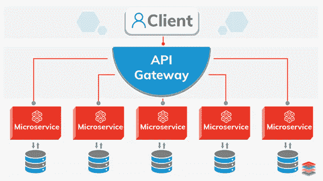
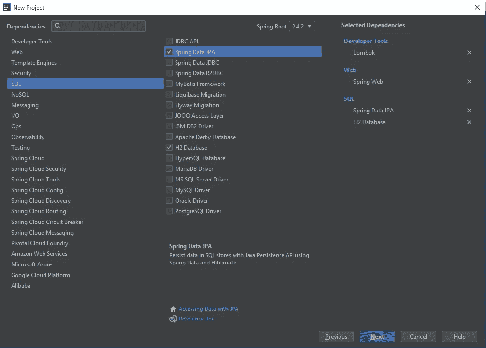
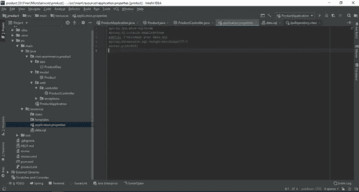
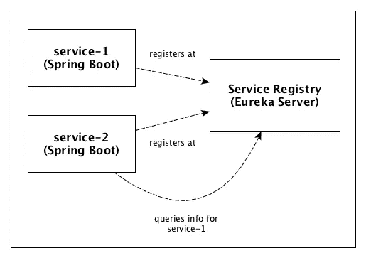
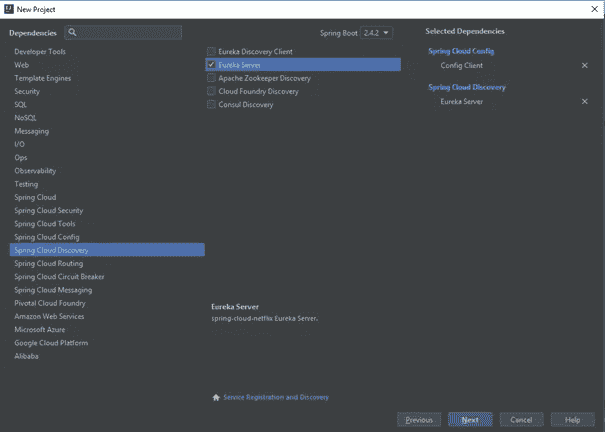
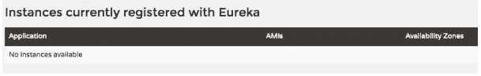
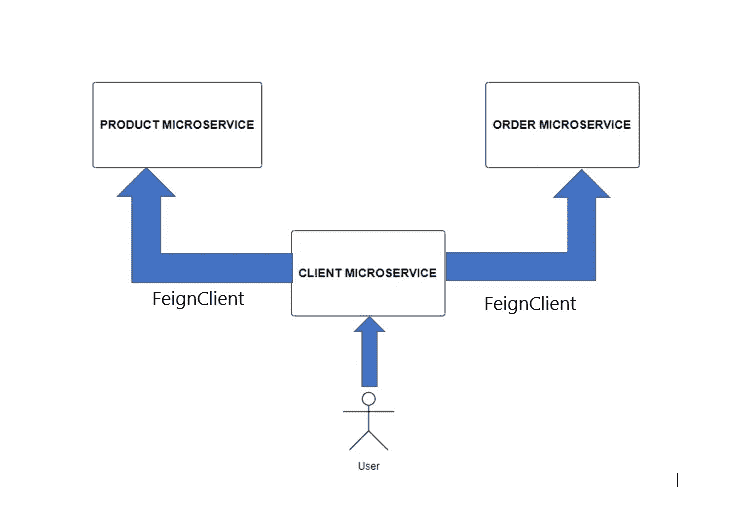

# 构建 Spring Boot 微服务，使用 prometheus 和 grafana 进行监控，使用 ELK stack 进行日志聚合:第一部分

> 原文：<https://medium.com/nerd-for-tech/creating-spring-boot-microservices-monitoring-with-prometheus-and-grafana-and-log-aggregation-ba4f20496942?source=collection_archive---------0----------------------->


**简介**

在开发大量复杂的应用程序(电子商务、流式视频、银行……)时，大多数开发人员都面临着许多挑战，例如:

**-可用性:**无论用户的行为如何，我们如何确保我们的应用程序始终可用？

**-可维护性:**我们的应用程序必须经常进化，并且在不关闭整个应用程序的情况下快速响应新的特性。

**-进化:**每天都有技术用于开发应用程序进化，因此我们必须确保我们的应用程序有能力适应这种进化

当然还有我们将要面临的许多其他问题和挑战。

在这篇文章的第一部分，我们将了解微服务架构是如何解决这个问题并应对挑战的。

# **什么是微服务架构？**

微服务架构提供了一个简单的解决方案:将应用程序拆分成称为微服务的小服务，这些服务是完全自治的，并公开其他微服务可以使用的 REST API。

下图简要概述了微服务架构:



全球建筑

# 微服务架构如何应对上述问题？

正如我们在上一张图中看到的，每个微服务都是完全自主的，可以部署在各种服务器和不同的实例上，这使得我们的微服务可用且可扩展。在这种情况下，负责 UI 的微服务将调用其中一个实例，并接收相同的响应，而不管选择哪个实例。

我们不必再担心可维护性，每个微服务都独立于其他微服务工作，所以每当我们想要在微服务上工作时，我们不必停止整个应用程序(monolothic 应用程序的情况),我们只需访问有问题的微服务。

由于提供的各种技术，每个微服务可以使用不同的技术，微服务 A 可以在 java 中，微服务 B 可以在 php 中……主要是每个微服务都公开了一个 rest API。这一优势将使我们能够关注应用程序的业务逻辑，而不用担心技术。

在我们快速了解了微服务架构及其优势之后，我们将把所有这些付诸实践，以便涵盖大多数主题。

我们将使用著名的 **Spring boot 框架**创建一个简单的电子商务应用，它有三个微服务(ProductMicroservice、OrderMicroservice 和 clientMicroservices)。

# **创建微服务**

第一步包括创建三个 spring initializer 项目，它们将代表我们的微服务。

这些项目每个都有一个类(产品、订单和客户),现在还有这些依赖项:



属国

产品微服务会有两个简单的操作:通过 id 找到一个产品，获取所有产品。

order 微服务:添加一个新订单，并按其 id 查找和订购。

客户端将使用微服务。

创建微服务及其方法后，我们必须在每个微服务中看到这个包树:



包裹

不要担心源代码，在本课程结束时，您会找到整个代码的链接，现在我们只需了解每个步骤。

现在我们有两个独立运行的 spring boot 应用程序，到目前为止一切都很熟悉。

# 尤里卡服务器

正如我们所说的，现在一切都很熟悉，每个微服务及其实例都是独立运行的。但是我们需要一些东西来注册所有这些实例。

网飞拥有的尤里卡服务响应这一需求，尤里卡将注册每一个微服务。

在 eureka server 中注册的每个微服务都称为 eureka client。



尤里卡

上图显示了我们的微服务如何与 eureka 服务器交互。

要设置 eureka 服务器，我们需要创建一个 Eureka 微服务并添加其配置。



尤里卡服务

添加依赖项后，转到 application.properties 并添加此配置

```
server.port:9102

spring.application.name=eureka-server

eureka.client.serviceUrl.defaultZone:http://localhost:9102/eureka/

eureka.client.registerWithEureka:false#set to false because we're not in cluster mode
eureka.client.fetchRegistry:false
#set to false because we're not in cluster mode
```

启用 Eureka 服务器:

```
@SpringBootApplication
@EnableEurekaServer
public class EurekaServerApplication {
   public static void main(String[] args) {

      SpringApplication.run(EurekaServerApplication.class, args);

   }

}
```

然后去 http: // localhost: 9102 /。然后你将进入一个页面，该页面提供了一定数量的关于你的尤里卡服务器的信息。



在这里，您将看到将要注册的微服务实例列表。

# 尤里卡客户

为了让不同的微服务开始在我们的 Eureka 服务器中注册，我们需要为每个微服务添加 Eureka 客户端。

转到 pom.xml 并添加这个依赖项:

```
**<dependency>****<groupId>org.springframework.cloud</groupId>****<artifactId>spring-cloud-starter-netflix-eureka-server</artifactId>****</dependency>**
```

然后是应用程序。属性:

```
**eureka.client.serviceUrl.defaultZone:** [**http://localhost:9102/eureka/**](http://localhost:9102/eureka/)
```

这一行表示要注册的 Eureka 的 URL。

最后转到每个微服务和注释@EnableDiscoveryClient:

```
@SpringBootApplication

@EnableDiscoveryClient

public class ProductApplication {

    public static void main(String[] args) {

        SpringApplication.*run*(ProductApplication.class, args);

    }

}
```

您的微服务现在受益于 Eureka 客户端，它将在每次启动时注册您的实例。

启动您的服务并转到 http: // localhost: 9102

# **与 Feign** 交流您的微服务

目前，两个微服务产品和订单以及一个客户端独立运行，并在 Eureka 上注册。但是如果我们需要其中一个和另一个交流呢。这就是为什么我们需要一种服务或协议来保证这一点。

**Feign** 是一个 HTTP 客户端，它极大地方便了不同微服务所公开的 API 的调用。因此，它能够基于所提供的注释和信息创建和执行 HTTP 请求

在我们的例子中，我们需要客户端微服务来与产品通信并订购微服务。

让我们从在客户端微服务中向我们的 *pom.xml* 添加 Feign 开始

```
<dependency><groupId>org.springframework.cloud</groupId><artifactId>spring-cloud-starter-openfeign</artifactId></dependency>
```

为了在这个微服务中激活 Feign，请转到 *ClientUiApplication* 并添加***@ EnableFeignClients***注释 ***:***

```
@SpringBootApplication@EnableFeignClients("com.ecommerce.clientui")public class ClientUiApplication {public static void main(String[] args) {SpringApplication.run(ClientUiApplication.class, args);}}
```

注释`@EnableFeignClients`要求假装扫描*com。*电子商务*。clientui"* 打包以查找声明自己为假扮客户端的类。



FeignClient

虽然客户端 mis 将使用 feign 来检索产品列表，但是我们必须在客户端 mis 中创建一个类似于产品微服务中的产品类，以便存储对象:

我们将在包 DTO 下创建一个类产品。

```
@Data
public class ProductDTO {

    private int id;

    private String titre;

    private String description;

    private String image;

    private Double prix;
}
```

我们现在将创建一个**接口，它将把我们想要传递给 ProductMicroservice *的请求***组合在一起。这个接口就是我们所说的**代理，**因为它被定位为一个中间类，使得与外部微服务的链接被调用。

```
@FeignClient(name = "microservice-product", url = "localhost:9001")
public interface ProductMicroserviceProxy{

    @GetMapping(value = "/Products")
    List<ProductDTO> findAll();

    @GetMapping( value = "/products/{id}")
    ProductDTO findById(@PathVariable("id") int id);

}
```

-Feign 将使用所提供的信息发出适当的 HTTP 请求来调用 ProductMicroservice *。*

*-* 第一个参数是将要调用的微服务的名称。此名称已在 application.properties 中设置

-第二个参数是微服务的 URL(localhost:9001)

剩下的就是使用这个代理。回到控制器:

```
@RestController
@CrossOrigin("*")
@RequestMapping("/client")
public class ClientController {

    @Autowired
    private ProductMicroserviceProxy ProductProxy;

    @GetMapping("/products")
    public List<ProductDTO> findAll(){

        List<ProductDTO> list=  ProducstsProxy.findAll();
        return LIST;

    }

    @GetMapping("/findById/{id}")
    public ProductDTO findByd(@PathVariable int id){

        ProductBean prod = ProductsProxy.findById(id);

        return prod;
    }
```

让我们简单介绍一下，到目前为止，我们已经创建了 3 个微服务(产品、订单和客户端),每个微服务都在 Eureka 服务器上注册，并与 FeignClient 通信。

我们现在取得了很大的进步，但是正如我们所看到的，我们仍然缺少一些东西。

# **ZULL API 网关**

ZUUL 将成为我们应用程序的一个独特入口。例如，当客户端微服务想要调用其中一个微服务时，它将通过 **ZUUL** 。它将负责分派、修改和应用过滤器和规则到这些请求。

祖尔原生地与尤里卡合作。它检索 Eureka 中所有可用微服务的列表，并通过 URL:localhost:9004/microservice-name 公开它们。

因此，要检索产品列表，只需调用:localhost:9004/microservice-Products/Products。

然后，您可以像直接调用微服务产品一样检索产品列表。


祖尔语

我们必须创建另一个微服务(Zuul)并在 eureka 注册。

将以下属性添加到 zuul 微服务属性中

```
server.port 9004
#Eureka
eureka.client.serviceUrl.defaultZone:http://localhost:9102/eureka/
```

激活尤利卡和祖尔

```
@SpringBootApplication
@EnableZuulProxy
@EnableDiscoveryClient
public class ZuulServerApplication {

   public static void main(String[] args) {
      SpringApplication.run(ZuulServerApplication.class, args);
   }
}
```

启动 zuul 并验证 Eureka 您会在其他微服务中找到 zuul 微服务。

为了让我们的客户通过 ZUUL，我们需要告诉虚拟代理联系 ZUUL，而不是直接联系微服务。

然后用 ZUUL 替换目标微服务的名称

我们把 */* 微服务产品 */加在*全 URIs 前面。然后，Feign 将通过 URI“/微服务产品/产品”联系 ZUUL。然后，当 ZUUL 从“微服务-产品”URL 中提取相关微服务的名称时，它可以将请求重定向到所需的目的地。

```
@FeignClient(name = "zuul-server")
public interface ProductMicroserviceProxy{

    @GetMapping(value = "microservice-product/Products")
    List<ProductDTO> findAll();

    @GetMapping( value = "microservice-product/products/{id}")
    ProductDTO findById(@PathVariable("id") int id);

}
```

# 结论

这篇文章的第一部分已经介绍了我们如何创建一个微服务，在 Eureka 中注册它，与其他微服务通信，以及如何创建一个 API 网关。

在[的下一部分](https://firas-messaoudi.medium.com/building-spring-boot-microservices-monitoring-with-prometheus-and-grafana-and-log-aggregation-5ed9ca7dda36)中，我们将了解如何使用 Prometheus 和 Grafana 监控我们的微服务。

正如所承诺的，这是本部分 github 资源库的链接

[](https://github.com/FirasMessaoudi/ecommerce) [## FirasMessaoudi/电子商务

### 在 GitHub 上创建一个帐户，为 FirasMessaoudi/电子商务发展做出贡献。

github.com](https://github.com/FirasMessaoudi/ecommerce)