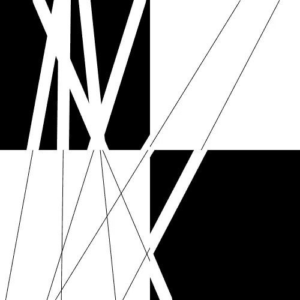
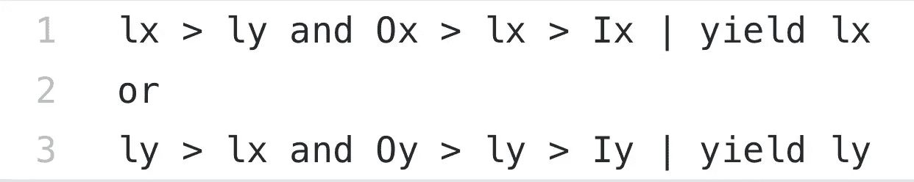
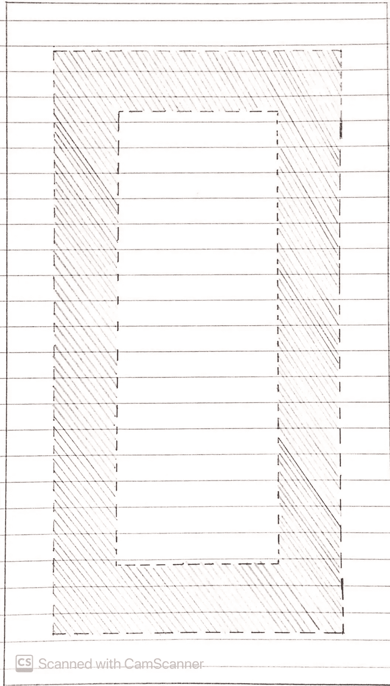
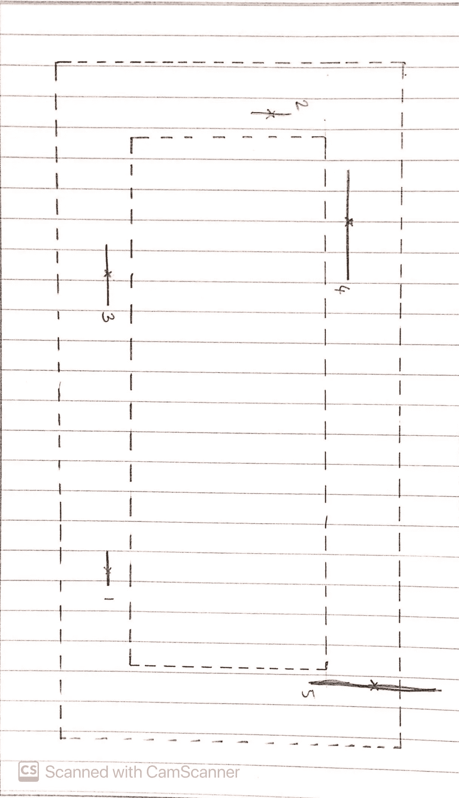
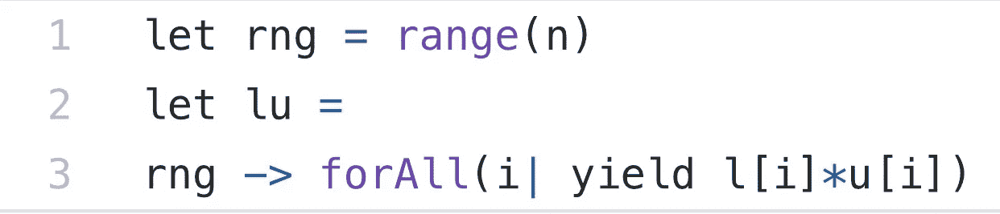
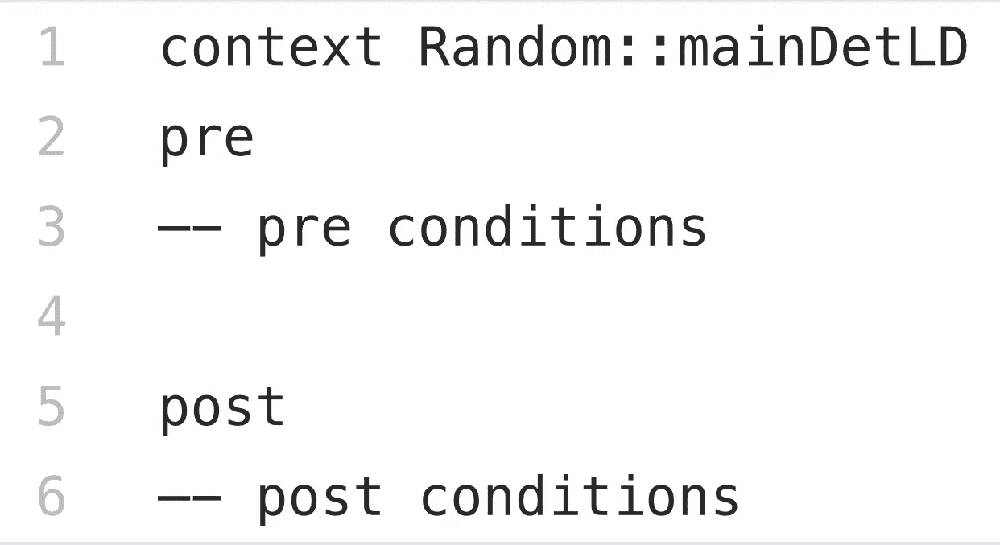
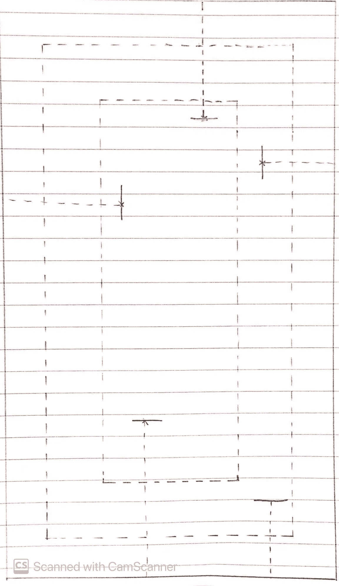
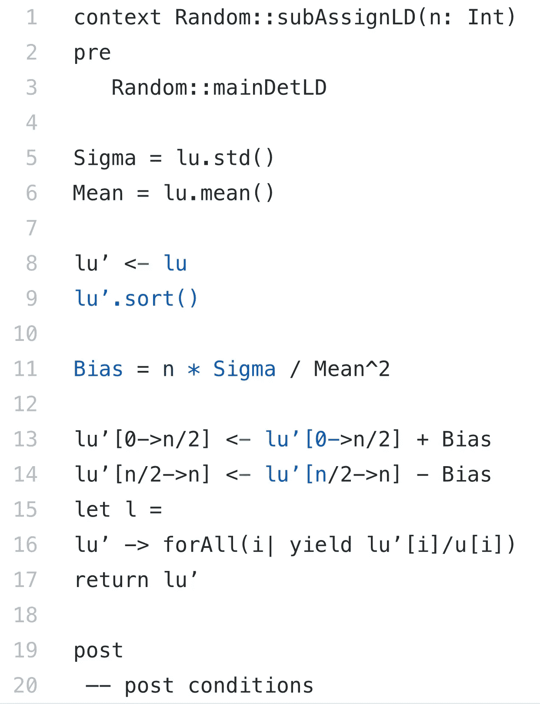
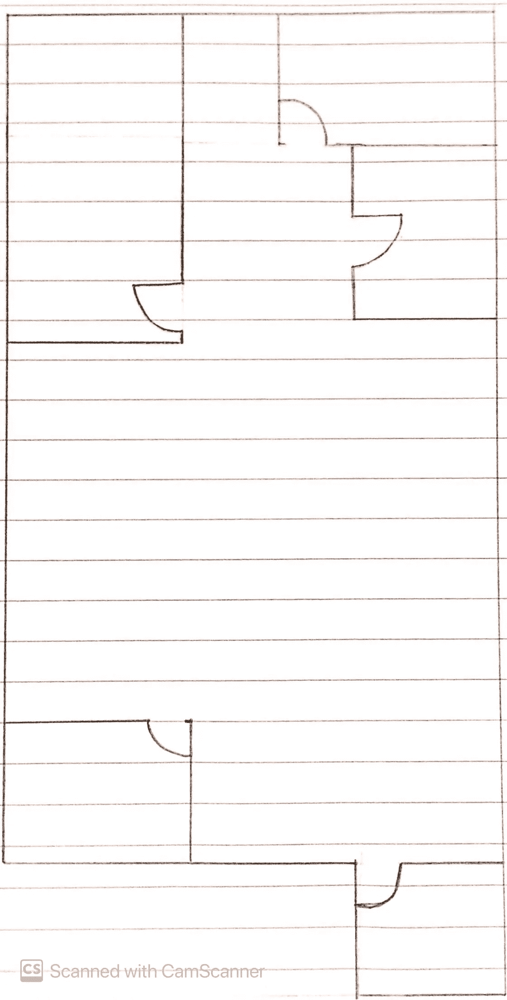

# 创建模板化的自动生成平面图

> 原文：<https://medium.com/nerd-for-tech/creating-templated-auto-generated-floor-plans-b984926d4920?source=collection_archive---------0----------------------->

*使用手动创建过程合成数据集的想法*

## 介绍

我们都想知道如何从随机数据、线和点生成数据。我们如何制作合成数据是基于它的相关数据分布。合成数据对于促进学习是有用的。随机化数据需要 OCL，或对象约束语言，它们与 OCL 结构代码中的算法或统计采样偏差有关。

我在这里提供了一个例子来演示使用 OCL 生成数据。取高斯分布，高斯服从马氏指数，协方差矩阵作为归一化矩阵。我举的例子是从“n”个点生成平面图。使用噪声和输入向量或偏差生成股票市场信号。python 库 Zipline 拥有评估股市符号和价值投资的自动化管道。

> 最好始终保持生成数据的基础，以便可以很容易地从中提取有用的指标。

## OCL

> 对象约束语言运行于:

> (1)数据类型级别、
> 
> (2)操作层面，
> 
> (3)操作员级别、
> 
> (4)功能层次

对象约束语言被定义为对结构模型施加约束。这些包括变量赋值、for 循环、从基本集合中提取子集合等。一个系列可以是一套、一系列或一个包。里面的对象可以有用户定义的类型和属性，类似于 OOP 风格的编程。

> 它们是将逻辑应用于数据集合的逻辑约束。

*   这些函数的定义就像带有显示类型化数据的参数的 OOP 函数一样。每个 OCL 函数都有前置条件和后置条件要满足。这就是最终开发功能规范的方式。

# 我们的例子

> 我们的示例是从随机输入坐标和由一组 OCL 控制的一些输入数据生成的平面图。

# 步骤很简单:-

1.  通过关键点或随机线选择
2.  随机化输入数据
3.  定义 OCL
4.  最终确定产出

## 通过关键点或随机线选择

> 使得能够选择关键通道门坐标，该坐标定义了从通道门开始的房间长度的特定约束。

> KD 树选择

约束条件是所选的最小房间长度将位于两个有边界的矩形长度之间。

从用 kd 树算法训练的集合中选择“n”个点。选择这些点，使它们彼此相距一个边缘距离。

## 随机化输入数据

> 入口坐标有一个指定的长度。这些长度与通道门宽度相关，与平均值 1.1 米的偏差为 66%。

> 随机化访问长度

约束条件是在所有“n”个访问坐标的间隔之间绘制均匀分布。

> 上图中提到的顺序是检修门与其对面墙壁的力矩顺序。

一旦它们被随机化，访问宽度和最小距离的乘积将被计算，这将表示该点在该访问坐标处的力矩。

## 定义 OCL

> 对于由 KD 树选择的 OCL，最小距离的确定已经在前面完成，KD 树选择可以从访问坐标到最近的墙壁画出的最短距离中的最长距离，使得它在那些有界矩形之间。

> 确定主要最小距离(LD)

这是根据 OCL 定义的:

> 最小距离被进一步过滤，并添加采样偏差以描绘最可能的平面图。抽样偏差包括“n”所选访问坐标的数量、“lu”的标准偏差和“lu”的平均值(访问坐标长度和最小距离的乘积)。

> 分配次最小距离(LD)

这是根据 OCL 定义的:

## 此处使用的抽样偏倚代表通道门或房间数量的传统计数以及作为加权比率项一部分的决定性测量。我们必须使用异方差的技巧来证明最终结果。加权比率项描述了测量平均值的平方。

## 最终确定产出

> 通过使通道门的宽度相等，并且可选地通过使一些对称平面图的最小距离相等，来确定输出。

> 均衡检修门宽度

通道门的宽度必须保持标准化。

> 最小距离可选地被归一化为相同的量，以便为平面图提供对称性，并以更好的方式管理空间和布局。

> [可选]均衡最小距离

最小距离必须保持正常。

> 最小距离可选地切换到不同的配置，以便从可选的墙绘制。如果最小距离超过或减小，则它们的配置被切换到另一个正交配置。

> [可选]切换最小距离

在均衡之前，最小距离必须保持最佳。

> 沿着入口坐标画一个等高线，这样每个房间都是相连的。最终的输出是一个集中的布局以及其他房间:

> (1)开放式布局

## 没有有趣的角落，或者在布局的边缘没有曲折的墙。

> (2)设计布局

## 有趣的角落或之字形墙出现在中央布局。

> (3)隐藏式布局

## 一个类似走廊的结构，也是通往其他房间的通道。

> (4)局部布局

## 由其他房间形成的布局，因此中心布局要么是另一个房间，要么小到可以归入上述三个房间。