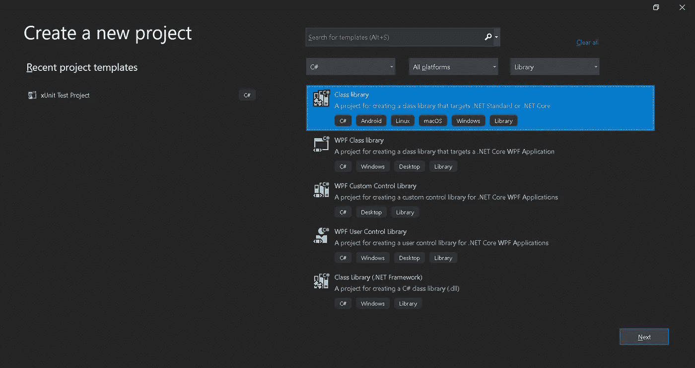
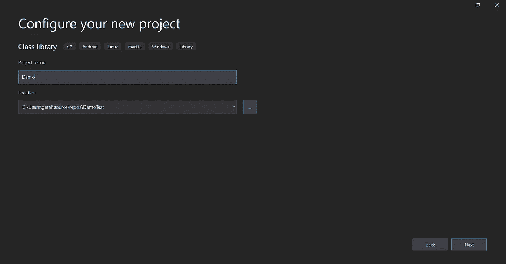
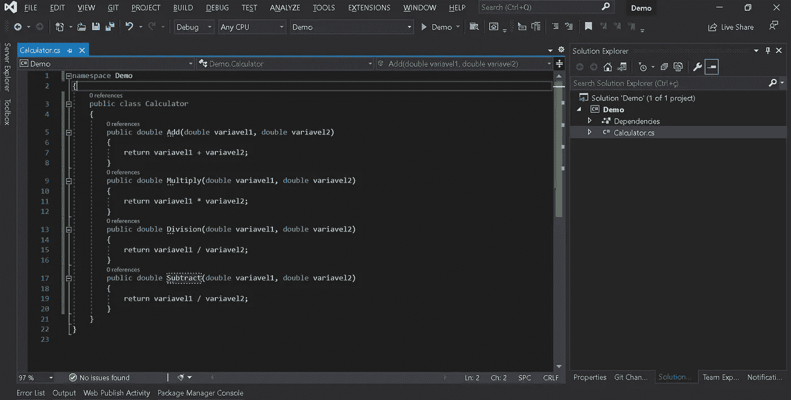
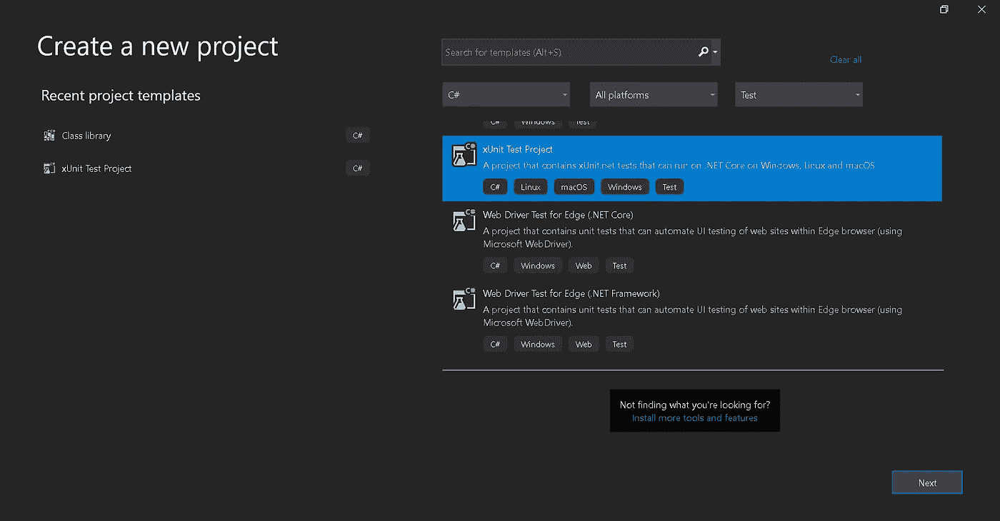
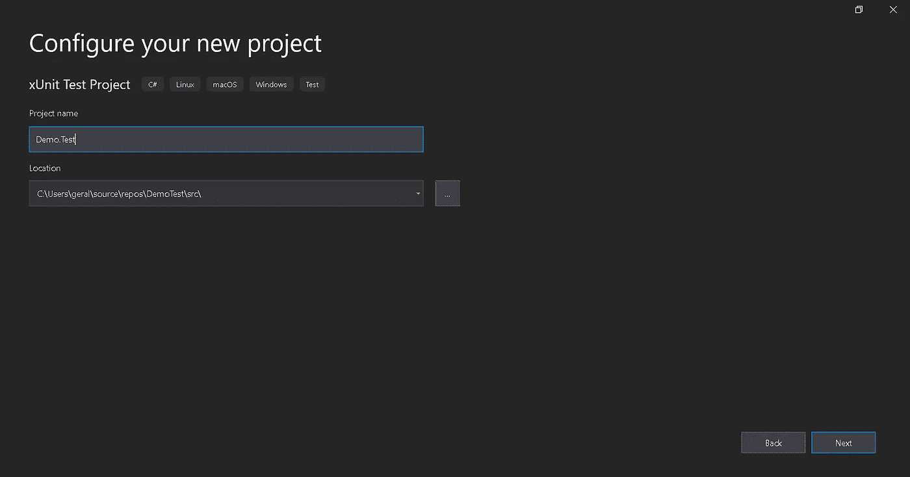
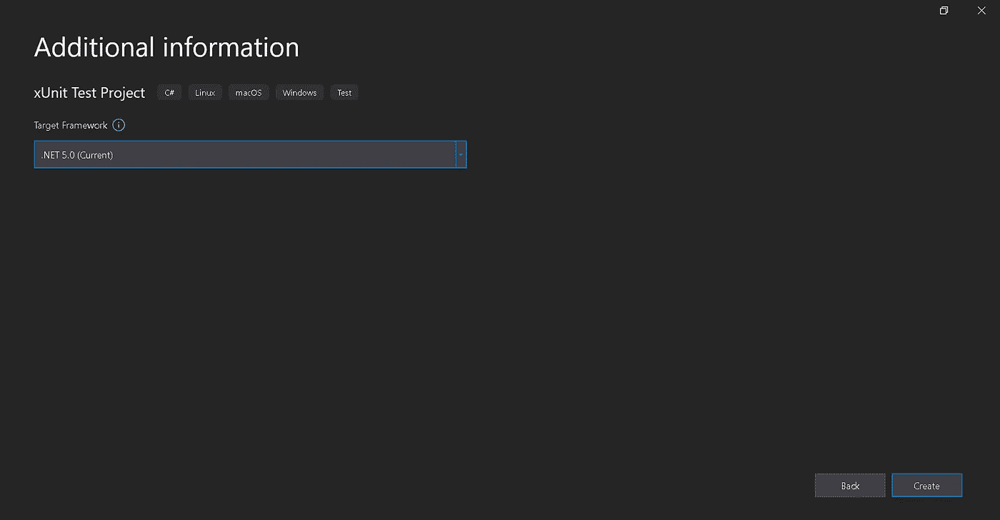
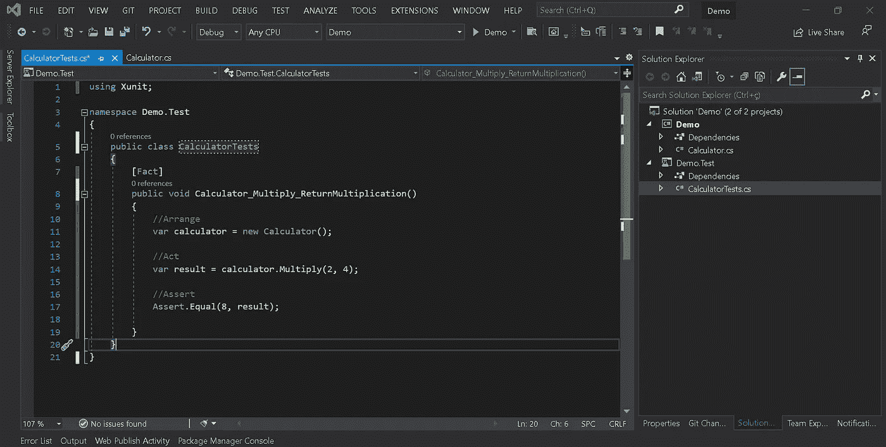
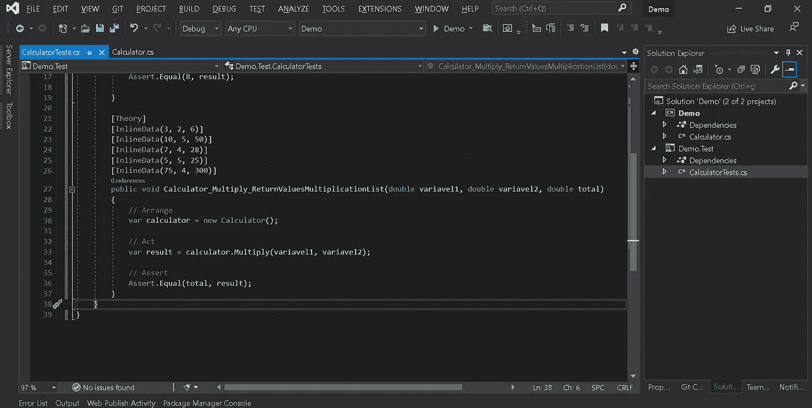
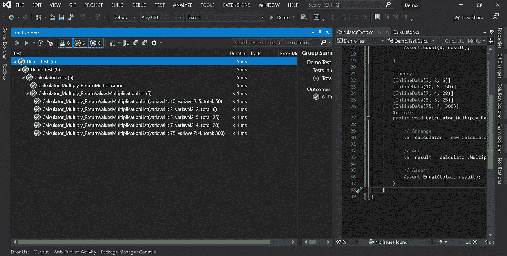

# 用 xUnit 和。网络 5

> 原文：<https://medium.com/nerd-for-tech/creating-tests-with-xunit-and-net-core-5-2203f527cc7b?source=collection_archive---------7----------------------->

xUnit.net 是一个现代的测试框架，也被。微软的. NET 开发团队。

在软件缺陷被发布到生产环境中后，修复它们通常更昂贵、更耗时、更有压力。一组好的自动化测试有助于验证应用程序是否按预期工作，并有助于防止 bug 进入生产环境。

主要思想是展示用 xUnit 开始编写自动化测试是多么简单和容易，以验证您的应用程序是否按预期运行，并帮助避免错误。

使用 xUnit

首先，让我们创建一个类库。Net 核心项目来模拟 Visual Studio 中的应用程序。

让我们输入项目的名称。

让我们选择框架。净 5。

让我们创建一个名为 Calculator 的类。

现在让我们创建一个 xUnit 测试项目类型的项目。Net 核心来创建我们的测试。

一个很好的模式是创建测试项目名称，名称与要测试的项目名称相同，后跟“.”。测试"后缀如下图所示。

同样，让我们选择框架。NET 5 进行测试项目。

创建一个名为 CalculatorTests 的类和第一个名为 Calculator _ Multiply _ return multiplication 的简单测试方法，用属性[Fact]修饰。

让我们遵循 AAA 原则:在方法中行动、安排和断言。

让我们通过创建一个带有[Theory]属性的新方法来创建一个稍微复杂一点的场景，使用它您可以测试可以动态插入的参数化数据的子集。

这些子集可以通过不同的方式获得，例如:[InlineData]、[ClassData]和[MemberData]。

对于这个例子，我们将使用[InlineData]，它允许多次执行一个测试方法，将不同的值作为参数传递给每个交互。

使用测试资源管理器，可以运行、调试和分析创建的测试。

**结论** :
我们可以看到，使用 xUnit 按照命名标准和 AAA 原则:Act、Arrange 和 Assert 来生成测试是非常容易的。

**完整源代码【https://github.com/geraldsimon/xUnit-and-.Net-5】:** 

**参考**:
[https://docs . Microsoft . com/en-us/dot net/core/testing/unit-testing-with-dot net-test](https://docs.microsoft.com/en-us/dotnet/core/testing/unit-testing-with-dotnet-test)