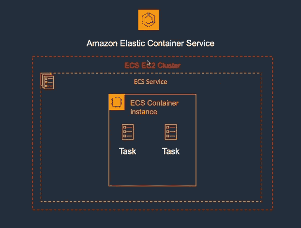
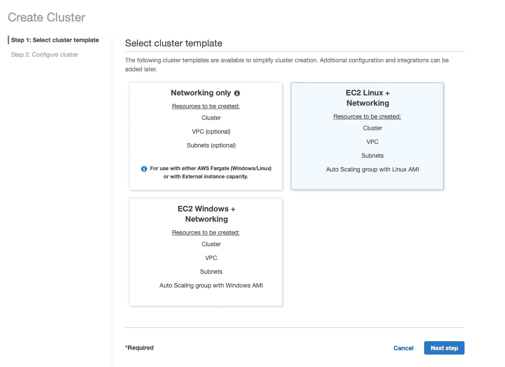
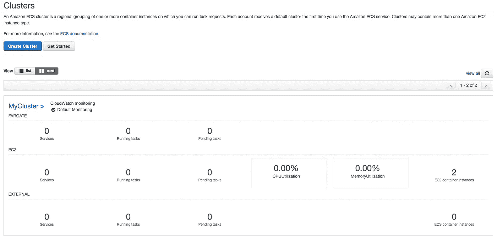
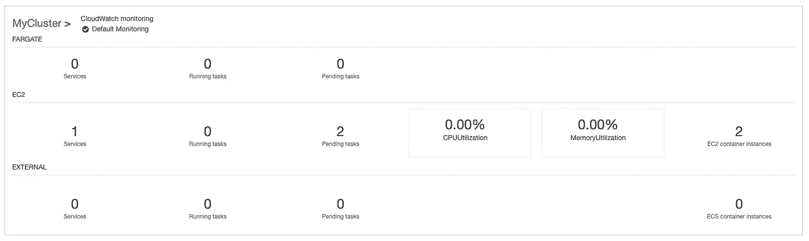
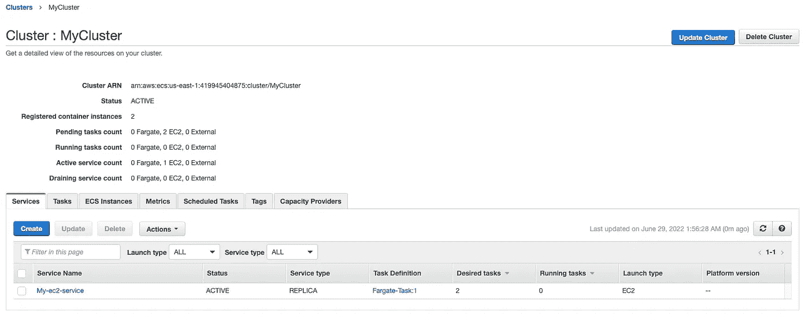

# 使用控制台创建 Amazon ECS 集群和任务

> 原文：<https://medium.com/nerd-for-tech/creating-the-amazon-ecs-cluster-and-task-using-the-console-16aa7634853c?source=collection_archive---------3----------------------->



我们将在本文中创建的架构

**概述:**
在本文中，我们将了解 ECS 的高级视图，并将做一些基本工作，即使用控制台创建 ECs 集群和任务

*   集群:任务或服务的逻辑分组。
*   服务:它定义、运行和维护任务
*   任务:一个正在运行的容器或者一个*任务*是集群中一个任务定义的实例化。
*   ECS 容器代理:它允许容器实例连接到集群。

**第一步:创建集群** 第一步是创建集群。转到 ECS >创建集群> >选择 EC2 Linux +网络，因为我们正在演示 EC2 类型。



选择集群名称(任何名称)、实例类型(t2.micro 以尽可能降低成本)、密钥对(使用现有对)、指定任务数量(2)> >创建集群

在我的集群被创建后，我将得到如下输出



创建集群后的仪表板视图

**步骤 2:创建服务和任务** 现在让我们创建一个服务并将任务添加到集群中。点击服务>创建服务。当您完成创建服务的步骤时，选择

```
Any desired name
Launch Type: EC2
Any desired Service name
Number of task: 2
Choose existing Cluster VPC and Subnets
```

创建完服务后，仪表板将如下所示



服务创建后的仪表板

如果我转到我的群集和服务，我会看到以下结果:



服务已定义

在 Task 下，我们看到 2 个任务，因为我们提到的任务数是 2，对我来说，AWS 控制台选择的默认名称是 Fargate-Task，即使我选择了 ec2 类型。


如果我们单击我们的实例，我们会发现它们没有公共 IP。要连接它们，我们必须私下进行，否则我们需要 NAT 实例或负载平衡器来处理入站流量。

因此，我们能够完成我们的目标。不要忘记清理以避免任何费用💰

感谢阅读，继续努力！！