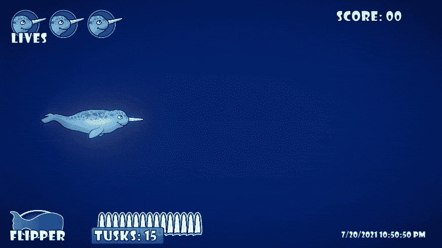

# 创建气泡爆破器第 1 部分:随机物理学

> 原文：<https://medium.com/nerd-for-tech/creating-the-bubble-blaster-part-1-random-physics-3a5f7eed70e3?source=collection_archive---------15----------------------->

我今天的**目标**是为我的 Unity 游戏中的玩家创造一种新型的**特殊武器**，向成群的敌人开火。我想要一串**气泡**，它们向前**浮动**和向上**浮动**，并带有一些**随机化**以获得更自然的气泡云外观。

我需要的第一件东西是值得信赖的泡沫资产。